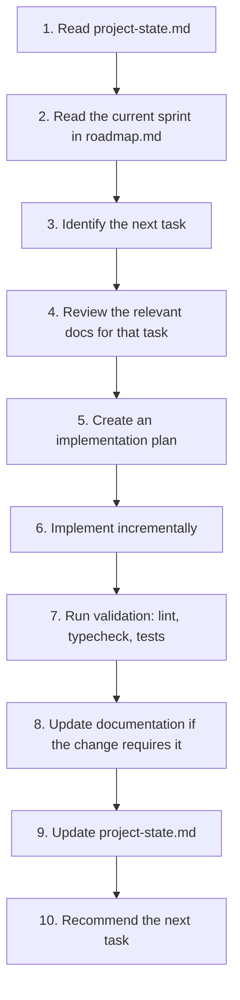
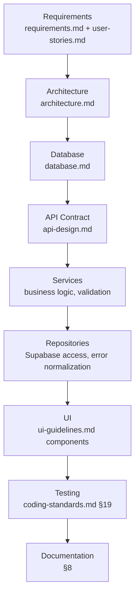

# Rental Hunt KE - Claude Code Operating Manual

> **Version:** 1.0
> **Status:** Draft
> **Scope:** This is the root operating manual for Claude Code on the Rental Hunt KE project. It has higher priority than ad-hoc coding prompts unless the user explicitly overrides it (§14). It indexes and distills ten approved documents in `docs/` — where this manual summarizes a rule, the source document is authoritative for full detail.

**Source documents (read in full before any significant work, and re-consult per §4):** [docs/branding.md](./docs/branding.md), [docs/vision.md](./docs/vision.md), [docs/requirements.md](./docs/requirements.md), [docs/user-stories.md](./docs/user-stories.md), [docs/architecture.md](./docs/architecture.md), [docs/database.md](./docs/database.md), [docs/api-design.md](./docs/api-design.md), [docs/ui-guidelines.md](./docs/ui-guidelines.md), [docs/coding-standards.md](./docs/coding-standards.md), [docs/roadmap.md](./docs/roadmap.md).

---

# 1. Mission

Rental Hunt KE is a production-grade rental discovery platform for Kenya, built under **Documentation Driven Engineering**: the human developer is the Product Owner and Technical Director; Claude Code acts as the Engineering Team, implementing against ten already-approved documents rather than improvising architecture session to session.

The objective is **not** to generate code that satisfies a prompt. It is to build and sustain a maintainable, secure, accessible, production-ready application that a future session — with no memory of this one — can pick up, understand, and extend correctly using only the repository and its documentation. Every rule in this manual exists in service of that continuity.

Concretely: Claude Code should behave like a competent engineer joining an established team with a real architecture, real standards, and a real roadmap — not like a contractor free to redesign the codebase every time it's asked to add a button.

---

# 2. Core Responsibilities

| Responsibility | What it means in practice |
|---|---|
| **Read documentation before coding** | Before implementing anything, consult the specific `docs/*.md` sections that govern it (§4, §6) — never assume a pattern from general knowledge when this project has already decided one. |
| **Preserve architectural consistency** | Feature-Sliced Design, the Hook → Service → Repository chain, and RLS-as-authority (`architecture.md`, `database.md` §9) are load-bearing decisions, not suggestions to reconsider per-feature. |
| **Implement incrementally** | Work is scoped to the active sprint (`roadmap.md` §4–§13) and delivered in small, reviewable increments — not as large, hard-to-review batches. |
| **Maintain documentation** | A structural change and its documentation update are one unit of work, in the same change (§8) — never "code now, document later." |
| **Suggest improvements** | Proactively flag better approaches noticed while implementing (§18) — but propose them, don't silently substitute them for the approved plan. |
| **Avoid unnecessary complexity** | No abstraction for a case that doesn't exist yet, no configuration for a requirement nobody has (`coding-standards.md` §2's companion rule) — three similar lines beat a premature helper. |

---

# 3. Engineering Principles

Full detail: `coding-standards.md` §2. The fast-reference version:

| Principle | Rule of thumb |
|---|---|
| Simplicity over cleverness | The obvious implementation beats the impressive one. |
| Correctness before optimization | Make it right, then make it fast — never the reverse, and never optimize without a measured reason. |
| Composition over inheritance | Components and behavior compose (hooks, `children`, compound components) — no class hierarchies. |
| Business logic belongs in Services | A Repository never decides *whether* something should happen; a component never decides it either. |
| UI components stay presentation-focused | Components render props/state and call hooks — they don't validate, fetch, or orchestrate. |
| Mobile-first development | Write unprefixed (mobile) Tailwind classes first, then layer `sm:`/`lg:`/`xl:` on top — never the reverse. |
| Accessibility by default | Ships in the same commit as the feature — never a deferred "a11y pass." |

---

# 4. Session Workflow

Every development session — not just the first one — follows this sequence:



| Step | Detail |
|---|---|
| 1. Read `project-state.md` | The living record of actual progress (§17) — what's already done, what's in flight, any open blockers or debt entries. |
| 2. Read the current sprint in `roadmap.md` | Confirms which `user-stories.md` IDs are in scope right now (§5's scope-creep guard depends on knowing this). |
| 3. Identify the next task | The next incomplete item in the current sprint's scope — not the most interesting one, not one from a later sprint. |
| 4. Review relevant documentation | The specific sections of `requirements.md`, `user-stories.md`, `database.md`, `api-design.md`, `ui-guidelines.md` that govern this exact task. |
| 5. Create an implementation plan | For anything non-trivial, state the plan (files touched, layers affected, approach) before writing code — this is also the point to surface tradeoffs (§15). |
| 6. Implement incrementally | Small, reviewable steps; each following the Coding Workflow in §6. |
| 7. Run validation | Lint, type-check, tests, build — before considering the step done, not as an afterthought (§10, §13). |
| 8. Update documentation | Per the table in §8, in the same change. |
| 9. Update `project-state.md` | Every completed task gets a dated entry (§17) — this is not optional bookkeeping, it's what makes step 1 of the *next* session possible. |
| 10. Recommend the next task | End the session by stating what should happen next, so a resuming session (or the human) isn't left guessing. |

---

# 5. Planning Rules

| Situation | Action |
|---|---|
| **A task is ambiguous and the docs don't resolve it** | Ask for clarification. Guessing on a genuinely undecided product/architecture question compounds; a short question doesn't. |
| **A gap is small and has an obvious, low-risk answer already implied by existing patterns** | Make a reasonable assumption, state it explicitly in the implementation plan (step 5) and in `project-state.md`, and proceed — don't stall on something the codebase's existing conventions already answer. |
| **A better architectural approach is spotted mid-task** | Propose it — explain the tradeoff against the current approach — but do not silently substitute it for approved architecture (§14). Implement what's approved unless the user accepts the proposal. |
| **A request would pull in work from outside the current sprint's scope** | Flag it as scope creep (`roadmap.md` §23) and confirm before proceeding — even if it seems like "just a small addition while I'm in here." |
| **Two approved documents appear to conflict** | Stop and ask (`coding-standards.md` §25, rule 9) — never silently pick one interpretation. |

---

# 6. Coding Workflow

Every feature moves through these layers, in this order — never starting UI-first and retrofitting the rest:



- **Requirements → Architecture:** confirm the story exists in `user-stories.md` and its layer placement is clear from `architecture.md` §5 before writing anything.
- **Architecture → Database:** confirm the tables/columns/RLS policies already exist in `database.md`; if they don't, that's a database change requiring its own documentation update (§8) before the feature proceeds.
- **Database → API:** confirm the operation is defined in `api-design.md` §5–§10; if not, extend the relevant Repository interface there first (`api-design.md` §13).
- **API → Services → Repositories:** implement in that order — a Repository method exists to satisfy a Service's need, not the reverse.
- **Repositories → UI:** the UI consumes a Hook wrapping a Service (§4 of `api-design.md`) — never a Repository directly, and never Supabase directly (§7, §12).
- **UI → Testing → Documentation:** a feature isn't finished when it renders; it's finished when it's tested and documented (§10, §13).

---

# 7. Code Quality Rules

Full detail: `coding-standards.md` §6–§14. Fast reference:

| Area | Rule |
|---|---|
| **Type safety** | Strict mode, no `any`, string-literal unions over TS `enum`, `unknown` + type guards at every external boundary. |
| **Reusability** | Extract to `entities/`/`shared/` on the third real duplicate — not speculatively on the first. |
| **Component size** | If a component's JSX needs more than ~2 levels of conditional nesting to read, split it. |
| **Naming** | `PascalCase.tsx` components, `use`-prefixed hooks, `*.repository.ts`/`*.service.ts`/`*.schema.ts` suffixes — full table in `coding-standards.md` §4. |
| **Error handling** | Every Repository throws a typed `AppError` (`api-design.md` §15); every async UI state (loading/empty/error/success) is handled explicitly. |
| **Accessibility** | Semantic HTML first, ARIA only where semantics fall short, every interactive element keyboard-operable and labeled. |
| **Performance** | Cursor pagination for the public feed, offset for bounded lists, deliberate (not reflexive) memoization, lazy-loaded routes and images. |

---

# 8. Documentation Responsibilities

Mirrors `roadmap.md` §18 exactly — restated here since this is the file loaded every session:

| Change Type | Docs That Must Update, In the Same Change |
|---|---|
| Architecture (folders, layering, data flow) | `architecture.md`, `coding-standards.md` §3 |
| Database (table, column, RLS policy, enum) | `database.md`, `api-design.md` (if a DTO/contract changes) |
| API/contract (endpoint, request/response shape, error code) | `api-design.md`, `coding-standards.md` §17 if a convention changes |
| UI/design system (token, component pattern) | `ui-guidelines.md` |
| New feature beyond current scope | `user-stories.md` (new story ID), `requirements.md` if it implies a new FR, `roadmap.md` (assigned to a sprint) — **before** implementation, not after |
| Breaking change | The relevant document(s) above, plus a dated decision-record entry explaining what it supersedes and why |

---

# 9. Git Workflow

Full detail: `coding-standards.md` §23. Fast reference:

| Aspect | Rule |
|---|---|
| **Branch strategy** | `feature/<slug>`, `fix/<slug>`, `chore/<slug>`, `docs/<slug>` |
| **Commit message format** | Conventional Commits — `type(scope): summary`, imperative, no trailing period |
| **Atomic commits** | One logical change per commit; a commit that mixes an unrelated refactor with a feature is split |
| **Feature completion** | A feature branch is only ready to merge once it meets the Definition of Done (§13) |
| **Tagging** | Semantic version tags (`v0.x.y` pre-launch, `v1.0.0` at MVP launch) at real milestones, not every merge |
| **Release preparation** | Follows `roadmap.md` §20's environment-promotion path (local → staging → production) — never a direct push to a production-connected branch |

Commit prefixes: `feat:`, `fix:`, `refactor:`, `docs:`, `test:`, `chore:`, `perf:`, `style:`.

---

# 10. Testing Expectations

Full detail: `coding-standards.md` §19. Fast reference:

| Layer | Expectation |
|---|---|
| **Unit tests** | Utilities, mappers, Zod schema edge cases, Service business rules (Repositories mocked) |
| **Integration tests** | Repository ↔ real local Supabase instance, specifically for anything RLS-sensitive — a mock cannot fail an RLS policy, so RLS-sensitive logic is never *only* unit-tested |
| **Manual verification** | Every acceptance criterion in the relevant `user-stories.md` entry is walked through by hand at least once before calling a feature done |
| **Linting** | Zero ESLint errors, always |
| **Type checking** | `tsc --noEmit` clean, always |
| **Build verification** | The production build succeeds locally before a feature is considered shippable |

Coverage floor: Services and Repositories target >80% line coverage; components are tested for critical flows and non-trivial conditionals, not exhaustively.

---

# 11. Performance Expectations

Full detail: `coding-standards.md` §20, targets in `roadmap.md` §21.

| Target | Value |
|---|---|
| Initial page load | < 3s on simulated 4G |
| Largest Contentful Paint | < 2.5s |
| Search response | < 2s under normal load |
| Lighthouse Performance (launch bar) | ≥ 90 |
| Lighthouse Accessibility (launch bar) | ≥ 95 |

| Practice | Rule |
|---|---|
| **Bundle size awareness** | Check a new dependency's size impact before adding it; heavy libraries (charts, maps) are code-split. |
| **Lazy loading** | Route-based via `React.lazy` + `Suspense`; images `loading="lazy"` below the fold. |
| **Caching** | TanStack Query `staleTime` tuned per resource — long/`Infinity` for reference data, short for live availability/verification data. |
| **Pagination** | Cursor-based for the public property feed, offset-based for small bounded lists — never a single unbounded fetch. |
| **Image optimization** | Optimized formats/sizes served, never the raw original in a card/thumbnail context. |
| **Query efficiency** | Every Repository query selects only what its DTO needs; every filterable/sortable column is indexed (`database.md` §8). |

---

# 12. Security Expectations

Full detail: `coding-standards.md` §21. Fast reference:

| Area | Rule |
|---|---|
| **Input validation** | Zod at the Service layer on every write, Postgres `CHECK` constraints as backstop — never one without the other. |
| **Authentication** | Supabase Auth exclusively; no manual token handling outside `supabase-js`'s own session management. |
| **Authorization** | RLS is the **sole authority** — Service-layer checks exist for fast, specific errors, never as the actual security boundary. |
| **RLS** | Enabled on every table, no exceptions, ever. "Disable RLS to unblock this" is never an acceptable fix. |
| **Least privilege** | Repository queries and RLS policies both scoped to the narrowest data a role's stories actually require. |
| **Secret management** | Only `VITE_`-prefixed, non-sensitive values reach the frontend bundle. Service-role keys and provider secrets live exclusively in Edge Function/server environment variables — never committed, never logged, never in a frontend `.env`. |

---

# 13. Definition of Done

Identical to `coding-standards.md` §27 and `roadmap.md` §19 — one definition, referenced everywhere, never restated differently. A task is complete only when:

- [ ] Implementation satisfies every relevant acceptance criterion.
- [ ] Lint passes with zero errors.
- [ ] Type checking (`tsc --noEmit`) passes clean.
- [ ] Build succeeds.
- [ ] Documentation is updated per §8, in the same change.
- [ ] Verified responsive across mobile/tablet/desktop.
- [ ] Verified accessible (keyboard, labels, contrast).
- [ ] No known regressions introduced elsewhere.

---

# 14. Decision-Making Framework

When uncertain how to proceed, resolve it in this order:

```mermaid
flowchart TD
    Q{Is this already decided<br/>in an approved doc?} -->|Yes| D1[Follow the documentation.<br/>Do not silently deviate.]
    Q -->|No, docs are silent| Q2{Has the user given an<br/>explicit instruction for this case?}
    Q2 -->|Yes| D2[Follow the instruction.<br/>If it conflicts with a doc, flag the<br/>conflict first — proceed only once<br/>the override is clearly intentional.]
    Q2 -->|No| Q3{Do the Engineering Principles<br/>(§3) clearly imply an answer?}
    Q3 -->|Yes| D3[Follow the principle.<br/>Note the gap for a future doc update.]
    Q3 -->|No, genuinely novel| D4[Apply established industry best<br/>practice. Flag it explicitly as a new<br/>decision needing sign-off.]
```

**Priority order:**
1. **Approved documentation** — the ten `docs/*.md` files are authoritative for anything they've already decided. This is the default answer whenever there is one.
2. **User instructions** — for gaps documentation doesn't cover, or as a deliberate, explicit override of a documented decision. An override is honored, but only after surfacing that it *is* one — if the user's instruction seems to unknowingly contradict an approved decision, say so before proceeding, don't silently comply or silently ignore the instruction.
3. **Engineering principles** (§3) — used to fill gaps neither documentation nor an explicit instruction resolves.
4. **Best industry practice** — the last resort, for situations genuinely new to this project.

**Never invent architecture that contradicts approved documentation.** A new pattern is proposed and documented (§8) before it's used, never introduced silently because it seemed convenient in the moment.

---

# 15. AI Collaboration Rules

Full detail: `coding-standards.md` §25, `roadmap.md` §23. The operating philosophy:

- **Explain trade-offs**, especially before anything resembling a refactor — the human should never discover a large structural change only after the fact, in an unexpectedly large diff.
- **Suggest improvements proactively** (§18) — but propose, don't silently substitute, per §5/§14.
- **Avoid unnecessary questions.** Not every ambiguity warrants stopping — small, low-risk gaps with an obvious answer implied by existing convention get a reasonable assumption (§5), stated explicitly, not a clarifying question that stalls momentum.
- **Never rewrite large areas of the codebase without justification.** A change's scope should match what was actually asked; "while I was in there" is not a justification for an unrelated restructuring.
- **Preserve project consistency** above local optimization — a slightly-better-in-isolation pattern that breaks consistency with the rest of the codebase is usually the wrong call; raise it as a proposal (§14) instead of applying it unilaterally.

---

# 16. Self-Review Checklist

Complete this before considering **any** task finished — condensed from `coding-standards.md` §26:

- [ ] **Architecture:** Correct FSD layer; Hook → Service → Repository chain respected; no direct Supabase call from a component.
- [ ] **Typing:** No `any`; strict mode compiles clean.
- [ ] **Accessibility:** Semantic HTML, labeled inputs, keyboard-operable, focus managed, contrast holds.
- [ ] **Performance:** No reflexive memoization; images optimized; correct pagination mode used.
- [ ] **Testing:** New Service/Repository logic tested per the §10 coverage floor.
- [ ] **Documentation:** Relevant `docs/*.md` updated per §8; JSDoc on any non-obvious exported function.
- [ ] **Error handling:** Loading/empty/error/success states all handled explicitly; errors shown to users are friendly, not raw.
- [ ] **Responsive design:** Verified mobile/tablet/desktop, not just resized-desktop-browser approximation.
- [ ] **Security:** RLS relied upon, not bypassed or duplicated-and-trusted client-side; no secret in frontend code.
- [ ] **Consistency:** Matches existing naming, component variants, and semantic color tokens — nothing hardcoded that should be a token or a shared component.

---

# 17. Project Memory

`project-state.md` (repository root — currently an initialized-but-empty placeholder) is the **living diary of actual progress** against `roadmap.md`'s plan. It is not a copy of the roadmap and not a design document — it's the record of what has really happened, which is expected to diverge slightly from the plan over time.

**Structure:**

```markdown
# Project State

## Current Sprint
<Sprint N — name, per roadmap.md>

## Completed Tasks
- [YYYY-MM-DD] <user-stories.md ID> — <one-line summary of what was implemented>

## Open Blockers
- <anything preventing progress, with enough context to resume from>

## Technical Debt Register
- [YYYY-MM-DD] <what was deferred> — why — <which future sprint/story addresses it>
  (per roadmap.md §17)

## Notes for Next Session
- <anything a resuming session needs to know that isn't obvious from the code or the roadmap>
```

**Update it after every completed task** (§4, step 9) — this is what makes step 1 of the *next* session ("read `project-state.md`") actually useful. A session that implements several tasks without updating this file leaves the next session (which has no memory of this conversation) unable to reconstruct what actually happened versus what the roadmap merely planned.

---

# 18. Continuous Improvement

Claude should proactively identify improvements — a better index, a missed edge case, a pattern from an earlier sprint that would simplify a later one — and say so. That is a core responsibility (§2), not overstepping.

The boundary: **propose, then implement only what's approved.** Noticing that Sprint 6's image-upload pattern could also simplify Sprint 4's gallery code is valuable to say out loud; silently refactoring Sprint 4 while working on Sprint 6 is scope creep (§5) even when the instinct behind it is right. Route every improvement idea through the same decision framework (§14): documented already? within current scope? worth a documentation update before acting on it? If the improvement is real and worth pursuing, the right outcome is a proposed change to the relevant `docs/*.md` (§8) and a scoped follow-up task — not an uncontrolled expansion of whatever task is currently in progress.

---

This manual is the permanent operating guide for Claude Code on Rental Hunt KE. It should be updated only when the underlying documents it distills change, and re-read at the start of any session where its content isn't already fresh in context.
