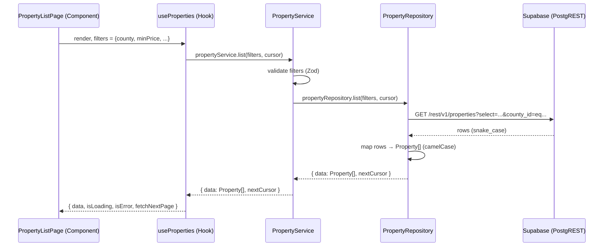
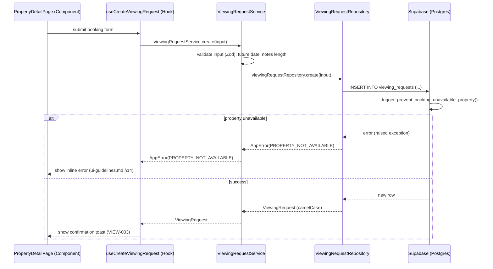
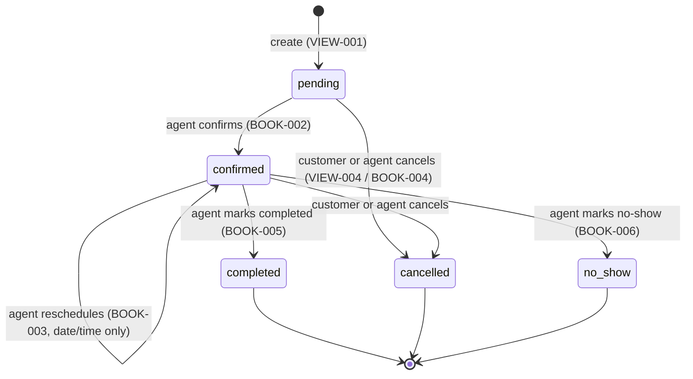

# Rental Hunt KE - API Design

> **Version:** 1.0
> **Status:** Draft
> **Owner:** Engineering Team
> **Related Documents:** [branding.md](./branding.md), [vision.md](./vision.md), [requirements.md](./requirements.md), [user-stories.md](./user-stories.md), [architecture.md](./architecture.md), [database.md](./database.md), [ui-guidelines.md](./ui-guidelines.md)

---

# 1. Purpose

Rental Hunt KE's backend is Supabase — PostgreSQL, Auth, Storage, and Realtime, fronted by PostgREST and RPC functions. There is no hand-written HTTP server. That makes it tempting to let every component call `supabase-js` directly wherever it's convenient — and exactly that temptation is what this document exists to close off.

This document defines the **API contract** the application is built against: every resource, every operation, every request/response shape, every error code, every permission rule, and every repository interface that sits between the UI and Supabase. It is the difference between "we use Supabase" and "we have an API," and it exists for four concrete reasons:

1. **Ambiguity elimination.** Every screen in `user-stories.md` needs a precise, agreed-upon data operation to call — this document is where that agreement is recorded before implementation, not improvised during it.
2. **Migration insurance.** `architecture.md` §9 commits to a Repository pattern specifically "to allow future migration away from Supabase with minimal impact." That promise is only real if every repository has a documented, stable contract independent of how it happens to be implemented today.
3. **A single normalized error/pagination/validation language.** Supabase, PostgREST, and Postgres each have their own error and response shapes. Nothing above the Repository layer should ever see any of them directly.
4. **A contract an AI coding agent can implement against.** Every operation below is specific enough to generate a repository method, a Zod schema, and a TanStack Query hook without guessing.

This document does not contradict `database.md` (the schema) or `architecture.md` (the layering) — it is the API-shaped view of both.

---

# 2. Architectural Overview

## 2.1 The Mandatory Data Flow

```text
Component
    ↓
Hook            (TanStack Query: useQuery / useMutation)
    ↓
Service         (business rules, orchestration, validation entry point)
    ↓
Repository      (Supabase calls, error normalization, snake_case ↔ camelCase mapping)
    ↓
Supabase        (PostgREST / RPC / Auth / Storage / Realtime)
```

This is the exact flow mandated in `architecture.md` §9, reproduced here because every section of this document assumes it.

## 2.2 Why Components Never Call Supabase Directly

- **Testability.** A component that calls `supabase.from(...)` cannot be unit-tested without a real or mocked Postgres connection. A component that calls a hook can be tested with a mocked hook.
- **Consistency.** If five components each independently write their own `supabase.from('properties').select(...)` query, a schema change (`database.md` evolving) means hunting down five call sites instead of one Repository method. `architecture.md`'s "no duplicated logic" principle is unenforceable otherwise.
- **Error normalization.** Supabase/PostgREST errors are Postgres-shaped (`{ code: '23505', message: 'duplicate key value...' }`). The UI should only ever see the standard envelope in §15. That translation happens in exactly one place: the Repository.
- **Type safety at the boundary.** Repositories are the one place that knows about `snake_case` database columns; everything above them works with camelCase, strongly-typed domain objects (`entities/*` per `architecture.md` §5).
- **Migration insurance.** See §1. If Rental Hunt KE ever needs a service that isn't PostgREST-shaped (a search engine, a payments provider, a public API gateway), only the Repository implementation changes — Services, Hooks, and Components are unaffected.
- **Authorization defense-in-depth.** RLS (`database.md` §9) is the *authoritative* authorization layer and holds even if the Repository has a bug. But Services still perform request-shape validation and business-rule checks (e.g. "is this date in the future?") *before* a request reaches the database, giving users a fast, specific error instead of a raw RLS rejection.

## 2.3 Example Sequence — Reading Data



## 2.4 Example Sequence — Writing Data with a Business Rule



Note the trigger from `database.md` §9 firing *inside* the database transaction — the Repository does not re-implement that rule, it only translates the resulting error.

---

# 3. Resource Overview

| Resource | Backing Table(s) | MVP / Future | Primary Consumers |
|---|---|---|---|
| Authentication | `auth.users`, `profiles` | MVP | Guest, Customer, Agent, Moderator, Admin |
| Profiles | `profiles` | MVP | All authenticated roles |
| Roles | `roles` | MVP (reference) | Admin (display only) |
| Agencies | `agencies` | MVP | Guest (read), Agent (own), Admin |
| Agents | `agents` | MVP | Guest (read, via directory view), Agent (own), Admin |
| Properties | `properties` | MVP | Guest, Customer, Agent, Moderator, Admin |
| Property Images | `property_images` | MVP | Guest (read), Agent (own), Admin |
| Amenities | `amenities`, `property_amenities` | MVP | Guest (read), Agent (own), Admin |
| Reference Data | `counties`, `locations`, `property_types` | MVP | Guest (read), Admin (write) |
| Favorites | `favorites` | MVP | Customer |
| Viewing Requests | `viewing_requests` | MVP | Customer, Agent, Moderator, Admin |
| Property Verifications | `property_verifications` | MVP | Moderator, Admin, Agent (own, read) |
| Activity Logs | `activity_logs` | MVP | Moderator, Admin |
| Notifications | *(future)* | Future (`FUT`) | All authenticated roles |
| Reviews | *(future)* | Future | Customer, Guest (read) |
| Payments | *(future)* | Future (`FUT-001`) | Customer, Admin |
| Subscriptions | *(future)* | Future (`FUT-003`) | Agency, Admin |

## 3.1 Canonical Domain Types (TypeScript)

These are the camelCase shapes every Repository returns. Endpoint sections below reference these by name rather than repeating them.

```typescript
type UUID = string;
type ISODateTime = string; // ISO 8601, UTC

interface Profile {
  id: UUID;
  role: 'customer' | 'agent' | 'moderator' | 'admin';
  fullName: string;
  phone: string | null;
  avatarUrl: string | null;
  notificationPreferences: Record<string, boolean>;
  isActive: boolean;
  createdAt: ISODateTime;
}

interface Agency {
  id: UUID;
  name: string;
  slug: string;
  description: string | null;
  logoUrl: string | null;
  phone: string | null;
  email: string | null;
  countyId: UUID | null;
  isActive: boolean;
}

interface Agent {
  id: UUID;
  profileId: UUID;
  agencyId: UUID;
  fullName: string;      // joined from profiles
  avatarUrl: string | null; // joined from profiles
  jobTitle: string | null;
  bio: string | null;
  isActive: boolean;
}

interface PropertyImage {
  id: UUID;
  propertyId: UUID;
  imageUrl: string;
  altText: string | null;
  displayOrder: number;
}

interface Amenity {
  id: UUID;
  name: string;
  icon: string | null;
}

interface Property {
  id: UUID;
  slug: string;
  title: string;
  description: string;
  agencyId: UUID;
  agentId: UUID;
  propertyTypeId: UUID;
  propertyTypeName: string; // joined
  countyId: UUID;
  countyName: string;       // joined
  locationId: UUID;
  locationName: string;     // joined
  latitude: number;
  longitude: number;
  bedrooms: number;
  bathrooms: number;
  rentAmount: number;
  depositAmount: number;
  currency: string;
  availabilityStatus: 'available' | 'reserved' | 'occupied' | 'hidden';
  verificationStatus: 'unverified' | 'pending_verification' | 'verified' | 'rejected';
  lastVerifiedAt: ISODateTime | null;
  isFeatured: boolean;
  isArchived: boolean;
  viewCount: number;
  images: PropertyImage[];
  amenities: Amenity[];
  agent: Pick<Agent, 'id' | 'fullName' | 'avatarUrl' | 'jobTitle' | 'bio' | 'agencyId'>;
  createdAt: ISODateTime;
  updatedAt: ISODateTime;
}

interface Favorite {
  propertyId: UUID;
  createdAt: ISODateTime;
  property: Property; // expanded by default — favorites are always shown with their property
}

interface ViewingRequest {
  id: UUID;
  customerId: UUID;
  propertyId: UUID;
  agentId: UUID;
  requestedDate: string; // YYYY-MM-DD
  requestedTime: string; // HH:mm
  status: 'pending' | 'confirmed' | 'completed' | 'cancelled' | 'no_show';
  notes: string | null;
  cancellationReason: string | null;
  createdAt: ISODateTime;
  updatedAt: ISODateTime;
  property?: Pick<Property, 'id' | 'slug' | 'title' | 'images'>; // expanded on list endpoints
}

interface PropertyVerification {
  id: UUID;
  propertyId: UUID;
  previousStatus: Property['verificationStatus'] | null;
  newStatus: Property['verificationStatus'];
  reviewedBy: UUID;
  reason: string | null;
  createdAt: ISODateTime;
}
```

---

# 4. API Conventions

| Convention | Rule |
|---|---|
| **Naming** | Logical routes use kebab-case plural nouns (`/viewing-requests`). Database tables use `snake_case` (`database.md` §2). JSON fields use `camelCase`. The Repository is the only layer that translates between the two. |
| **Pluralization** | Collection routes are always plural (`/properties`, not `/property`). Singular sub-resources under a specific ID use the parent's plural form plus the child collection (`/properties/:id/images`). |
| **Filtering** | Query parameters, one per filterable field (`?county=nairobi&minPrice=20000&bedrooms=2`). Multi-value filters (amenities) accept a comma-separated list (`?amenities=wifi,parking`). See §17. |
| **Sorting** | `?sort=<field>_<direction>`, e.g. `sort=price_asc`, `sort=newest` (alias for `created_at_desc`). Exactly one sort key is active at a time in the MVP — no multi-column sort UI. |
| **Pagination** | `?cursor=<opaque>&limit=<n>` for keyset-paginated collections (public property feed); `?page=<n>&pageSize=<n>` for offset-paginated collections (bounded admin/dashboard lists). See §16. |
| **Searching** | `?q=<text>` for free-text/location search, mapped to `ILIKE`/`to_tsvector` matching (`database.md` §8). |
| **Field selection** | Not exposed as a client-tunable parameter in the MVP — each Repository method returns a fixed, purpose-built shape (the DTOs in §3.1) matching exactly what its consuming screen needs, avoiding both over-fetching and a general-purpose `?fields=` query-planning surface this app doesn't need yet. |
| **Relationship expansion** | Expansion is **not** client-controlled; it's baked into each Repository method's fixed `select()` (e.g. `list()` always includes the primary image and agent name; `getBySlug()` always includes the full gallery and amenities). This keeps payloads predictable and matches each screen's actual needs (§3.1). |
| **Soft deletes** | Every Repository read method filters out `deleted_at IS NOT NULL` (and, for `properties`, `is_archived = true`) by default. An explicit `includeArchived: true` parameter — available only to Agent (own properties) and Admin — opts back in. Soft-deleted rows are never returned to Guest/Customer under any parameter combination (enforced doubly by RLS, `database.md` §9). |
| **Timestamps** | Always ISO 8601, UTC, in `createdAt`/`updatedAt` fields. Never a Unix epoch, never a locale-formatted string. |
| **UUID usage** | Every resource identifier is a UUID v4 string, both in the database (`database.md` §2) and in the JSON contract. Human-readable identifiers (property `slug`, agency `slug`) are used only in user-facing URLs, never as the actual foreign key or lookup key inside repository calls beyond the single "get by slug" method. |

---

# 5. Authentication API

Backed entirely by Supabase Auth (`architecture.md` §7) plus the `profiles` table. There is no custom auth server — every operation below wraps a `supabase.auth.*` call and, where noted, the `handle_new_user` trigger (`database.md` §5.1).

## 5.1 Register

| | |
|---|---|
| **Purpose** | Create a new account (`AUTH-001`). |
| **Repository Function** | `authRepository.register(input: { email, password, fullName })` |
| **Underlying call** | `supabase.auth.signUp({ email, password, options: { data: { full_name } } })` → `handle_new_user` trigger creates the `profiles` row with `role = 'customer'`. |
| **Request** | `{ email: string, password: string, fullName: string }` |
| **Response** | `{ user: Profile, session: Session }` |
| **Validation** | Email: valid format. Password: min 8 chars, at least 1 letter and 1 number. `fullName`: 2–100 chars. |
| **Possible Errors** | `VALIDATION_ERROR`, `EMAIL_ALREADY_REGISTERED` |
| **Authorization** | None — public endpoint (Guest). |

```json
// Request
{ "email": "amina@example.com", "password": "Kilimani2026", "fullName": "Amina Yusuf" }

// Response
{
  "success": true,
  "data": {
    "user": { "id": "b1e...", "role": "customer", "fullName": "Amina Yusuf", "phone": null, "avatarUrl": null },
    "session": { "accessToken": "eyJ...", "refreshToken": "v1.M...", "expiresAt": "2026-07-17T15:00:00Z" }
  }
}
```

## 5.2 Login

| | |
|---|---|
| **Purpose** | Authenticate an existing user (`AUTH-002`). |
| **Repository Function** | `authRepository.login(input: { email, password })` |
| **Underlying call** | `supabase.auth.signInWithPassword({ email, password })` |
| **Request** | `{ email: string, password: string }` |
| **Response** | `{ user: Profile, session: Session }` |
| **Validation** | Both fields required; no format validation beyond "non-empty" (format errors are folded into the generic auth failure to avoid leaking which field was wrong). |
| **Possible Errors** | `INVALID_CREDENTIALS` (deliberately generic — never distinguishes "wrong password" from "no such account"), `RATE_LIMITED` |
| **Authorization** | None — public endpoint. |

## 5.3 Logout

| | |
|---|---|
| **Purpose** | End the current session (`AUTH-003`). |
| **Repository Function** | `authRepository.logout()` |
| **Underlying call** | `supabase.auth.signOut()` |
| **Request** | *(none — uses current session)* |
| **Response** | `{ success: true }` |
| **Possible Errors** | `UNAUTHENTICATED` (already logged out) |
| **Authorization** | Any authenticated role. |

## 5.4 Refresh Session

| | |
|---|---|
| **Purpose** | Transparently renew an access token before expiry, backing `AUTH-005` (session persistence). |
| **Repository Function** | `authRepository.refreshSession()` — called automatically by the `supabase-js` client on a timer; not directly invoked by application code in the normal path. |
| **Underlying call** | `supabase.auth.refreshSession()` |
| **Response** | `{ session: Session }` |
| **Possible Errors** | `SESSION_EXPIRED` (refresh token itself has expired — the app redirects to login) |
| **Authorization** | Requires a valid (even if access-expired) refresh token. |

## 5.5 Forgot Password

| | |
|---|---|
| **Purpose** | Request a password reset email (`AUTH-004`). |
| **Repository Function** | `authRepository.requestPasswordReset(email: string)` |
| **Underlying call** | `supabase.auth.resetPasswordForEmail(email, { redirectTo })` |
| **Request** | `{ email: string }` |
| **Response** | `{ success: true }` — **always**, regardless of whether the email exists, to avoid account enumeration. |
| **Validation** | Valid email format. |
| **Possible Errors** | `VALIDATION_ERROR`, `RATE_LIMITED` |
| **Authorization** | None. |

## 5.6 Reset Password

| | |
|---|---|
| **Purpose** | Complete a password reset using the emailed link's token. |
| **Repository Function** | `authRepository.resetPassword(input: { newPassword })` — called after the recovery link has already established a temporary session. |
| **Underlying call** | `supabase.auth.updateUser({ password: newPassword })` |
| **Request** | `{ newPassword: string }` |
| **Response** | `{ success: true }` |
| **Validation** | Same password rules as registration. |
| **Possible Errors** | `VALIDATION_ERROR`, `RESET_TOKEN_EXPIRED` |
| **Authorization** | Valid (unexpired) recovery session only. |

## 5.7 Get Current User

| | |
|---|---|
| **Purpose** | Resolve the active session into a full `Profile` on app load (`AUTH-005`). |
| **Repository Function** | `authRepository.getCurrentUser()` |
| **Underlying call** | `supabase.auth.getSession()` + `profileRepository.getById(session.user.id)` |
| **Response** | `Profile \| null` |
| **Possible Errors** | *(none — returns `null` rather than throwing when unauthenticated)* |
| **Authorization** | None required to call; returns `null` for Guests. |

## 5.8 Update Profile

| | |
|---|---|
| **Purpose** | Edit account details (`AUTH-006`, `CUST-003`). |
| **Repository Function** | `profileRepository.update(id: UUID, input: Partial<{ fullName, phone, avatarUrl, notificationPreferences }>)` |
| **Underlying call** | `supabase.from('profiles').update({...}).eq('id', auth.uid())` |
| **Request** | `{ fullName?: string, phone?: string, avatarUrl?: string, notificationPreferences?: Record<string, boolean> }` |
| **Response** | `Profile` (updated) |
| **Validation** | `fullName`: 2–100 chars if present. `phone`: E.164 format if present. `role` is never accepted in this payload — attempting to set it is a `VALIDATION_ERROR` at the Zod layer, backstopped by the `prevent_self_role_change()` trigger (`database.md` §9). |
| **Possible Errors** | `VALIDATION_ERROR`, `FORBIDDEN` (attempting to update another profile) |
| **Authorization** | Owner only (`id = auth.uid()`), or Admin. |

---

# 6. Property API

Route prefix: none (logical root). All routes below are the Repository's contract, not hand-built HTTP handlers — see §2.1.

## 6.1 List Properties

| | |
|---|---|
| **Method / Route** | `GET /properties` |
| **Repository Function** | `propertyRepository.list(filters: PropertyFilters, cursor?: string, limit = 20)` |
| **Underlying call** | `supabase.from('properties').select('*, images:property_images(*), agent:agents(*, profile:profiles(full_name, avatar_url))').match({...}).order('created_at', { ascending: false }).limit(limit)` with a keyset `WHERE (created_at, id) < (cursor.createdAt, cursor.id)` predicate. |
| **Request Parameters** | See §17 (Filtering) for the full filter set; plus `cursor`, `limit`, `sort`, `q`. |
| **Response Schema** | `{ data: Property[], meta: { nextCursor: string \| null, hasMore: boolean } }` |
| **Permissions** | Public (Guest and above). RLS restricts rows to `is_archived = false AND deleted_at IS NULL AND verification_status <> 'rejected'` (`database.md` §9) regardless of what the caller requests. |
| **Errors** | `VALIDATION_ERROR` (malformed filter values, e.g. `minPrice` not numeric) |
| **Pagination** | Cursor-based (§16.1). |

```json
// GET /properties?county=nairobi&bedrooms=2&sort=price_asc&limit=2
{
  "success": true,
  "data": [
    {
      "id": "3f2...", "slug": "2br-apartment-kilimani-3f2",
      "title": "Modern 2BR Apartment in Kilimani",
      "rentAmount": 55000, "currency": "KES", "bedrooms": 2, "bathrooms": 2,
      "availabilityStatus": "available", "verificationStatus": "verified",
      "images": [{ "id": "img1", "imageUrl": "https://.../property-images/3f2.../1.jpg", "displayOrder": 0 }],
      "agent": { "id": "ag1", "fullName": "James Mwangi", "avatarUrl": null }
    }
  ],
  "meta": { "nextCursor": "eyJjcmVhdGVkQXQiOiIyMDI2LTA3LTE1VDEwOjAwOjAwWiIsImlkIjoiM2YyIn0=", "hasMore": true }
}
```

## 6.2 Get Property

| | |
|---|---|
| **Method / Route** | `GET /properties/:slug` |
| **Repository Function** | `propertyRepository.getBySlug(slug: string)` |
| **Underlying call** | `supabase.from('properties').select('*, images:property_images(*), amenities:property_amenities(amenity:amenities(*)), agent:agents(*, profile:profiles(full_name, avatar_url))').eq('slug', slug).single()`, plus a fire-and-forget `increment_view_count` RPC (§9's `view_count` counter). |
| **Response Schema** | `Property` (full shape, §3.1) |
| **Permissions** | Public, subject to the same visibility rule as §6.1. |
| **Errors** | `PROPERTY_NOT_FOUND` |
| **Pagination** | N/A (single resource). |

## 6.3 Search Properties

Not a separate endpoint — `q` is a parameter on `GET /properties` (§6.1) matched against the GIN full-text index on `title`/`description` and `ILIKE` on `locations.name`/`counties.name` (`database.md` §8, NFR-SEARCH-002). Documented separately here only because `user-stories.md` (`DISC-002`) treats it as a distinct user journey.

```json
// GET /properties?q=kilimani
```

## 6.4 Filter Properties

Also not a separate endpoint — see §17 for the full filter parameter reference applied to `GET /properties`.

## 6.5 Featured Properties

| | |
|---|---|
| **Method / Route** | `GET /properties/featured` |
| **Repository Function** | `propertyRepository.listFeatured(limit = 8)` |
| **Underlying call** | `supabase.from('properties').select(...).eq('is_featured', true).order('created_at', { ascending: false }).limit(limit)` — served by the partial index in `database.md` §8. |
| **Response Schema** | `{ data: Property[] }` (no pagination — bounded, small set, `FR-HOME-002`) |
| **Permissions** | Public. `is_featured = true` can only exist alongside `verification_status = 'verified'` (enforced by a `CHECK` constraint, `database.md` §5.8), so this endpoint needs no additional verification filter. |
| **Errors** | *(none expected — empty array is a valid response)* |

## 6.6 Nearby Properties *(Future)*

| | |
|---|---|
| **Method / Route** | `GET /properties/nearby` *(not implemented in MVP)* |
| **Sketch** | `?lat=&lng=&radiusKm=` using PostGIS `ST_DWithin` once/if the `postgis` extension is enabled — `latitude`/`longitude` columns already exist (`database.md` §5.8), so this is additive, not a schema change. |
| **Status** | Deferred — no MVP user story requires proximity search; `DISC-002` is county/neighborhood-based. |

## 6.7 Property Images

| Operation | Method / Route | Repository Function | Permissions |
|---|---|---|---|
| List | `GET /properties/:id/images` | `propertyImageRepository.listByProperty(propertyId)` | Public (parent property visible) |
| Create (metadata) | `POST /properties/:id/images` | `propertyImageRepository.create(propertyId, { imageUrl, altText, displayOrder })` | Agent (own property), Admin — see §10 for the upload flow this follows |
| Delete | `DELETE /properties/:id/images/:imageId` | `propertyImageRepository.delete(imageId)` | Agent (own property), Admin |
| Reorder | `PATCH /properties/:id/images/reorder` | `propertyImageRepository.reorder(propertyId, orderedImageIds: UUID[])` | Agent (own property), Admin |

`Response Schema`: `PropertyImage[]` for list/reorder, `PropertyImage` for create. `Errors`: `PROPERTY_NOT_FOUND`, `IMAGE_NOT_FOUND`, `FORBIDDEN`.

## 6.8 Property Availability

| | |
|---|---|
| **Method / Route** | `PATCH /properties/:id/availability` |
| **Repository Function** | `propertyRepository.updateAvailability(id: UUID, status: PropertyStatus)` (`AGENT-006`) |
| **Underlying call** | `supabase.from('properties').update({ availability_status: status }).eq('id', id)` — triggers `property.availability_changed` in `activity_logs` (`database.md` §11). |
| **Request** | `{ status: 'available' \| 'reserved' \| 'occupied' \| 'hidden' }` |
| **Response Schema** | `Property` |
| **Permissions** | Agent (own agency's property only), Admin. |
| **Errors** | `VALIDATION_ERROR` (invalid enum value), `FORBIDDEN`, `PROPERTY_NOT_FOUND` |

## 6.9 Property Verification

| | |
|---|---|
| **Method / Route** | `POST /properties/:id/verification` |
| **Repository Function** | `verificationRepository.setStatus(propertyId: UUID, input: { status, reason? })` (`AGENT-007`) |
| **Underlying call** | `supabase.rpc('set_property_verification', { property_id: propertyId, new_status: status, reason })` — the only path allowed to write `verification_status`/`verified_by`/`last_verified_at`, and the sole writer of `property_verifications` (`database.md` §9, §5.15). |
| **Request** | `{ status: 'verified' \| 'rejected' \| 'pending_verification', reason?: string }` |
| **Response Schema** | `{ property: Property, verification: PropertyVerification }` |
| **Validation** | `reason` required when `status = 'rejected'` (enforced inside the RPC, not a table `CHECK`, per `database.md` §5.15). |
| **Permissions** | Moderator, Admin only. |
| **Errors** | `VALIDATION_ERROR`, `FORBIDDEN`, `PROPERTY_NOT_FOUND` |

---

# 7. Favorites API

## 7.1 Save Favorite

| | |
|---|---|
| **Method / Route** | `POST /favorites` |
| **Repository Function** | `favoritesRepository.save(propertyId: UUID)` (`FAV-001`) |
| **Underlying call** | `supabase.from('favorites').upsert({ customer_id: auth.uid(), property_id }, { onConflict: 'customer_id,property_id', ignoreDuplicates: true })` |
| **Request** | `{ propertyId: UUID }` |
| **Response** | `Favorite` |
| **Validation** | `propertyId` must be a valid UUID referencing a non-deleted, non-archived property. |
| **Duplicate handling** | **Idempotent.** Saving an already-favorited property is a no-op success (`onConflict` + `ignoreDuplicates`), not a `CONFLICT` error — the user's intent ("I want this saved") is already satisfied. |
| **Permissions** | Customer only (own `customer_id`, enforced by RLS). |
| **Errors** | `UNAUTHENTICATED`, `PROPERTY_NOT_FOUND` |

## 7.2 Remove Favorite

| | |
|---|---|
| **Method / Route** | `DELETE /favorites/:propertyId` |
| **Repository Function** | `favoritesRepository.remove(propertyId: UUID)` (`FAV-002`) |
| **Underlying call** | `supabase.from('favorites').delete().match({ customer_id: auth.uid(), property_id: propertyId })` |
| **Response** | `{ success: true }` |
| **Duplicate handling** | Removing a non-favorited property is also idempotent — a successful no-op, not a `NOT_FOUND` error. |
| **Permissions** | Customer only, own rows. |
| **Errors** | `UNAUTHENTICATED` |

## 7.3 List Favorites

| | |
|---|---|
| **Method / Route** | `GET /favorites` |
| **Repository Function** | `favoritesRepository.list(page = 1, pageSize = 20)` (`FAV-003`) |
| **Underlying call** | `supabase.from('favorites').select('created_at, property:properties(*, images:property_images(*))').eq('customer_id', auth.uid()).order('created_at', { ascending: false }).range(...)` |
| **Response Schema** | `{ data: Favorite[], meta: { page, pageSize, total } }` |
| **Permissions** | Customer only, own rows. |
| **Pagination** | Offset (§16.2) — a customer's favorites list is small and bounded, so simple page numbers are appropriate. |
| **Errors** | `UNAUTHENTICATED` |

---

# 8. Viewing Request API

## 8.1 Status State Machine



`completed`, `cancelled`, and `no_show` are terminal — no operation transitions a viewing request out of them. Every transition is validated against this table at the Service layer *before* the Repository call, so an invalid transition returns a specific `INVALID_STATE_TRANSITION` error rather than a generic database failure.

## 8.2 Create Viewing

| | |
|---|---|
| **Method / Route** | `POST /viewing-requests` |
| **Repository Function** | `viewingRequestRepository.create(input: { propertyId, requestedDate, requestedTime, notes? })` (`VIEW-001`, `VIEW-002`) |
| **Underlying call** | `supabase.from('viewing_requests').insert({ customer_id: auth.uid(), property_id, agent_id: <resolved from property>, requested_date, requested_time, notes })` — the `prevent_booking_unavailable_property()` trigger (`database.md` §9) rejects the insert if the property isn't bookable. |
| **Request** | `{ propertyId: UUID, requestedDate: string (YYYY-MM-DD), requestedTime: string (HH:mm), notes?: string }` |
| **Response** | `ViewingRequest` |
| **Validation** | `requestedDate` must be today or later. `notes` max 500 chars. |
| **Permissions** | Customer only. |
| **Errors** | `VALIDATION_ERROR`, `PROPERTY_NOT_FOUND`, `PROPERTY_NOT_AVAILABLE` |

```json
// Request
{ "propertyId": "3f2...", "requestedDate": "2026-07-22", "requestedTime": "14:00", "notes": "Available after 1pm on weekdays." }

// Response
{
  "success": true,
  "data": {
    "id": "vr1...", "propertyId": "3f2...", "agentId": "ag1...",
    "requestedDate": "2026-07-22", "requestedTime": "14:00",
    "status": "pending", "notes": "Available after 1pm on weekdays.",
    "createdAt": "2026-07-17T09:12:00Z"
  }
}
```

## 8.3 List User Viewings

| | |
|---|---|
| **Method / Route** | `GET /viewing-requests?scope=mine` |
| **Repository Function** | `viewingRequestRepository.listForCustomer(status?: ViewingStatus[], page = 1, pageSize = 20)` (`VIEW-005`, `CUST-001`, `CUST-002`) |
| **Permissions** | Customer, own rows only. |
| **Pagination** | Offset (§16.2). |
| **Errors** | `UNAUTHENTICATED` |

## 8.4 List Property Viewings (Agent Queue)

| | |
|---|---|
| **Method / Route** | `GET /viewing-requests?scope=agency` |
| **Repository Function** | `viewingRequestRepository.listForAgent(status?: ViewingStatus[], page = 1, pageSize = 20)` (`BOOK-001`) |
| **Permissions** | Agent (rows where `agent_id` is their own), Moderator/Admin (all). |
| **Pagination** | Offset (§16.2). |

## 8.5 Update / Reschedule Viewing

| | |
|---|---|
| **Method / Route** | `PATCH /viewing-requests/:id` |
| **Repository Function** | `viewingRequestRepository.reschedule(id: UUID, input: { requestedDate, requestedTime })` (`BOOK-003`) |
| **Validation** | Only allowed while `status IN ('pending', 'confirmed')`; new date must be today or later. |
| **Permissions** | Agent (own), Admin. |
| **Errors** | `VALIDATION_ERROR`, `INVALID_STATE_TRANSITION`, `FORBIDDEN` |

## 8.6 Cancel Viewing

| | |
|---|---|
| **Method / Route** | `POST /viewing-requests/:id/cancel` |
| **Repository Function** | `viewingRequestRepository.cancel(id: UUID, reason?: string)` (`VIEW-004`, `BOOK-004`) |
| **Validation** | Only allowed while `status IN ('pending', 'confirmed')`. |
| **Permissions** | Customer (own request), Agent (own assigned request), Admin. |
| **Errors** | `INVALID_STATE_TRANSITION`, `FORBIDDEN` |

## 8.7 Confirm Viewing

| | |
|---|---|
| **Method / Route** | `POST /viewing-requests/:id/confirm` |
| **Repository Function** | `viewingRequestRepository.confirm(id: UUID)` (`BOOK-002`) |
| **Validation** | Only allowed while `status = 'pending'`. |
| **Permissions** | Agent (own), Admin. |
| **Errors** | `INVALID_STATE_TRANSITION`, `FORBIDDEN` |

## 8.8 Complete Viewing

| | |
|---|---|
| **Method / Route** | `POST /viewing-requests/:id/complete` |
| **Repository Function** | `viewingRequestRepository.complete(id: UUID)` (`BOOK-005`) |
| **Validation** | Only allowed while `status = 'confirmed'`. |
| **Permissions** | Agent (own), Admin. |
| **Errors** | `INVALID_STATE_TRANSITION`, `FORBIDDEN` |

## 8.9 No Show

| | |
|---|---|
| **Method / Route** | `POST /viewing-requests/:id/no-show` |
| **Repository Function** | `viewingRequestRepository.markNoShow(id: UUID)` (`BOOK-006`) |
| **Validation** | Only allowed while `status = 'confirmed'`. |
| **Permissions** | Agent (own), Admin. |
| **Errors** | `INVALID_STATE_TRANSITION`, `FORBIDDEN` |

---

# 9. Admin API

All routes below require `moderator` or `admin` (verification/viewing oversight) or `admin` alone (user/agency management), per the RLS matrix in `database.md` §9.

| Operation | Method / Route | Repository Function | Permissions | Notes |
|---|---|---|---|---|
| Dashboard Metrics | `GET /admin/metrics` | `adminRepository.getMetrics()` | Admin | Platform-wide counts: total properties, pending verifications, active agencies, bookings this week. |
| Manage Properties | `GET /admin/properties`, `PATCH /admin/properties/:id` | `propertyRepository.list({ scope: 'all' })`, `.update()` | Admin | Bypasses the public visibility filter (§4); can force-archive any listing. |
| Manage Users | `GET /admin/users`, `PATCH /admin/users/:id` | `profileRepository.list()`, `.adminUpdate(id, { role?, isActive? })` | Admin | The only path that can change `profiles.role` (bypasses the self-role-change trigger, `database.md` §9). |
| Manage Agencies | `GET /admin/agencies`, `POST /admin/agencies`, `PATCH /admin/agencies/:id` | `agencyRepository.list()`, `.create()`, `.update()` | Admin | Agency onboarding is admin-driven in the MVP (`FUT-002` self-service onboarding is deferred). |
| Verification Queue | `GET /admin/properties/pending-verification` | `verificationRepository.listPending()` | Moderator, Admin | Filters `properties.verification_status = 'pending_verification'`. |
| Verification Action | see §6.9 | `verificationRepository.setStatus()` | Moderator, Admin | Same RPC as the Agent Dashboard's verification screen. |
| Activity Logs | `GET /admin/activity-logs` | `activityLogRepository.list(filters)` | Moderator (read), Admin (read + retention delete) | Filterable by `entityType`, `entityId`, `actorId`, date range. |
| Analytics | `GET /admin/analytics` | `adminRepository.getAnalytics(range)` | Admin | Aggregates `view_count`, viewing-request volume, and per-agency listing counts over a date range (`AGENT-008` at the platform level). |

---

# 10. Storage API

Buckets, MIME types, and size limits are defined in `database.md` §10 and reproduced here in their API-operation form.

## 10.1 Upload Property Image

| | |
|---|---|
| **Method / Route** | `POST /properties/:id/images/upload` (two-step: storage upload, then metadata row) |
| **Repository Function** | `propertyImageRepository.upload(propertyId: UUID, file: File, altText?: string)` |
| **Underlying calls** | 1. `supabase.storage.from('property-images').upload('${propertyId}/${uuid()}.${ext}', file)` 2. `propertyImageRepository.create(propertyId, { imageUrl: publicUrl, altText, displayOrder })` (§6.7) |
| **Allowed MIME types** | `image/jpeg`, `image/png`, `image/webp` |
| **Max file size** | 5 MB |
| **Validation** | MIME type and size checked client-side (fast feedback) *and* re-checked by the Storage bucket policy (`database.md` §10) — never trust the client-side check alone. |
| **Permissions** | Agent (own property), Admin. |
| **Errors** | `VALIDATION_ERROR` (bad type/size), `STORAGE_ERROR`, `FORBIDDEN` |

## 10.2 Delete Image

| | |
|---|---|
| **Method / Route** | `DELETE /properties/:id/images/:imageId` |
| **Repository Function** | `propertyImageRepository.delete(imageId: UUID)` |
| **Underlying calls** | `supabase.storage.from('property-images').remove([path])` then delete the `property_images` row. |
| **Permissions** | Agent (own property), Admin. |
| **Errors** | `IMAGE_NOT_FOUND`, `STORAGE_ERROR`, `FORBIDDEN` |

## 10.3 Reorder Images

See §6.7 — a metadata-only operation (`display_order` update), no Storage interaction.

## 10.4 Public URL Generation

Since `property-images`, `agency-logos`, and `avatars` are all **public** buckets (`database.md` §10), URL generation is a pure client-side call with no signed-URL round-trip: `supabase.storage.from(bucket).getPublicUrl(path).data.publicUrl`. This value is what's persisted in `property_images.image_url` / `agencies.logo_url` / `profiles.avatar_url` — the Repository stores the resolved public URL, not the bare storage path, so consumers never need to know which bucket a given image came from.

---

# 11. Realtime Events

Backed by Supabase Realtime's `postgres_changes` (row-level change feed, RLS-aware) rather than custom `broadcast` channels — every subscription below only receives rows the subscribing user is already permitted to `SELECT` per `database.md` §9.

| Event | Channel | Payload | Subscribers | Use Case |
|---|---|---|---|---|
| Property Updated | `postgres_changes` on `properties`, filter `id=eq.<id>` | Full updated row (mapped to `Property`) | Any user with the property detail page open | Live-update availability/price if an agent edits the listing while a customer is viewing it. |
| Availability Changed | *(subset of the above, distinguished client-side by diffing `availability_status`)* | `{ propertyId, from, to }` | Customers with the property open or favorited; the property list if visible | Reflect `AGENT-006` changes without a manual refresh. |
| Viewing Confirmed / Status Changed | `postgres_changes` on `viewing_requests`, filter `customer_id=eq.<id>` (customer side) or `agent_id=eq.<id>` (agent side) | Full updated row (mapped to `ViewingRequest`) | The requesting customer (`FR-BOOK-006`); the assigned agent's dashboard | Live status badge updates on `CUST-001` and `BOOK-001` without polling. |
| Booking Cancelled | *(subset of the above, `status = 'cancelled'`)* | `{ viewingRequestId, cancelledBy, reason }` | Same as above | Immediate reflection of `VIEW-004`/`BOOK-004`. |
| Notification Created *(Future)* | `postgres_changes` on `notifications`, filter `profile_id=eq.<id>` | `{ id, type, payload }` | The owning profile | Backs a future in-app notification bell; no MVP consumer since `notifications` doesn't exist yet (`database.md` §15). |

**Subscription pattern:** each Hook that needs realtime data (e.g. `useViewingRequests`) opens its `postgres_changes` subscription in a `useEffect`, and on any event simply invalidates the corresponding TanStack Query cache key (§23) rather than manually patching local state — letting the existing `list`/`get` Repository methods remain the single source of truth for shape.

---

# 12. Edge Functions

Edge Functions (Deno, deployed alongside the Supabase project — `architecture.md` §4) are reserved for logic that **cannot** or **should not** live in a Repository/Service/RLS combination. The decision test:

```mermaid
flowchart TD
    A[New backend behavior needed] --> B{Needs a secret\n(email/SMS provider key,\npayment gateway key)?}
    B -- Yes --> E[Edge Function]
    B -- No --> C{Must run on a schedule\nor independent of any\nclient request?}
    C -- Yes --> E
    C -- No --> D{CPU/time-heavy\n(image processing,\nbulk export)?}
    D -- Yes --> E
    D -- No --> F[Repository + Service + RLS/trigger]
```

| Edge Function | Trigger | Purpose |
|---|---|---|
| `send-booking-notifications` | Database webhook on `viewing_requests` insert/update | Sends email (and future SMS) to the customer/agent on booking creation and every status change — requires an email provider secret key, which must never reach the client. |
| `verification-workflow` | Database webhook on `property_verifications` insert | Notifies the affected agent when a listing is verified/rejected; future extension point for auto-flagging listings that have sat in `pending_verification` too long. |
| `daily-analytics` | Scheduled (`pg_cron` or Supabase Scheduled Functions, daily) | Aggregates `view_count` and viewing-request volume into a summary the Admin Analytics screen (§9) reads, instead of computing heavy aggregates on every dashboard load. |
| `scheduled-cleanup` | Scheduled, weekly | Purges/archives `activity_logs` rows past the retention window (`database.md` §11) and flags properties that have been `pending_verification` for an unreasonable time. |
| `process-property-image` | Storage webhook on upload to `property-images` | Optional MVP-nice-to-have: generates a compressed/resized variant so the client never uploads (or the app never serves) an unnecessarily large original — supports `SYS-004`. |

None of these are called directly by the frontend; they react to database/storage webhooks or a schedule. Where a Service does need to *invoke* one directly (rare — e.g. a manual "resend notification" admin action), it goes through `supabase.functions.invoke(name, { body })`, still behind a Repository method, never called from a component.

---

# 13. Repository Contracts

Every Repository implements a plain TypeScript interface — no Supabase types leak through the return values (`architecture.md` §9).

```typescript
interface AuthRepository {
  register(input: { email: string; password: string; fullName: string }): Promise<{ user: Profile; session: Session }>;
  login(input: { email: string; password: string }): Promise<{ user: Profile; session: Session }>;
  logout(): Promise<void>;
  refreshSession(): Promise<{ session: Session }>;
  requestPasswordReset(email: string): Promise<void>;
  resetPassword(input: { newPassword: string }): Promise<void>;
  getCurrentUser(): Promise<Profile | null>;
}
// Errors: VALIDATION_ERROR, EMAIL_ALREADY_REGISTERED, INVALID_CREDENTIALS, RATE_LIMITED, SESSION_EXPIRED

interface PropertyRepository {
  list(filters: PropertyFilters, cursor?: string, limit?: number): Promise<{ data: Property[]; meta: CursorMeta }>;
  listFeatured(limit?: number): Promise<Property[]>;
  getBySlug(slug: string): Promise<Property>;
  create(agencyId: string, input: CreatePropertyInput): Promise<Property>;
  update(id: string, input: Partial<CreatePropertyInput>): Promise<Property>;
  archive(id: string): Promise<Property>;
  updateAvailability(id: string, status: PropertyStatus): Promise<Property>;
}
// Errors: VALIDATION_ERROR, PROPERTY_NOT_FOUND, FORBIDDEN

interface PropertyImageRepository {
  listByProperty(propertyId: string): Promise<PropertyImage[]>;
  upload(propertyId: string, file: File, altText?: string): Promise<PropertyImage>;
  delete(imageId: string): Promise<void>;
  reorder(propertyId: string, orderedImageIds: string[]): Promise<PropertyImage[]>;
}
// Errors: VALIDATION_ERROR, PROPERTY_NOT_FOUND, IMAGE_NOT_FOUND, STORAGE_ERROR, FORBIDDEN

interface FavoritesRepository {
  save(propertyId: string): Promise<Favorite>;
  remove(propertyId: string): Promise<void>;
  list(page?: number, pageSize?: number): Promise<{ data: Favorite[]; meta: PageMeta }>;
}
// Errors: UNAUTHENTICATED, PROPERTY_NOT_FOUND

interface ViewingRequestRepository { // "BookingRepository"
  create(input: CreateViewingRequestInput): Promise<ViewingRequest>;
  listForCustomer(status?: ViewingStatus[], page?: number, pageSize?: number): Promise<{ data: ViewingRequest[]; meta: PageMeta }>;
  listForAgent(status?: ViewingStatus[], page?: number, pageSize?: number): Promise<{ data: ViewingRequest[]; meta: PageMeta }>;
  reschedule(id: string, input: { requestedDate: string; requestedTime: string }): Promise<ViewingRequest>;
  cancel(id: string, reason?: string): Promise<ViewingRequest>;
  confirm(id: string): Promise<ViewingRequest>;
  complete(id: string): Promise<ViewingRequest>;
  markNoShow(id: string): Promise<ViewingRequest>;
}
// Errors: VALIDATION_ERROR, PROPERTY_NOT_FOUND, PROPERTY_NOT_AVAILABLE, INVALID_STATE_TRANSITION, FORBIDDEN

interface AgencyRepository {
  list(filters?: { county?: string }): Promise<Agency[]>;
  getBySlug(slug: string): Promise<Agency>;
  create(input: CreateAgencyInput): Promise<Agency>; // Admin only
  update(id: string, input: Partial<CreateAgencyInput>): Promise<Agency>; // Admin, or own agency's agent for limited fields
}
// Errors: VALIDATION_ERROR, AGENCY_NOT_FOUND, FORBIDDEN

interface VerificationRepository {
  listPending(page?: number, pageSize?: number): Promise<{ data: Property[]; meta: PageMeta }>;
  setStatus(propertyId: string, input: { status: VerificationStatus; reason?: string }): Promise<{ property: Property; verification: PropertyVerification }>;
  history(propertyId: string): Promise<PropertyVerification[]>;
}
// Errors: VALIDATION_ERROR, PROPERTY_NOT_FOUND, FORBIDDEN
```

---

# 14. Request Validation

All input validation uses **Zod**, at the Service layer, before a Repository method is ever called (`architecture.md` §10). Schemas below are illustrative of the pattern applied consistently across every operation in §5–§10.

```typescript
import { z } from 'zod';

export const RegisterSchema = z.object({
  email: z.string().trim().toLowerCase().email('Enter a valid email address.'),
  password: z.string()
    .min(8, 'Password must be at least 8 characters.')
    .regex(/[A-Za-z]/, 'Password must include a letter.')
    .regex(/[0-9]/, 'Password must include a number.'),
  fullName: z.string().trim().min(2).max(100),
});

export const CreateViewingRequestSchema = z.object({
  propertyId: z.string().uuid(),
  requestedDate: z.string().refine(
    (val) => new Date(val) >= new Date(new Date().toDateString()),
    'Requested date must be today or later.'
  ),
  requestedTime: z.string().regex(/^([01]\d|2[0-3]):([0-5]\d)$/, 'Enter a valid time (HH:mm).'),
  notes: z.string().max(500).optional(),
});

export const CreatePropertySchema = z.object({
  title: z.string().trim().min(5).max(150),
  description: z.string().trim().min(20).max(5000),
  propertyTypeId: z.string().uuid(),
  countyId: z.string().uuid(),
  locationId: z.string().uuid(),
  latitude: z.number().min(-4.9).max(5.5),   // bounding box for Kenya
  longitude: z.number().min(33.9).max(41.9),
  bedrooms: z.number().int().min(0).max(20),
  bathrooms: z.number().int().min(0).max(20),
  rentAmount: z.number().positive(),
  depositAmount: z.number().nonnegative(),
  amenityIds: z.array(z.string().uuid()).max(20),
});

export const SetVerificationSchema = z.object({
  status: z.enum(['verified', 'rejected', 'pending_verification']),
  reason: z.string().max(500).optional(),
}).refine(
  (val) => val.status !== 'rejected' || !!val.reason,
  { message: 'A reason is required when rejecting a listing.', path: ['reason'] }
);

// File validation is layered on top of the JSON schema, since Zod parses
// structured data, not binary streams — the File object's metadata is
// validated directly:
export function validatePropertyImageFile(file: File) {
  const allowed = ['image/jpeg', 'image/png', 'image/webp'];
  if (!allowed.includes(file.type)) {
    throw new AppError('VALIDATION_ERROR', 'Only JPEG, PNG, or WEBP images are allowed.');
  }
  if (file.size > 5 * 1024 * 1024) {
    throw new AppError('VALIDATION_ERROR', 'Images must be 5MB or smaller.');
  }
}
```

**Conventions:**
- Required fields have no `.optional()`; optional fields are explicit, never inferred from "empty string is fine."
- Length limits exist on every free-text field — no unbounded `text` input reaches the database without a Zod-enforced ceiling, even though Postgres itself doesn't cap `text` columns.
- Enums in Zod (`z.enum([...])`) are kept in lockstep with the Postgres enum values in `database.md` §6 — the same string literals, so no translation layer is needed between schema validation and the database `CHECK`.
- Custom validators (`.refine()`) express business rules that are shape-valid but semantically wrong (future dates, conditional-required fields) — the same category of rule that also gets a database-level backstop (`database.md` §9) for the highest-stakes cases.

---

# 15. Error Handling

## 15.1 Standard Envelope

Every Repository method either resolves with a `{ success: true, data, meta? }` shape or throws an `AppError`, which every Service/Hook layer catches and re-presents as:

```json
{
  "success": false,
  "error": {
    "code": "PROPERTY_NOT_FOUND",
    "message": "This property could not be found. It may have been removed.",
    "details": null
  }
}
```

`details` is populated only for `VALIDATION_ERROR` (a field-path → message map matching the Zod error shape) — never for anything that could leak internal state.

## 15.2 Error Code Taxonomy

| Code | Category | Meaning |
|---|---|---|
| `VALIDATION_ERROR` | Client | Request shape/content failed Zod validation. |
| `UNAUTHENTICATED` | Auth | No valid session present for an operation that requires one. |
| `INVALID_CREDENTIALS` | Auth | Login failed — deliberately generic (§5.2). |
| `SESSION_EXPIRED` | Auth | Refresh token itself is no longer valid. |
| `FORBIDDEN` | Authorization | Authenticated, but not permitted to perform this action on this resource (RLS-backed). |
| `PROPERTY_NOT_FOUND` / `AGENCY_NOT_FOUND` / `VIEWING_REQUEST_NOT_FOUND` / `PROFILE_NOT_FOUND` / `IMAGE_NOT_FOUND` | Not Found | Resource-specific 404 equivalents. |
| `EMAIL_ALREADY_REGISTERED` | Conflict | Registration with a duplicate email. |
| `PROPERTY_NOT_AVAILABLE` | Conflict | Attempted to book a property that isn't `available` (§8.2). |
| `INVALID_STATE_TRANSITION` | Conflict | Attempted an illegal `viewing_requests.status` transition (§8.1). |
| `RATE_LIMITED` | Throttling | See §18. |
| `STORAGE_ERROR` | Infrastructure | Supabase Storage upload/delete failure. |
| `DATABASE_ERROR` | Infrastructure | An unmapped Postgres error surfaced through PostgREST. |
| `UNEXPECTED_ERROR` | Infrastructure | Anything not otherwise classified — always logged server-side with full detail; the client only ever sees this generic code and message. |

## 15.3 Normalization at the Repository Boundary

| Source | Example | Normalized to |
|---|---|---|
| Postgres `unique_violation` (`23505`) | Duplicate `agencies.slug` | `CONFLICT` (or a resource-specific code where one exists) |
| Postgres `foreign_key_violation` (`23503`) | Referencing a deleted `propertyTypeId` | `VALIDATION_ERROR` |
| Postgres `check_violation` (`23514`) | `rent_amount <= 0` | `VALIDATION_ERROR` |
| RLS policy rejection (PostgREST `42501`/empty result on an owned-row update) | Agent updating another agency's property | `FORBIDDEN` |
| Trigger-raised exception | `prevent_booking_unavailable_property()` | `PROPERTY_NOT_AVAILABLE` |
| Supabase Auth error | Weak password, bad credentials | `VALIDATION_ERROR` / `INVALID_CREDENTIALS` |
| Storage error | Bucket policy rejection, quota | `STORAGE_ERROR` |
| Network/timeout | Supabase unreachable | `UNEXPECTED_ERROR` (with retry, `architecture.md` §16) |

This mapping table lives in exactly one shared utility (`mapSupabaseError()`), used by every Repository — never reimplemented per-repository.

---

# 16. Pagination

Two modes, matching `database.md` §14 exactly — chosen per endpoint based on how the underlying list actually behaves, not applied uniformly.

## 16.1 Cursor (Keyset) Pagination — Public Property Feed

Used by: `GET /properties` (§6.1).

```json
{
  "success": true,
  "data": [ /* Property[] */ ],
  "meta": {
    "nextCursor": "eyJjcmVhdGVkQXQiOiIyMDI2LTA3LTE1VDEwOjAwOjAwWiIsImlkIjoiM2YyIn0=",
    "hasMore": true
  }
}
```

The cursor is an opaque, base64-encoded `{ createdAt, id }` pair — clients pass it back verbatim, never construct or inspect it. This avoids the `OFFSET`-degradation problem on the app's highest-traffic query (`database.md` §14) and stays correct even as new properties are inserted while a user scrolls.

## 16.2 Offset Pagination — Bounded Lists

Used by: Favorites (§7.3), Viewing Requests (§8.3/8.4), Admin lists (§9).

```json
{
  "success": true,
  "data": [ /* T[] */ ],
  "meta": { "page": 1, "pageSize": 20, "total": 47, "totalPages": 3 }
}
```

Appropriate here because these lists are small (a customer's bookings, one agent's properties) and benefit from jumpable page numbers (`ui-guidelines.md` §11.16) — the `OFFSET` cost that matters for the public feed never materializes at this scale.

---

# 17. Filtering

Applies primarily to `GET /properties` (§6.1); the same shape informs any future filterable list.

| Filter | Param | Type | Maps to |
|---|---|---|---|
| Location (free text) | `q` | string | GIN full-text index + `ILIKE` on `locations.name`/`counties.name` (`NFR-SEARCH-002`) |
| County | `county` | slug/UUID | `properties.county_id` |
| Property Type | `propertyType` | slug/UUID | `properties.property_type_id` |
| Bedrooms | `bedrooms` | integer (exact) or `bedroomsMin`/`bedroomsMax` | `properties.bedrooms` |
| Bathrooms | `bathrooms` | integer | `properties.bathrooms` |
| Price | `minPrice`, `maxPrice` | number | `properties.rent_amount` range |
| Availability | `availability` | enum | `properties.availability_status` (public callers implicitly restricted to non-hidden rows regardless) |
| Verification | `verification` | enum | `properties.verification_status` (public callers can see `unverified`/`pending_verification`/`verified`, never `rejected` — RLS-enforced) |
| Amenities | `amenities` | comma-separated UUID/slug list | `property_amenities` (`AND` semantics — a property must have *all* listed amenities, not any) |
| Sorting | `sort` | `price_asc` \| `price_desc` \| `newest` | `ORDER BY rent_amount` / `created_at DESC` |
| Searching | `q` | *(same as Location above)* | — |

All filters are combinable simultaneously (`NFR-SEARCH-003`) and are reflected in the browser URL by the calling Hook, not by the Repository (`NFR-SEARCH-004`) — the Repository is a pure function of its filter object regardless of where that object came from.

---

# 18. Rate Limiting

Supabase does not provide general-purpose application-level rate limiting out of the box (beyond Auth's own internal throttling); the recommendations below are enforced via a combination of Cloudflare (already the DNS/CDN layer, `architecture.md` §19) request-rate rules and Service-layer counters backed by Postgres.

| Operation | Recommended Limit | Enforcement Point | Rationale |
|---|---|---|---|
| Login / Register / Password Reset | 5 attempts per 15 minutes, per IP + email combination | Supabase Auth (built-in) + Cloudflare rule | Brute-force and credential-stuffing protection (`SYS-001`). |
| Viewing Request creation | 10 per hour, per customer | Service layer (count recent rows via `viewingRequestRepository`) | Prevents spam bookings from tying up agent queues. |
| Image Upload | 20 per hour, per agent | Service layer | Storage cost/abuse control; well above any legitimate single-listing need (a listing typically has <15 images). |
| Search (`GET /properties`) | 60 requests per minute, per IP | Cloudflare rule | Generous enough for real usage and pagination scrolling; blocks basic scraping without hindering renters. |
| Future Public API | Per-API-key daily quota (e.g. 1,000 requests/day on the free tier) | Edge Function gateway (§22) | Standard practice once the API has external consumers who aren't the first-party frontend. |

All rate-limit rejections return `RATE_LIMITED` with a `retryAfterSeconds` hint in `error.details` where the enforcement point can supply one.

---

# 19. API Security

| Layer | Mechanism |
|---|---|
| **Authentication** | Supabase Auth issues short-lived JWT access tokens plus a longer-lived refresh token; `supabase-js` attaches the access token as a `Bearer` header automatically — no manual token handling in application code. |
| **Authorization** | Enforced authoritatively by **RLS** (`database.md` §9) — every policy in that document applies unchanged here. Service-layer checks are a UX convenience (fast, specific errors), never the actual security boundary. |
| **RLS** | See `database.md` §9 in full; this document's `FORBIDDEN`/permission columns throughout §5–§10 are a direct restatement of those policies from the API's point of view. |
| **JWT** | `supabase-js`'s default storage handling is used as-is, which persists the session to `localStorage` (resolved in Sprint 2, `AUTH-005`, per the tension FEAT-005 flagged: the SDK's actual default *is* `localStorage`-based, not the absence of it — no custom storage adapter is introduced without a concrete reason to deviate, and none exists yet). Tokens are never logged, including in error reports. |
| **HTTPS** | Enforced end-to-end by Vercel, Supabase Cloud, and Cloudflare (`architecture.md` §19) — no plaintext transport exists in any deployed environment. |
| **Storage security** | Bucket-level RLS policies restrict writes to path-scoped ownership (`database.md` §10); MIME/size validation is enforced at the bucket policy level, not just client-side (§10.1). |
| **Input validation** | Zod at the Service layer (§14) is the first line; Postgres `CHECK` constraints (`database.md` §5) are the backstop that holds even if a Service-layer bug lets bad data through. |
| **Output sanitization** | Rich text (`properties.description`) is sanitized before storage (`requirements.md` §13.2) *and* rendered through React's default escaping on the frontend — defense in depth against stored XSS, not reliance on a single layer. |
| **Least privilege** | Every Repository method requests only the columns it needs (§4, "Relationship expansion" — no `select('*')` beyond what a DTO actually uses); every role's RLS grant is scoped to the narrowest set of rows/columns that satisfies its user stories (`database.md` §9). |

---

# 20. Versioning Strategy

The API described in this document is **internal-only** for the MVP — it is the contract between the frontend and Supabase, not a contract with third parties. Versioning is therefore handled at two different layers:

1. **Repository interfaces (now):** Versioned implicitly through TypeScript. A breaking change to a Repository method's signature is caught at compile time across every call site in the same PR — there is no need for parallel `v1`/`v2` Repository implementations while there is exactly one consumer (this frontend).
2. **Database schema (now):** Migrations are additive-first (`database.md` §13) — new nullable columns and new tables rather than renames/drops — precisely so Repository code doesn't need to change in lockstep with every migration.
3. **A future public API (§22):** If/when Rental Hunt KE exposes an API to external consumers (mobile app under separate release cadence, agency integrations, a public API product), it will be versioned at the URL level through an Edge Function gateway — `/api/v1/...` — sitting in front of the same Repositories. That gateway is the point where "internal API" becomes "public API," and it is the only layer that needs real version negotiation; the Repository/Service/RLS stack underneath remains single-version.

---

# 21. Testing Strategy

| Test Type | Approach |
|---|---|
| **Repository testing** | Unit tests against a thin fake implementing only the subset of the Supabase client interface a given Repository calls (`from().select()...`, `auth.signInWithPassword()`, etc.), asserting the Repository correctly maps rows → DTOs and normalizes errors (§15.3). Fast, no network, no database. |
| **Integration testing** | Run against a local Supabase instance (`supabase start`, `database.md` §13) seeded with known fixtures, exercising **real RLS policies** — this is the only reliable way to catch an RLS bug, since a mocked client can't reproduce Postgres's actual policy evaluation. |
| **Contract testing** | CI regenerates Supabase's TypeScript types (`supabase gen types typescript`) and diffs them against the hand-written DTOs/Zod schemas in this document (§3.1, §14); a mismatch fails the build, catching schema drift before it reaches a Repository silently returning `undefined` for a renamed column. |
| **Edge Function testing** | Local: `supabase functions serve` + Deno's test runner for unit-level logic (e.g. the notification payload builder). CI: a smoke test invoking the deployed staging function end-to-end after every deploy. |
| **Mocking Supabase** | Reserved for Repository-level error-mapping tests (§15.3) where a real database isn't needed to exercise the logic. Anything touching RLS, triggers, or actual query correctness uses the local Supabase instance instead of a mock — mocks cannot fail an RLS check, so they cannot catch the bugs that matter most here. |

---

# 22. Future Expansion

| Direction | How this API design accommodates it |
|---|---|
| **Mobile applications** (`FUT-006`) | The Service/Repository layer is plain TypeScript with no DOM dependency; it can be extracted into a shared package consumed by a React Native client calling the same Supabase project, with only the Hook layer (and its TanStack Query bindings) needing a mobile-appropriate replacement. |
| **Public API** | An Edge Function gateway at `/api/v1/...` (§20) fronts the existing Repositories, adding API-key auth and per-key rate limiting (§18) without touching RLS or the internal Service layer. |
| **Agency integrations** | Outbound webhooks (e.g. `property.verified`, `viewing.confirmed`) can be added as a thin Edge Function subscribing to the same database webhooks already used internally (§12), without new schema. |
| **M-Pesa (`FUT-001`)** | A `payments` resource (sketched in `database.md` §15) plus a `daraja-webhook` Edge Function to receive M-Pesa callbacks — the pattern already established for `send-booking-notifications` (§12) extends directly. |
| **Notifications (`FUT`)** | The `notifications` table sketch in `database.md` §15 pairs with the `notification-dispatch` Edge Function pattern (§12) and a new realtime channel (§11) — additive across every layer. |
| **AI recommendations (`FUT-005`)** | A `recommendations` cache table (`database.md` §15) fed by a scheduled Edge Function consuming `favorites`/`activity_logs`/search history, exposed through a new `recommendationRepository.listForCustomer()` method — the rest of the stack is unaffected. |
| **Premium subscriptions (`FUT-003`)** | A `subscriptions` resource gates `properties.is_featured` (already a real column, `database.md` §5.8) behind an active-subscription check inside the existing `set_property_verification`-style RPC pattern, rather than requiring a new authorization mechanism. |

---

# 23. Claude Code Implementation Rules

1. **Never call Supabase directly from a React component.** Every data access goes through a Hook → Service → Repository chain (§2.1). A `supabase.from(...)` or `supabase.auth.*` call appearing inside `pages/`, `widgets/`, `features/*/components`, or `shared/ui` is a defect.
2. **Always go through the Repository defined for that resource.** If an operation isn't in §13, extend the relevant Repository interface first — don't reach for a raw Supabase call as a shortcut, even "just this once."
3. **Always validate input with Zod at the Service layer** before calling a Repository method (§14) — never rely on the database `CHECK` constraint alone to catch a bad request; the user deserves a specific, fast error, not a generic 500.
4. **Always return typed, camelCase domain objects from Repositories** (§3.1) — never let a raw `snake_case` Supabase row or a PostgREST error object escape the Repository boundary.
5. **Always handle loading, empty, and error states explicitly** in the Hook/Component that consumes a Repository call, per `architecture.md` §16 and `ui-guidelines.md` §11.18/§19 — a screen that only handles the success path is incomplete, not "MVP-acceptable."
6. **Never duplicate API logic.** If two features need the same data operation, they call the same Repository method — extend or parameterize it rather than writing a second near-identical query.
7. **Use TanStack Query for all server state**, with query keys namespaced by resource and parameters (e.g. `['properties', 'list', filters]`, `['viewing-requests', 'mine']`) so cache invalidation (including from Realtime events, §11) is precise and predictable.
8. **Keep business logic in Services, not Repositories or Components.** Repositories only perform data access and error normalization; Services own validation orchestration, permission-adjacent UX decisions ("is this transition even worth attempting"), and multi-step workflows (e.g. upload image → create metadata row, §10.1).
9. **Verification-status and availability-guarded writes go through the documented RPCs** (`set_property_verification`, the booking-availability trigger) — never a direct `UPDATE`/`INSERT` on `properties`/`viewing_requests` for those specific fields, even from a Service, since RLS and triggers are the actual authority (§2.2, `database.md` §9).
10. **Every new endpoint gets a corresponding entry in this document** (route, repository function, request/response shape, permissions, errors) in the same change that implements it — this document decays the moment implementation outruns it.

---

This document is the single source of truth for Rental Hunt KE's API contract. It should be updated alongside any new Repository method, Edge Function, or schema change, and kept consistent with `requirements.md`, `user-stories.md`, `architecture.md`, `database.md`, and `ui-guidelines.md` as the product evolves.
