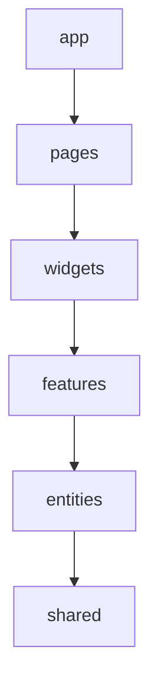

# Rental Hunt KE - Coding Standards & Engineering Handbook

> **Version:** 1.0
> **Status:** Draft
> **Owner:** Engineering
> **Related Documents:** [branding.md](./branding.md), [vision.md](./vision.md), [requirements.md](./requirements.md), [user-stories.md](./user-stories.md), [architecture.md](./architecture.md), [database.md](./database.md), [api-design.md](./api-design.md), [ui-guidelines.md](./ui-guidelines.md)

This is the authoritative engineering handbook for Rental Hunt KE. It governs code style, architectural implementation, naming, testing, documentation, Git workflow, and AI-assisted development. Every line of code written for this project — by a human or by an AI coding assistant — must conform to it. Where a rule here appears to conflict with `architecture.md`, `database.md`, `api-design.md`, or `ui-guidelines.md`, those documents win; this handbook operationalizes their decisions into checkable coding rules, it does not re-decide them.

---

# 1. Purpose

Rental Hunt KE is built by a solo developer collaborating with AI coding assistants. That context — no second engineer to catch drift in review, no institutional memory carried between sessions unless it's written down — is why this document exists and why it is stricter and more explicit than a typical team style guide.

Coding standards here serve five goals:

| Goal | Why it matters in this project specifically |
|---|---|
| **Consistency** | Code written in one session must look like code written in another, months apart, by a different AI session with no memory of the first. |
| **Quality** | Strong typing, tested repositories, and enforced separation of concerns substitute for the safety net a second engineer's review would normally provide. |
| **Predictability** | Anyone (including a future contributor) should be able to guess where a given piece of logic lives without searching — layer, naming, and folder placement are rule-driven, not case-by-case judgment. |
| **Easier reviews** | Solo development still needs a review checkpoint (§23, §26) — a documented standard turns "does this look right?" into a checklist, not a vibe. |
| **Easier AI collaboration** | An AI assistant re-derives context every session. A rule that's written down and specific ("no `any`", "repositories never contain business logic") survives across sessions; a rule that's only "understood" does not. |

---

# 2. Engineering Principles

| Principle | What it means here |
|---|---|
| **Simplicity over cleverness** | The obvious implementation beats the clever one. If a reviewer (including a future AI session) needs a comment to understand *what* the code does, rewrite it — comments should only ever explain *why* (§24). |
| **Readability over brevity** | A longer, self-explanatory name or an extra intermediate variable beats a dense one-liner. Optimize for the next reader's first pass, not for line count. |
| **Composition over inheritance** | No class hierarchies for UI or domain logic. Components compose (`ui-guidelines.md` §11.9's `Card.Header` pattern); behavior composes via hooks and small functions, not base classes and overrides. |
| **Reuse over duplication** | Three near-identical implementations are a signal to extract one, per `architecture.md`'s "no duplicated logic" principle — but see §2's companion rule below on premature abstraction. |
| **Explicit over implicit** | No magic — no implicit `any`, no silently-swallowed errors, no side effects hidden inside a getter. If something happens, it's visible in the function signature or the call site. |
| **Strong typing** | TypeScript's type system is the first line of defense against an entire class of bugs an AI-assisted, review-light workflow would otherwise miss silently (§6). |
| **Single responsibility** | A function, hook, component, service method, or repository method does exactly one job. If describing what something does requires "and", it's two things. |
| **Separation of concerns** | The Hook → Service → Repository chain (`architecture.md` §9, `api-design.md` §2) is not optional scaffolding — UI, business rules, and data access are never mixed in the same file. |
| **Mobile-first thinking** | Every component is designed and coded mobile-first (`ui-guidelines.md` §1) — write the unprefixed Tailwind classes first, layer breakpoints on top. |
| **Accessibility by default** | Accessibility is not a follow-up pass; it ships in the same commit as the feature (§15, `ui-guidelines.md` §17). |

**A companion rule, not a contradiction:** don't introduce an abstraction for a case that doesn't exist yet. Three similar lines of code are better than a premature helper function guessing at future variation. Reuse is extracted when a third real call site appears, not speculated about in advance.

---

# 3. Project Organization

The approved structure is Feature-Sliced Design (FSD), as defined in `architecture.md` §5. This section adds the import-direction rule that document didn't spell out.

```text
src/
├── app/          Bootstrap: providers, router, global config
├── pages/        Route-level composition
├── widgets/      Large reusable page sections
├── features/     Business functionality (owns components/hooks/services/repositories/schemas/types)
├── entities/     Domain models (types, mappers, validation, repository interfaces)
├── shared/       Framework-agnostic reusable code (ui, hooks, utils, constants, api client)
├── routes/       Route definitions
├── assets/
└── styles/
```

## 3.1 Layer Responsibilities & Ownership

| Layer | Owns | Must NOT contain |
|---|---|---|
| `app/` | App bootstrap, providers, router setup | Any feature-specific logic |
| `pages/` | Composing widgets/features into a route; minimal logic | Business logic, direct data fetching |
| `widgets/` | Large, reusable page sections composed from features/entities | Business logic (delegates to features) |
| `features/` | A specific business capability's components, hooks, services, repositories, schemas, types | Logic belonging to a different feature — cross-feature reuse goes through `entities/` or `shared/`, not a features-importing-features shortcut |
| `entities/` | Domain model types, mappers (snake_case ↔ camelCase, `api-design.md` §3.1), Zod validation schemas, repository interfaces | React components with business workflow logic (presentational domain components like `PropertyCard` are fine here; a booking wizard is not) |
| `shared/` | Presentation-only UI primitives (shadcn wrappers), generic hooks, utilities, constants, the Supabase client instance | Anything that knows about a specific domain concept (no `PropertyCard` in `shared/`, no booking logic in a "shared" hook) |

## 3.2 Import Direction Rule

Imports flow strictly downward. A layer may import from itself or any layer below it in this order — never upward, never sideways between sibling features:



- `shared/` imports nothing from any other layer — it is the floor.
- `entities/` may import only from `shared/`.
- `features/` may import from `entities/` and `shared/`, but **never from another feature**. If two features need the same logic, extract it into `entities/` or `shared/`.
- `widgets/` may import from `features/`, `entities/`, `shared/`.
- `pages/` may import from `widgets/`, `features/`, `entities/`, `shared/`.
- `app/` may import from anything.

## 3.3 Preventing Circular Dependencies

- The import-direction rule above is enforced by an ESLint rule (`eslint-plugin-boundaries` or an equivalent import-graph rule configured against these exact layer definitions) — not by convention alone. A PR that violates layer direction fails linting, it doesn't wait for a human to notice.
- `import/no-cycle` is enabled project-wide as a second, independent guard against any cycle the layer rule doesn't catch (e.g. two files within the same feature importing each other).
- If a genuine need arises for two features to share logic, the fix is always "move the shared part down a layer," never "add a one-off exception to the lint rule."

---

# 4. File Naming

| Artifact | Convention | Example |
|---|---|---|
| Component | `PascalCase.tsx` | `PropertyCard.tsx` |
| Page component | `PascalCase` + `Page` suffix | `HomePage.tsx`, `PropertyDetailPage.tsx` |
| Hook | `camelCase` + `use` prefix | `useProperties.ts`, `useCreateViewingRequest.ts` |
| Repository | `camelCase.repository.ts` | `property.repository.ts` |
| Service | `camelCase.service.ts` | `property.service.ts` |
| Zod schema | `camelCase.schema.ts` | `property.schema.ts` |
| Types | `camelCase.types.ts` | `property.types.ts` |
| Mapper | `camelCase.mapper.ts` | `property.mapper.ts` |
| Utility function file | `camelCase.ts`, named after the function | `formatCurrency.ts` |
| Constants | `camelCase.constants.ts` | `property.constants.ts` |
| Test file | co-located, `<subject>.test.ts(x)` | `property.repository.test.ts`, `PropertyCard.test.tsx` |
| Edge Function | `kebab-case` (Deno/Supabase CLI convention) | `send-booking-notifications/index.ts` |

**Exceptions:**
- `index.ts`/`index.tsx` barrel files are permitted only to re-export a feature/entity's public surface (what other layers are allowed to import) — never as a dumping ground that re-exports internals.
- shadcn/ui-generated primitive files keep the naming shadcn's CLI produces (`button.tsx`, lowercase) since they're vendor-managed inside `shared/ui` (§14) — this is a deliberate, scoped exception to the PascalCase component rule, not a precedent for hand-written components.

---

# 5. Folder Naming

- All folders are **lowercase**.
- Multi-word folders use **kebab-case**: `viewing-requests/`, `property-images/`, `forgot-password/`.
- Feature folders are named after the **user-facing capability**, typically plural when it represents a collection-oriented capability (`favorites/`, `viewing-requests/`) and singular when it represents a single flow (`authentication/`, `profile-management/`).
- Entity folders are always **singular**, named after the domain concept (`property/`, `agency/`, `agent/`) — an entity models one thing, not a collection of them.

```text
features/
├── authentication/
├── property-search/
├── favorites/
├── viewing-requests/
└── profile-management/

entities/
├── property/
├── agency/
├── agent/
└── amenity/
```

---

# 6. TypeScript Standards

| Rule | Standard |
|---|---|
| **Strict mode** | `"strict": true` in `tsconfig.json`, plus `noUncheckedIndexedAccess` and `noImplicitOverride`. Never weakened project-wide to "make something compile faster." |
| **No `any`** | Banned via `@typescript-eslint/no-explicit-any`. An escape hatch, if ever truly needed (e.g. a third-party type gap), requires `// eslint-disable-next-line` with a comment explaining why, reviewed as a flag, not a default. |
| **Prefer `unknown`** | Genuinely unknown input (e.g. a caught error, a JSON-parsed value) is typed `unknown` and narrowed via a type guard before use — never widened to `any` to make the type checker stop complaining. |
| **Interfaces vs. types** | `interface` for object shapes that represent an entity or props (`interface Property`, `interface PropertyCardProps`) — they support declaration merging and read as "a thing with these fields." `type` for unions, intersections, mapped/utility types, and function signatures (`type ViewingStatus = 'pending' \| ...`, `type AsyncState<T> = ...`). |
| **Readonly** | Function parameters that shouldn't be mutated by the callee are typed `readonly T[]` / `Readonly<T>`. Domain DTOs returned from Repositories (`api-design.md` §3.1) are treated as read-only by convention — a Service constructs a new object to make changes, it never mutates a Repository's return value in place. |
| **Enums** | **String literal union types are preferred over TypeScript `enum`** (`type PropertyStatus = 'available' \| 'reserved' \| 'occupied' \| 'hidden'`), matching the Postgres enum values verbatim (`database.md` §6) and the DTO shapes already defined in `api-design.md` §3.1/§14. TS `enum` is avoided because it doesn't serialize identically to the string the database/API actually sends, and const-enum has known tooling pitfalls. |
| **Generics** | Used for genuinely reusable shapes — `PaginatedResult<T>`, `AppResult<T>` — not introduced speculatively for a function with one caller. |
| **Discriminated unions** | Used for state that has a fixed set of mutually exclusive shapes: `AppError` variants (§16), async UI state (`{ status: 'idle' } \| { status: 'loading' } \| { status: 'error', error: AppError } \| { status: 'success', data: T }`). |
| **Utility types** | `Pick`, `Omit`, `Partial`, `Required` used to derive request/update input types from a canonical entity type rather than hand-duplicating a near-identical shape (e.g. `type UpdatePropertyInput = Partial<Pick<Property, 'title' \| 'description' \| 'rentAmount' \| ...>>`). |
| **Null handling** | `null` means "intentionally absent," matching a nullable Postgres column (`Profile.phone: string \| null`). `undefined` means "not yet provided / optional field," matching an optional request parameter. The two are never used interchangeably for the same field. |
| **Type assertions** | `as` is discouraged and requires a comment explaining why a type guard isn't possible. `as any` and non-null assertions (`!`) are effectively banned outside test fixtures. |
| **Type guards** | Custom `is` functions (`function isAppError(e: unknown): e is AppError`) are the standard way to narrow `unknown`/`unbound` values — used at every boundary where external data enters typed code (API responses, caught errors, `JSON.parse` results). |

```typescript
// Preferred
type ViewingStatus = 'pending' | 'confirmed' | 'completed' | 'cancelled' | 'no_show';

interface ViewingRequest {
  readonly id: string;
  status: ViewingStatus;
  // ...
}

function isAppError(error: unknown): error is AppError {
  return typeof error === 'object' && error !== null && 'code' in error;
}
```

---

# 7. React Standards

| Rule | Standard |
|---|---|
| **Functional components only** | No class components anywhere in application code. The one sanctioned exception is the Error Boundary primitive (§16), since React does not yet provide a hook-based equivalent — it lives once in `shared/` and is never reimplemented per-feature. |
| **Hooks only** | All state and lifecycle logic uses hooks. No lifecycle-method patterns, no HOCs as the default composition mechanism (composition is via children/render props/hooks, per the principle in §2). |
| **Component composition** | Prefer small, composed components (`Card`, `Card.Header`, `Card.Content`) over one large component with many conditional branches. If a component's JSX has more than ~2 levels of conditional nesting, it's a signal to extract. |
| **Props design** | Every component has an explicit, named `Props` interface (`PropertyCardProps`), destructured in the function signature. Boolean props are avoided when they multiply (`isCompact`, `isFeatured`, `isHighlighted` on the same component is a smell) — prefer a single `variant` discriminated-union prop instead. |
| **Controlled components** | All form inputs are controlled, via React Hook Form (§12) — never an uncontrolled `ref`-read-on-submit pattern outside of React Hook Form's own internal handling. |
| **Memoization** | `React.memo`/`useMemo`/`useCallback` are applied deliberately — for genuinely expensive computations, or to preserve referential stability for a memoized child/effect dependency — never reflexively wrapped around every component "just in case." Unnecessary memoization adds cognitive overhead without a measured benefit. |
| **Error boundaries** | One shared `<RouteErrorBoundary>` (the sanctioned class-component exception) wraps each top-level route in `pages/`, catching render-time errors and rendering the standard error empty-state (`ui-guidelines.md` §19). Feature code never defines its own bespoke error boundary. |
| **Lazy loading** | Route components are lazy-loaded via `React.lazy` + `Suspense` (`architecture.md` §17), with a route-level `Skeleton` (`ui-guidelines.md` §11.18) as the fallback. |
| **Code splitting** | Route-based, driven by the lazy-loading above — no manual `import()` splitting inside a single page unless a specific heavy dependency (e.g. the Leaflet map, §20) justifies an additional split point. |
| **Suspense** | Used for `React.lazy` route boundaries. TanStack Query is used in its standard (non-Suspense) mode for the MVP — one async-state pattern (§9), not two competing ones. |
| **Keys** | Always a stable, real identifier (`property.id`), never the array index, for any list that can reorder, filter, or have items added/removed. |
| **Children** | Typed as `React.ReactNode`. Render-prop patterns are used only when composition via children/props genuinely can't express the need — not reached for by default. |
| **Ref usage** | `forwardRef` is used only where DOM access is genuinely required (focus management, a shadcn primitive that already forwards a ref, e.g. wrapping `Input`). Refs are never used as a substitute for state to avoid a re-render. |

---

# 8. Hooks Standards

| Rule | Standard |
|---|---|
| **Custom hooks** | Every custom hook is prefixed `use` and lives in the `features/*/hooks` or `entities/*` folder of the domain it belongs to (§3). |
| **Naming** | Mirrors the Service method it wraps: `useProperties` wraps `propertyService.list`, `useCreateViewingRequest` wraps `viewingRequestService.create`. |
| **Responsibilities** | One hook, one responsibility — a query hook fetches; it does not also expose a mutation function "for convenience." If a screen needs both, it composes two hooks. |
| **Side effects** | Side effects (subscriptions, timers, realtime channel setup) live inside the hook that owns the related data, in a single `useEffect` with a complete, correct dependency array and cleanup function — never scattered across the consuming component. |
| **Query hooks** | Thin wrappers around TanStack Query's `useQuery`, with a project-standard query-key convention (`api-design.md` §24: `['properties', 'list', filters]`) and the Service call as the query function. Return the TanStack result shape directly (`data`, `isLoading`, `isError`, `error`) — components consume that shape, not a custom-reinvented one. |
| **Mutation hooks** | Wrap `useMutation`, handle cache invalidation (`queryClient.invalidateQueries`) on success, and wire up any Realtime-driven invalidation (`api-design.md` §11) in the same place — a mutation's side effects on the cache are documented in the hook, not left to the calling component to remember. |
| **Avoid unnecessary state** | Server data is never copied into a component's local `useState` "for convenience" — it's read from the TanStack Query cache every time. Local state is reserved for genuinely local, ephemeral UI state (§9). |

---

# 9. State Management

| State category | Tool | Examples |
|---|---|---|
| **Server state** | TanStack Query, exclusively | Property lists, viewing requests, profile data — anything that ultimately comes from Supabase. |
| **Form state** | React Hook Form | Every form field, validation state, submission state (§12). |
| **UI state (local)** | `useState`/`useReducer` | Dialog open/closed, active tab, hovered card, current gallery image index. |
| **UI state (cross-cutting)** | React Context, sparingly | Auth session (current `Profile`), theme — genuinely global concerns with few consumers, not a general prop-drilling escape hatch. |
| **Derived state** | Computed in render or `useMemo`, never re-stored | e.g. "is this property favorited" derived by checking the favorites query cache against the current property ID — never duplicated into its own `useState`. |

**When NOT to introduce global state:** if the motivation is "I don't want to pass this prop through two components," that is not sufficient justification — prefer component composition (pass the already-rendered child as `children`) first. Global state (Context or otherwise) is reserved for state that is genuinely needed in many unrelated places in the tree, which in this project's MVP scope is limited to the authenticated user's session. Redux and other global state libraries remain explicitly excluded (`architecture.md` §10).

---

# 10. Repository Pattern

Repositories are the **only** layer that talks to Supabase (`api-design.md` §2, §13).

| Responsibility | Detail |
|---|---|
| **Query abstraction** | Every Supabase call (`supabase.from()`, `.rpc()`, `.storage.*`, `.auth.*`) lives inside a Repository method. Nothing above the Repository constructs a Supabase query. |
| **No UI logic** | A Repository file never imports React, never returns JSX, never knows what a component or a Toast is. |
| **No business logic** | A Repository does not decide *whether* an operation should happen (that's the Service, §11) — it only performs the operation and shapes the result. The one exception is the thin structural validation a query itself requires (e.g. a well-formed UUID) — anything resembling a business rule belongs one layer up. |
| **Error handling** | Every Repository method funnels errors through the single shared `mapSupabaseError()` utility (`api-design.md` §15.3), throwing a typed `AppError` — never a raw Supabase/PostgREST error object. |
| **Return types** | Always the camelCase domain DTOs defined in `api-design.md` §3.1, mapped from the raw snake_case row via a co-located mapper (`property.mapper.ts`, §4) — never the raw Supabase response shape. |
| **Testing expectations** | Every Repository has both a unit test (against a fake Supabase client, asserting correct mapping and error normalization) and, for anything RLS-sensitive, an integration test against a local Supabase instance (`api-design.md` §21). |

```typescript
// property.repository.ts
export const propertyRepository: PropertyRepository = {
  async getBySlug(slug) {
    const { data, error } = await supabase
      .from('properties')
      .select('*, images:property_images(*), agent:agents(*, profile:profiles(full_name, avatar_url))')
      .eq('slug', slug)
      .single();

    if (error) throw mapSupabaseError(error, { notFoundCode: 'PROPERTY_NOT_FOUND' });
    return mapPropertyRow(data);
  },
};
```

---

# 11. Service Layer

Services sit between Hooks and Repositories (`architecture.md` §9) and own everything a Repository deliberately doesn't.

| Responsibility | Detail |
|---|---|
| **Business logic** | Decisions like "can this viewing request be cancelled given its current status" (§8.1's state machine, `api-design.md`) live here, checked *before* the Repository call so the user gets a fast, specific error rather than waiting on a database rejection. |
| **Validation** | Every Service method's public entry point runs its Zod schema (`api-design.md` §14) first — a Repository is never called with unvalidated input. |
| **Workflow orchestration** | Multi-step operations (upload an image to Storage, then create its `property_images` metadata row, `api-design.md` §10.1) are coordinated here, not left for the calling Hook to sequence. |
| **Multiple repository coordination** | A Service may call more than one Repository (e.g. resolving the current property's `agentId` before calling `viewingRequestRepository.create`) — this cross-repository orchestration is exactly why it doesn't belong inside a single Repository. |
| **No UI code** | Like Repositories, Services never import React or return JSX — they are plain, framework-agnostic TypeScript, which is also what keeps them straightforwardly unit-testable. |

```typescript
// viewingRequest.service.ts
export const viewingRequestService = {
  async create(input: unknown): Promise<ViewingRequest> {
    const parsed = CreateViewingRequestSchema.parse(input); // throws VALIDATION_ERROR on failure
    return viewingRequestRepository.create(parsed);
  },
  async cancel(id: string, reason?: string): Promise<ViewingRequest> {
    const current = await viewingRequestRepository.getById(id);
    if (!['pending', 'confirmed'].includes(current.status)) {
      throw new AppError('INVALID_STATE_TRANSITION', 'This viewing can no longer be cancelled.');
    }
    return viewingRequestRepository.cancel(id, reason);
  },
};
```

---

# 12. Forms

All forms use **React Hook Form** + **Zod** via `zodResolver`, per `architecture.md` §10 and `ui-guidelines.md` §14.

| Aspect | Standard |
|---|---|
| **Setup** | `useForm({ resolver: zodResolver(Schema), mode: 'onBlur' })` — validates on blur, matching `ui-guidelines.md`'s validation-timing rule. |
| **Validation** | The Zod schema is the single source of truth for a form's rules — no duplicate hand-written validation logic in the component. |
| **Error handling** | Field errors come from `formState.errors`, rendered via the shared `FieldError` component (`ui-guidelines.md` §11.2), wired to the input via `aria-describedby`. |
| **Submission flow** | `handleSubmit(onSubmit)` where `onSubmit` calls the relevant mutation hook (§8) — never the Repository or Service directly from the component. |
| **Loading state** | `formState.isSubmitting` (or the mutation hook's `isPending`) disables the submit button and shows its loading state (`ui-guidelines.md` §11.1); fields become read-only, not fully disabled, during submission. |
| **Success state** | A Toast (`ui-guidelines.md` §11.20) confirms success; the form either resets or the screen navigates, per that specific story's acceptance criteria — never left showing stale submitted values with no feedback. |

```typescript
const form = useForm<CreateViewingRequestInput>({
  resolver: zodResolver(CreateViewingRequestSchema),
  mode: 'onBlur',
});

const { mutate, isPending } = useCreateViewingRequest();

const onSubmit = form.handleSubmit((values) => mutate(values));
```

---

# 13. Styling Standards

**Tailwind CSS v4 only** — no CSS-in-JS, no styled-components, no Sass.

| Rule | Standard |
|---|---|
| **Utility-first** | Styling is expressed as Tailwind utility classes directly in JSX. No custom CSS class is written to replicate what a utility combination already does. |
| **Class ordering** | Enforced automatically via `prettier-plugin-tailwindcss` on save/commit — never manually maintained. Nobody hand-orders classes; the formatter does it. |
| **Reusable variants** | Component style variants (Button's `default`/`outline`/`ghost`, Badge's `success`/`warning`/`destructive`, `ui-guidelines.md` §11.1/§11.7) are defined once via `class-variance-authority` (`cva`), already the pattern shadcn/ui components use — never reimplemented as ad hoc conditional class strings per component. |
| **Responsive design** | Mobile-first: unprefixed classes first, `sm:`/`lg:`/`xl:` layered on top (`ui-guidelines.md` §8). |
| **Spacing consistency** | Only the spacing scale in `ui-guidelines.md` §6/§21 is used (`p-4`, `gap-6`, etc.). Arbitrary-value spacing (`mt-[13px]`) requires a specific justification comment — it is not a normal styling tool in this project. |
| **No inline styles** | `style={{}}` is banned except for a genuinely dynamic runtime value that cannot be expressed as a class (e.g. a computed percentage width for a progress bar) — never for anything expressible as a Tailwind utility. |
| **Minimal custom CSS** | The only project-level CSS is the `@theme` token block (`ui-guidelines.md` §21) and the `@font-face` declaration. Component-level custom CSS is avoided in favor of utilities + `cva`. |
| **CSS Modules** | Not used in this project. Tailwind utilities and `cva` cover every styling need identified so far. A CSS Module would only be justified for a complex, one-off animation with no reasonable Tailwind expression, and requires explicit sign-off before introduction — it is not a fallback reached for by default. |

---

# 14. shadcn/ui Standards

| Rule | Standard |
|---|---|
| **Use existing primitives first** | Before adding a new shadcn component via its CLI, check `shared/ui` for one already installed that composes to the need. |
| **Do not modify vendor code directly** | shadcn components are generated/copied into `shared/ui`, not npm-installed — but that does not make their internals a place for ad hoc edits. Once generated, a primitive's internal markup/ARIA wiring is treated as owned-but-stable; behavioral changes are made by wrapping, not by hand-editing the primitive's logic. |
| **Wrap when customization is needed** | Domain-specific behavior (a `PropertyBadge` that maps `verificationStatus` to a `Badge` variant, `ui-guidelines.md` §12.9) is a wrapper component in `entities/property`, composing the primitive — the primitive itself stays generic and reusable. |
| **Prefer composition** | Compound-component patterns (`Card`, `Card.Header`, `Card.Content`, `Dialog`, `Dialog.Trigger`) are used as shadcn/Radix already provide them — never flattened into a single component with a dozen boolean props trying to reproduce that flexibility. |
| **Accessibility requirements** | Radix-backed primitives already provide correct focus management and ARIA wiring (`ui-guidelines.md` §11) — these are never stripped, overridden, or worked around; if a primitive's default accessibility behavior seems wrong for a use case, that's a sign the wrong primitive was chosen, not a reason to patch around its accessibility. |

---

# 15. Accessibility Standards

Target: **WCAG 2.2 AA**, restated here as a coding-time checklist (full rationale in `ui-guidelines.md` §17).

| Area | Rule |
|---|---|
| **Semantic HTML** | `<nav>`, `<main>`, `<button>` for actions, `<a>` for navigation, `<table>` for tabular data — never a `<div>` with an `onClick` standing in for an interactive element. |
| **Keyboard navigation** | Every interactive element reachable and operable via `Tab`/`Enter`/`Space`/arrow keys as appropriate, in logical visual order. |
| **ARIA** | Added only where semantic HTML falls short (`aria-live` for Toasts, `aria-current` for active nav). Never used to patch broken markup that could instead be fixed. |
| **Labels** | Every form field has a programmatically associated `<Label>` — never a placeholder standing in as the only label. |
| **Focus management** | Modals/Drawers trap focus and return it to the trigger on close (`ui-guidelines.md` §9.6/§11.10); route changes move focus to the new page's `<h1>`. |
| **Color contrast** | Verified against the exact token values in `ui-guidelines.md` §4 — AA thresholds are a hard gate, not an eyeballed approximation. |
| **Reduced motion** | Every non-essential transition respects `prefers-reduced-motion: reduce` (`ui-guidelines.md` §18). |
| **Alt text** | Every `` has meaningful, descriptive `alt` text; purely decorative icons are `aria-hidden`. |
| **Touch targets** | Minimum 44×44px hit area on every interactive control, achieved via padding where the visual element is smaller. |

---

# 16. Error Handling

| Aspect | Standard |
|---|---|
| **Typed errors** | A single `AppError` class/discriminated union (`code`, `message`, optional `details`) is the only error shape that crosses the Repository boundary (§10, `api-design.md` §15). Native `Error`/Supabase errors never propagate past the Repository unmapped. |
| **User-friendly messages** | Every error the UI displays is written per `ui-guidelines.md` §20's copywriting standard — plain language, states what happened and how to fix it. Raw Postgres/Supabase error text is never shown to a user. |
| **Logging strategy** | See §22. |
| **Retry policy** | TanStack Query's default retry (exponential backoff, capped attempts) applies to transient network failures. `AppError`s representing a definite outcome (`VALIDATION_ERROR`, `FORBIDDEN`, `PROPERTY_NOT_AVAILABLE`) are never retried automatically — retrying a definite rejection just delays the user's correct next action. |
| **Unexpected errors** | Caught by the route-level Error Boundary (§7), logged with context (§22), and rendered as the standard "Something went wrong" empty state (`ui-guidelines.md` §19) — never a blank screen or an unhandled promise rejection in the console as the only signal. |
| **Empty states** | Every list-rendering component handles the zero-results case explicitly, per the scenarios and copy in `ui-guidelines.md` §19 — never left to silently render nothing. |
| **Loading states** | Every async operation renders a `Skeleton` (shape-known content) or an inline loading indicator (`Button`'s `isLoading`, §11.1) — never a layout that jumps once data arrives. |

---

# 17. API Usage

Restated as a coding rule from `api-design.md` §24 — see that document for full rationale:

- **Always go through a Repository.** No component, hook, or service bypasses the Repository to call Supabase directly.
- **Never call Supabase directly from a component.** This is checked in code review (§26) as a hard blocker, not a style nit.
- **Always route business logic through a Service**, even for operations that feel "simple enough to skip it" — consistency here is what keeps the Hook → Service → Repository chain trustworthy everywhere else.
- **Always validate with Zod** before a Service calls a Repository (§11, §14 of `api-design.md`).
- **Always use typed responses** — a Repository's return type is the camelCase DTO (`api-design.md` §3.1), never `any`, never the raw Supabase response.

---

# 18. Database Standards

Restated from `database.md` as coding-time rules — that document remains authoritative for the schema itself.

| Rule | Standard |
|---|---|
| **UUID usage** | Every entity table's primary key is `uuid`, generated with `gen_random_uuid()`. New tables follow this by default; a deviation (like `roles.code` or the composite-PK junctions) requires the same explicit documented justification `database.md` §2 gives its existing exceptions — not a silent new pattern. |
| **Composite keys for junction tables** | Pure many-to-many link tables use a composite primary key on their two foreign keys (`database.md` §2) — never a surrogate `id` "for consistency" on a table with no independent identity. |
| **Soft deletes** | Applied where other rows reference a record historically (`profiles`, `agencies`, `agents`, `properties`) via a nullable `deleted_at`. Pure reference tables and append-only logs do not get one. |
| **Audit fields** | `created_at`/`updated_at` on every mutable table, `updated_at` auto-stamped by the shared `set_updated_at()` trigger — never manually set by application code. |
| **Migrations** | Supabase CLI only (`supabase migration new`), timestamp-ordered, immutable once merged (`database.md` §13) — no direct schema edits via the Supabase dashboard in any shared environment. |
| **Indexes** | Every foreign key and every filterable/sortable column used by a real query gets an index, justified by a named consumer (`database.md` §8) — never spec'd speculatively. |
| **Naming conventions** | `snake_case` tables and columns, singular table-name-derived foreign keys (`agency_id`, not `agencyID` or `agency`). |
| **RLS considerations** | RLS is enabled on every table in `public`, no exceptions, ever — including new tables added after the MVP. "Just disable RLS to get this working" is never an acceptable resolution to a permission bug; the fix is always a corrected policy. |

---

# 19. Testing Standards

| Layer | Approach | Tooling |
|---|---|---|
| **Unit tests** | Pure functions, utilities, mappers, and Zod schema edge cases | Vitest (matches the existing Vite toolchain) |
| **Repository tests** | Unit: fake Supabase client, asserting mapping/error-normalization logic. Integration: real local Supabase instance (`supabase start`), asserting actual RLS behavior (`api-design.md` §21) | Vitest + a hand-rolled fake client for unit; Vitest against `localhost` Supabase for integration |
| **Service tests** | Business-rule and validation-orchestration logic, with Repositories mocked | Vitest |
| **Component tests** | Behavior-focused (what the user sees/can do), not implementation-detail focused (never asserting on internal state or class names) | React Testing Library |
| **Integration tests** | Full Hook → Service → Repository → local Supabase flow for the highest-stakes user journeys (booking creation, verification transitions) | Vitest + local Supabase |
| **End-to-end tests** *(future)* | Deferred until post-MVP stabilization — Playwright is the recommended tool when introduced, covering the golden paths in `user-stories.md` (register → search → book a viewing; agent creates → verifies → confirms a booking) | Playwright (future) |
| **Mocking Supabase** | A thin fake implementing only the client surface actually used, for fast unit tests (§10). Anything touching RLS, triggers, or real query correctness uses the local Supabase instance instead — a mock cannot fail an RLS policy, so it cannot catch the bugs that matter most. |
| **Accessibility tests** *(Sprint 8)* | Automated WCAG 2.2 AA checks (axe-core, zero critical/serious violations per `roadmap.md` §12/§21) against the primary screens (home, search, detail, both dashboards) plus form/dialog-heavy screens, real integration tests against seeded local Supabase data — not isolated component snapshots. | `jest-axe` (its matcher works against Vitest's `expect` too), extended onto `expect` in `src/test/setup.ts` |
| **Coverage goals** | No arbitrary blanket percentage target. Services and Repositories (the business-rule and data boundary) target **>80% line coverage** as a practical floor. Presentational components are tested for critical user flows and non-trivial conditional rendering, not exhaustively for every prop combination. |

---

# 20. Performance Standards

| Area | Standard |
|---|---|
| **Code splitting** | Route-based, via `React.lazy` (§7). |
| **Lazy loading** | Below-the-fold images use native `loading="lazy"`; the Leaflet map (`ui-guidelines.md` §12.11) loads lazily and never blocks initial page render. |
| **Image optimization** | Property images are served in optimized formats/sizes (`database.md` §5.9, `api-design.md` §12's `process-property-image` Edge Function); no unoptimized original is served directly to a card/thumbnail context. |
| **Memoization** | Applied deliberately (§7) — never as a default wrapper on every component. |
| **Pagination** | Cursor-based for the public property feed, offset-based for small bounded lists (`database.md` §14, `api-design.md` §16) — never a single unbounded fetch of "all rows." |
| **Virtualization** *(future)* | Deferred until a real list (a dashboard table, most plausibly) exceeds roughly 100 rendered rows in practice — not introduced speculatively for lists that are small today. |
| **Bundle size awareness** | A new dependency is checked against its bundle-size impact before being added; heavy libraries (charting, maps) are code-split rather than included in the main bundle. |
| **Caching** | TanStack Query `staleTime` is tuned per query type: reference data (`counties`, `propertyTypes`, `amenities`) uses a long or `Infinity` `staleTime` since it rarely changes; property listings use a short `staleTime` (seconds) since availability/verification can change; the current user's session/profile is cached for the session lifetime and invalidated explicitly on logout/profile update. |

---

# 21. Security Standards

| Area | Standard |
|---|---|
| **Authentication** | Supabase Auth exclusively; tokens are never handled manually outside `supabase-js`'s own session management (`api-design.md` §19). |
| **Authorization** | RLS (`database.md` §9) is the sole authority. Service-layer permission checks exist purely for fast, specific user-facing errors — never treated as the actual security boundary, and never used as a substitute for a correct RLS policy. |
| **Input validation** | Zod at the Service layer on every write, backstopped by Postgres `CHECK` constraints (§11, §18). |
| **Output encoding** | React's default JSX escaping is relied upon for all rendered text; rich text (`properties.description`) is additionally sanitized at write time (`requirements.md` §13.2) — defense in depth, not a single point of trust. |
| **Environment variables** | `.env.local` is gitignored; only `VITE_`-prefixed variables are exposed to the client bundle, and **no service-role key, provider secret, or Edge Function secret is ever prefixed `VITE_`** or otherwise bundled into frontend code. |
| **Secrets** | Live exclusively in Edge Function environment/Supabase project secrets — never in a frontend `.env` file, never committed, never logged (§22). |
| **RLS** | Enabled on every table, no exceptions (§18). |
| **Least privilege** | Repository queries select only the columns a DTO actually needs (`api-design.md` §19); RLS policies grant the narrowest row/column access each role's user stories require (`database.md` §9). |
| **Storage security** | Bucket policies enforce path-scoped ownership and MIME/size limits server-side, never trusting the client-side check alone (`database.md` §10, `api-design.md` §10.1). |

---

# 22. Logging & Monitoring

| Aspect | Standard |
|---|---|
| **Console usage** | `console.log` is not committed to the repository — it's a debugging tool removed before commit, enforced via an ESLint rule (`no-console`, allowing only `console.warn`/`console.error`). |
| **Development logging** | A single `logger` utility (`shared/lib/logger.ts`) wraps `console.warn`/`console.error` with contextual metadata (feature, action) — this is what code calls instead of `console.*` directly, so the transport can change without touching call sites. |
| **Production logging** | The same `logger` utility is the only logging call site in the codebase; in production it is a no-op for anything below `warn`, and `error`-level calls are the hook point for the future monitoring integration below. |
| **Future monitoring integrations** | A service like Sentry is the planned drop-in replacement for `logger`'s transport (swap the implementation behind the same interface) — no call-site changes anywhere in the app when it's introduced. Not implemented in the MVP. |
| **Error reporting** | The route-level Error Boundary (§7) and the Repository's `mapSupabaseError` (§10) both call `logger.error` with enough context to debug (route, action, error code) and explicitly **no PII** (no email, no full profile, no booking notes) — logging is for debugging the system, not for capturing user content. |

---

# 23. Git Standards

| Aspect | Standard |
|---|---|
| **Branch naming** | `feature/<slug>`, `fix/<slug>`, `chore/<slug>`, `docs/<slug>` — matching the commit-prefix taxonomy below. |
| **Commit message format** | [Conventional Commits](https://www.conventionalcommits.org/): `type(scope): summary`, imperative mood, no trailing period — e.g. `feat(viewing-requests): add cancellation reason field`. |
| **PR expectations (even solo)** | Every non-trivial change still goes through a Pull Request rather than a direct push to `main` — this is the checkpoint where the diff gets self-reviewed against the checklist in §26 before merging, the closest equivalent to a second reviewer this project has. |
| **Squash strategy** | Squash-merge to `main` — one logical commit per PR in the mainline history, regardless of how many WIP commits happened on the branch. |
| **Tagging releases** | Annotated Git tags at meaningful milestones (`v1.0.0` at MVP launch), never on every merge. |
| **Semantic versioning** | `MAJOR.MINOR.PATCH` — `MAJOR` for breaking API/schema changes requiring migration, `MINOR` for new features, `PATCH` for fixes. Pre-MVP work stays under `v0.x.y`. |

## Commit Prefixes

| Prefix | Use for |
|---|---|
| `feat:` | A new user-facing capability |
| `fix:` | A bug fix |
| `refactor:` | Code restructuring with no behavior change |
| `docs:` | Documentation-only changes (including these `docs/*.md` files) |
| `test:` | Adding or updating tests only |
| `chore:` | Tooling, dependencies, config — no application code change |
| `perf:` | A performance improvement |
| `style:` | Formatting-only changes (no logic change) — rare, since Prettier/ESLint handle most of this automatically |

---

# 24. Documentation Standards

| Aspect | Standard |
|---|---|
| **JSDoc usage** | Added only to exported functions whose behavior isn't obvious from their name and TypeScript signature alone — typically Repository/Service methods with a non-obvious constraint (e.g. "throws `PROPERTY_NOT_AVAILABLE` if..."). Not blanket-applied to every function. |
| **README updates** | Kept current with local setup/run instructions only — it does not duplicate the content of `docs/*.md`, it points to this handbook and the other approved documents. |
| **Architecture updates** | Any change that alters folder structure, a Repository contract, a database table, or a design token updates the corresponding `docs/*.md` file **in the same PR** — a structural change and its documentation are one unit of work, not two. |
| **Decision records** | A deviation from an approved document significant enough to need explaining is recorded as a dated entry (what changed, why, what it supersedes) rather than silently diverging from what's written — this project's equivalent of a lightweight ADR log. |
| **Code comments** | Comments explain **why**, never **what** — a hidden constraint, a workaround for a specific bug, a non-obvious invariant. If removing a comment wouldn't confuse the next reader, it shouldn't have been written. |
| **Inline documentation** | Minimized by default — clear naming and strong typing (§6) carry most of the meaning that would otherwise need a comment. |
| **When comments should NOT be written** | Restating what the code obviously does; narrating routine steps; a bare `// TODO` with no explanation (§25); commented-out dead code (delete it — Git history is the record, not a comment block). |

---

# 25. AI Collaboration Standards

Explicit, checkable rules for Claude Code (or any AI agent) working on this repository — the operational core of this document's purpose (§1).

1. **Read the relevant `docs/*.md` before writing code.** Check `architecture.md`, `database.md`, `api-design.md`, and `ui-guidelines.md` for the feature area being touched before assuming a pattern.
2. **Never invent architecture.** No new top-level folder, layer, or cross-cutting pattern outside FSD (§3) without first proposing the change and updating `architecture.md` — architecture changes are a documented decision, not an implementation-time improvisation.
3. **Never bypass Repositories.** No `supabase.*` call outside a Repository file, under any circumstance, including "quick" scripts or one-off fixes (§17).
4. **Never duplicate components or logic.** Search `shared/ui` and `entities/*` before creating a new component (`ui-guidelines.md` §22); search existing Repository/Service methods before writing a new near-duplicate one.
5. **Update documentation when architecture changes**, in the same change, per §24 — not as a follow-up "docs pass" that may never happen.
6. **Prefer editing existing files over creating new ones**, consistent with this project's general working style — a new file is justified by a genuine new responsibility, not convenience.
7. **Never leave a TODO without an explanation.** A `// TODO` states what is deferred, why it's deferred now, and — where one exists — which future story (`user-stories.md` ID) or roadmap item covers it.
8. **Always explain tradeoffs before a large refactor.** A restructuring that touches many files is proposed and reasoned about before being executed, not discovered by the developer after the fact in a large diff.
9. **Stop and ask when requirements conflict** — between two `docs/*.md` files, between a request and an approved decision, or between an instruction and this handbook — rather than silently picking one interpretation. A wrong guess compounds; a clarifying question does not.
10. **Treat this handbook as binding, not advisory.** If a shortcut would violate a rule here to move faster, the shortcut is the wrong call — flag the tension instead of quietly taking it.

---

# 26. Code Review Checklist

Applied to every Pull Request (§23), whether self-reviewed or AI-assisted:

- [ ] **Architecture:** Code lives in the correct FSD layer (§3); import direction is respected; no component bypasses Hook → Service → Repository (§17).
- [ ] **Naming:** Files, folders, and identifiers follow §4/§5.
- [ ] **Typing:** No `any`; strict mode compiles clean; enums are string-literal unions, not TS `enum` (§6).
- [ ] **Accessibility:** Semantic HTML, labeled inputs, keyboard-operable, focus managed, contrast holds (§15).
- [ ] **Security:** No direct Supabase calls from components; RLS relied upon, not duplicated-and-trusted client-side; no secret ever appears in frontend code (§21).
- [ ] **Performance:** No reflexive/unnecessary memoization; images optimized; the correct pagination mode is used (§20).
- [ ] **Documentation:** JSDoc present on any non-obvious exported function; relevant `docs/*.md` updated if this PR changes architecture, schema, or API contract (§24).
- [ ] **Testing:** New Service/Repository logic has tests meeting the §19 coverage floor; critical new user flows have a component/integration test.
- [ ] **Error handling:** Loading, empty, and error states are all handled explicitly (§16); errors surfaced to the user are friendly, not raw (§16).
- [ ] **UI consistency:** Only semantic color tokens are used (no hardcoded colors/hex); components match `ui-guidelines.md`'s documented variants and states.

---

# 27. Definition of Done

A feature is **done** only when every item below is true — not when the happy path works:

- [ ] **Implementation** satisfies every acceptance criterion in its `user-stories.md` entry.
- [ ] **Tests** are written and passing per the coverage expectations in §19 for every layer touched.
- [ ] **Documentation** is updated — relevant `docs/*.md`, plus JSDoc on any non-obvious new exported function (§24).
- [ ] **Accessibility** has been verified: keyboard navigation works, labels/ARIA are correct, contrast passes (§15).
- [ ] **Responsive behavior** has been checked across mobile/tablet/desktop per `ui-guidelines.md` §16.
- [ ] **Performance** has no obvious regression — appropriate pagination, optimized images, no unnecessary re-renders introduced (§20).
- [ ] **Linting** passes with zero errors.
- [ ] **Type checking** (`tsc --noEmit`) passes clean.
- [ ] **Review** — the PR has been opened and self-reviewed (or reviewed by the user) against the §26 checklist before merge.

---

# 28. Engineering Decision Summary

| Area | Decision | Rationale |
|---|---|---|
| Architecture | Feature-Sliced Design with a strict, lint-enforced downward import rule (§3) | Predictable file placement and no circular dependencies, without relying on a human reviewer to notice a violation. |
| Data access | Hook → Service → Repository, no exceptions (§10, §11, §17) | Preserves the Supabase-migration insurance `architecture.md` already committed to, and keeps business rules out of components. |
| TypeScript | Strict mode, no `any`, string-literal unions over `enum`, `unknown` + type guards at boundaries (§6) | Matches the DTO shapes already defined in `api-design.md` and closes the most common source of AI-introduced runtime bugs. |
| React | Functional components + hooks only, one sanctioned class-component exception (Error Boundary) (§7) | Consistency with the rest of the stack; React 19 has no hook-based error boundary yet. |
| State | TanStack Query for all server state, Context reserved for auth/theme only, no Redux (§9) | Matches `architecture.md` §10 exactly; avoids a second, competing source of truth for server data. |
| Styling | Tailwind v4 utilities + `cva` only, no CSS Modules by default, semantic tokens only (§13, §14) | Matches `ui-guidelines.md`'s token system; removes an entire category of hardcoded-color bugs. |
| Testing | Vitest for unit/integration, RTL for components, Playwright deferred, real local Supabase for RLS-sensitive tests (§19) | Mocks can't fail an RLS policy — the tests that matter most need the real thing. |
| Errors | One `AppError` shape, normalized once at the Repository boundary, never a raw Postgres error shown to a user (§16) | One error language for every layer above the Repository, matching `api-design.md` §15. |
| Security | RLS is the sole authorization authority; Service-layer checks are UX-only; secrets never reach the frontend bundle (§21) | Defense-in-depth without ever mistaking the convenience layer for the security layer. |
| Git | Conventional Commits, squash-merged PRs even solo, semantic version tags (§23) | A readable mainline history and a real review checkpoint despite having one contributor. |
| AI collaboration | Explicit, checkable rules (§25) treated as binding, not advisory | The standards only work if an AI session with no memory of this conversation still follows them — that requires them to be rules, not assumed norms. |

---

This document is the single source of truth for how code is written on Rental Hunt KE. It should be updated whenever a standard changes, and kept consistent with `branding.md`, `vision.md`, `requirements.md`, `user-stories.md`, `architecture.md`, `database.md`, `api-design.md`, and `ui-guidelines.md` as the project evolves.
