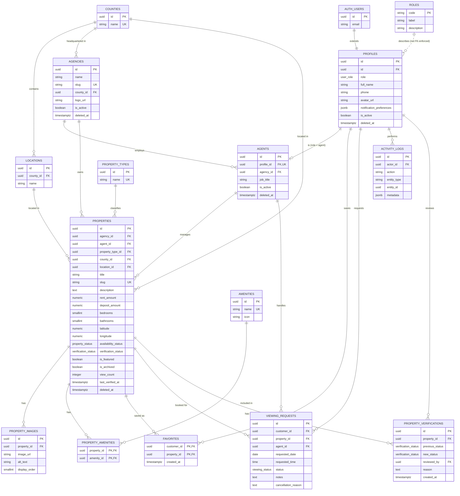
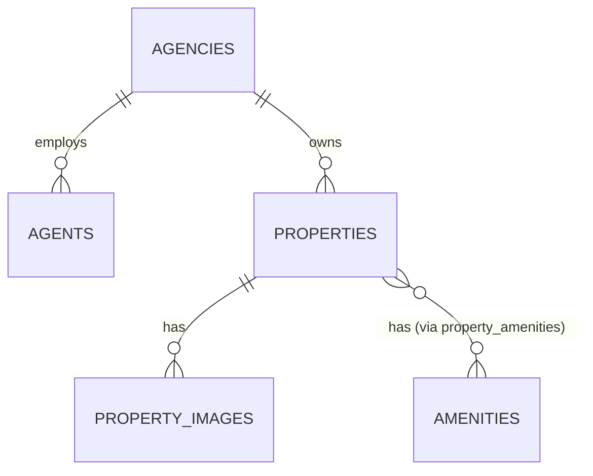
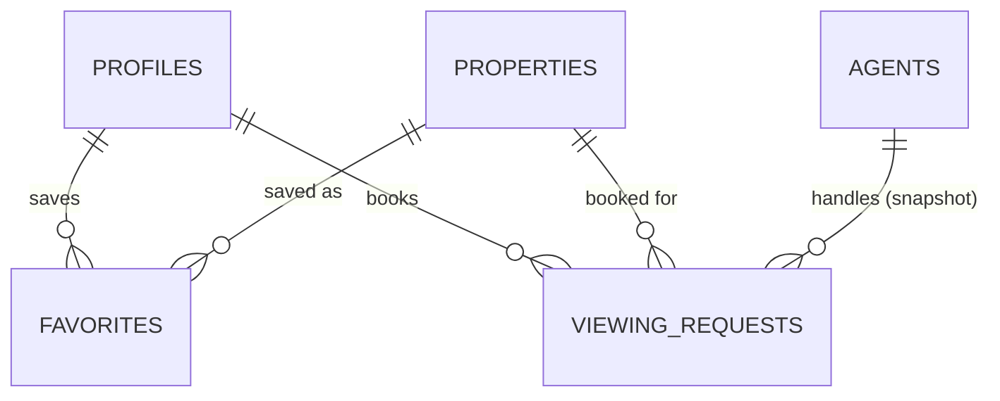

# Rental Hunt KE - Database Architecture

> **Version:** 1.0
> **Status:** Draft
> **Owner:** Engineering Team
> **Project:** Rental Hunt KE
> **Related Documents:** [branding.md](./branding.md), [vision.md](./vision.md), [requirements.md](./requirements.md), [user-stories.md](./user-stories.md), [architecture.md](./architecture.md)

---

# 1. Purpose

This document is the authoritative database design specification for Rental Hunt KE. It defines every table, relationship, constraint, index, Row Level Security (RLS) policy, and storage bucket required to implement the MVP described in `requirements.md` and `user-stories.md`, on the technology stack committed to in `architecture.md` (Supabase PostgreSQL, Supabase Auth, Supabase Storage, Supabase Realtime).

Its goals are to:

- Give engineers an implementation-ready schema they can migrate directly into Supabase.
- Ensure every functional requirement in `requirements.md` has a corresponding data structure.
- Encode authorization (RBAC) at the database layer via RLS, consistent with architecture.md's principle that "the frontend must never rely solely on hidden UI elements to enforce permissions."
- Establish naming, typing, and constraint conventions that remain consistent as the schema grows.
- Document explicitly what is **not** being built in the MVP (payments, lease management, property management operations, multi-agency support), so the schema doesn't silently grow beyond the approved scope.

This document is the single source of truth for database structure. Application code, migrations, and seed scripts must conform to it; any schema change should be reflected here first.

---

# 2. Design Principles

The schema adheres to the following principles, in order of priority when trade-offs arise:

1. **PostgreSQL best practices.** Use native types (`uuid`, `timestamptz`, `numeric`, `jsonb`, enums) instead of encoding structure into strings. Use `timestamptz` everywhere, never bare `timestamp`.
2. **Third Normal Form where appropriate.** Every non-key column depends on the whole key and nothing but the key. Deliberate, documented denormalization (e.g. a booking's `agent_id`) is only used where it protects historical accuracy, never for query convenience alone.
3. **UUID primary keys.** Every entity table uses a surrogate `uuid` primary key generated with `gen_random_uuid()`. This avoids exposing sequential IDs (enumeration risk), simplifies client-side optimistic inserts, and matches Supabase Auth's `auth.users.id` type.
   - **Documented exception — junction tables.** Pure many-to-many link tables (`property_amenities`, `favorites`) use a **composite primary key** on the two foreign keys instead of a surrogate UUID. A junction row has no identity beyond the pair it links; adding a surrogate key would only add an unused column and a redundant `UNIQUE` constraint. This is a deliberate, scoped exception, not a departure from the principle for entity tables.
   - **Documented exception — `roles`.** The `roles` table uses its `code` (`text`) as primary key rather than a UUID, because it exists purely to mirror the values of the `user_role` enum for UI/display purposes (see §6). A natural key keeps it self-evidently in sync with the enum it describes.
4. **Strong referential integrity.** Every foreign key has an explicit `ON DELETE` behavior (`CASCADE`, `RESTRICT`, or `SET NULL`) chosen deliberately per relationship — never left to default.
5. **Soft deletes where appropriate.** Tables representing durable business records that other rows reference historically (`profiles`, `agencies`, `agents`, `properties`) use a nullable `deleted_at` column instead of hard deletes, preserving referential integrity for historical bookings and audit logs. Pure reference/lookup tables and append-only logs do not need soft deletes. Two independent "hidden" mechanisms exist on `properties` and must not be confused: `is_archived` (a reversible, agent-facing business action — see `AGENT-004`) and `deleted_at` (an irreversible-in-practice, admin-only removal for data retention).
6. **Auditability.** State-changing actions on trust-sensitive entities (verification, booking status, availability) are recorded in an append-only `activity_logs` table (§11), independent of the mutable rows themselves.
7. **Future scalability.** The schema anticipates multi-agency growth, payments, notifications, and reviews (§15) without requiring the MVP tables to be reshaped — only extended.
8. **Minimal duplication.** Reference data (counties, locations, property types, amenities) lives in dedicated lookup tables rather than being repeated as free text on every property.
9. **Efficient querying.** Every foreign key, every filterable column, and every slug/unique lookup column is indexed (§8).
10. **Clear naming conventions.** All identifiers are `snake_case`. Tables are plural nouns (`properties`, `agencies`). Foreign keys are named `<singular_referenced_table>_id` (e.g. `agency_id`, `property_id`). Enum types are named `<name>` in `snake_case` and their PostgreSQL values are lowercase `snake_case` strings. Booleans are prefixed `is_`/`has_`. Timestamps end in `_at`; dates end in `_date`; times end in `_time`.

---

# 3. High-Level Domain Model



**Notes on the diagram:**
- `AUTH_USERS` is Supabase's built-in `auth.users` table, shown only to anchor `profiles`. It is not created or modified by this schema.
- `ROLES` is linked with a dotted, non-FK-enforced relationship — see §4.1 and §6 for why `profiles.role` is an enum rather than a foreign key.

---

# 4. Core Entities

## 4.1 Identity

### `profiles`
The application-level identity record for every authenticated user (Customer, Agent, Moderator, Admin). Extends Supabase's `auth.users` 1:1. Guests are unauthenticated visitors and therefore have no row anywhere in this schema.

### `roles`
A metadata-only reference table describing the four persisted values of the `user_role` enum (label, description, sort order) for use in admin UI and documentation. It is **not** foreign-keyed from `profiles.role` — see the rationale in §2 and §6.

## 4.2 Business

### `agencies`
The organization that owns and is accountable for a portfolio of properties. Every property belongs to exactly one agency (multi-agency-per-property is explicitly out of scope — see `FUT-004`).

### `agents`
An agent-specific extension of a `profiles` row (`role = 'agent'`). Holds agency membership and agent-only attributes (job title, bio) that don't belong on every profile.

### `properties`
The core listing entity: a rental unit advertised on the platform, owned by an agency and managed day-to-day by one assigned agent.

### `property_images`
Ordered gallery images belonging to a property, with metadata only — binary files live in Supabase Storage (§10).

### `amenities`
A curated, admin-managed catalogue of amenity types (parking, WiFi, borehole, etc.).

### `property_amenities`
The many-to-many join between `properties` and `amenities`.

## 4.3 Customer

### `favorites`
The many-to-many join recording which customers have saved which properties.

### `viewing_requests`
A customer's request to physically view a property, tracked through its full lifecycle (pending → confirmed → completed/cancelled/no_show).

## 4.4 Reference

### `counties`
Kenya's 47 counties (or a relevant subset for MVP), used to scope agencies and properties geographically.

### `locations`
Neighborhoods/areas within a county (e.g. Kilimani, Westlands within Nairobi), used for property search and display.

### `property_types`
The catalogue of property categories (Apartment, Bedsitter, Studio, Townhouse, etc.).

## 4.5 System

### `activity_logs`
An append-only audit trail of trust-sensitive and security-relevant events across the platform (§11).

### `property_verifications`
An append-only, structured history of every verification status transition on a property — who reviewed it, the previous and new status, and the reason. Kept separate from `activity_logs` because verification is a trust-critical, frequently-reported-on workflow (FR-DASH-010/011) that benefits from typed, queryable columns rather than opaque JSON metadata (see §5.15, §11).

## 4.6 Future Entities (not implemented in MVP)

`payments`, `subscriptions`, `notifications`, and `reviews` are sketched directionally in §15. They are explicitly excluded from this release per the constraints in this task and the "Out of Scope" section of `vision.md`.

---

# 5. Detailed Table Specifications

Conventions used throughout this section:
- All primary keys default to `gen_random_uuid()` unless noted otherwise.
- All tables with an `updated_at` column use a shared trigger (`set_updated_at()`) that stamps `now()` on every `UPDATE`.
- `ON DELETE` behavior is specified explicitly for every foreign key.

## 5.1 `profiles`

**Purpose:** Stores application-level data for every authenticated user, one row per Supabase Auth user, and is the anchor for role-based authorization.

| Column | Type | Nullable | Description |
|---|---|---|---|
| `id` | `uuid` | No | Primary key. Same value as `auth.users.id`. |
| `role` | `user_role` (enum) | No | Default `'customer'`. See §6. |
| `full_name` | `text` | No | Display name. |
| `phone` | `text` | Yes | E.164-formatted phone number. |
| `avatar_url` | `text` | Yes | Path/URL into the `avatars` storage bucket. |
| `notification_preferences` | `jsonb` | No | Default `'{}'`. Per-category opt-in/out flags (`CUST-004`). |
| `is_active` | `boolean` | No | Default `true`. Allows disabling an account without deleting it. |
| `created_at` | `timestamptz` | No | Default `now()`. |
| `updated_at` | `timestamptz` | No | Default `now()`, auto-updated. |
| `deleted_at` | `timestamptz` | Yes | Soft-delete marker. |

**Primary Key:** `id`
**Foreign Keys:** `id` → `auth.users.id` (`ON DELETE CASCADE`) — created via a Postgres trigger (`handle_new_user`) on `auth.users` insert, not by direct client insert.
**Unique Constraints:** `id` (inherently unique as PK).
**Indexes:** `role` (partial, `WHERE deleted_at IS NULL`) — supports RLS role checks and admin user-management filtering.

---

## 5.2 `roles`

**Purpose:** Read-only reference metadata describing the four values of `user_role`, for display in admin/agent UI. Does not participate in referential integrity.

| Column | Type | Nullable | Description |
|---|---|---|---|
| `code` | `text` | No | Primary key. Matches a `user_role` enum value exactly. |
| `label` | `text` | No | Human-readable name (e.g. "Agent"). |
| `description` | `text` | Yes | Short explanation of the role's scope. |
| `sort_order` | `smallint` | No | Default `0`. Controls display order in admin UI. |

**Primary Key:** `code`
**Foreign Keys:** None.
**Unique Constraints:** `code` (PK).
**Indexes:** None beyond the PK — table has exactly 4 rows.

---

## 5.3 `agencies`

**Purpose:** The organization that owns a portfolio of properties and employs agents.

| Column | Type | Nullable | Description |
|---|---|---|---|
| `id` | `uuid` | No | Primary key. |
| `name` | `text` | No | Agency display name. |
| `slug` | `text` | No | URL-safe unique identifier. |
| `description` | `text` | Yes | Public-facing description. |
| `logo_url` | `text` | Yes | Path into the `agency-logos` bucket. |
| `phone` | `text` | Yes | Public contact number. |
| `email` | `text` | Yes | Public contact email. |
| `county_id` | `uuid` | Yes | Headquarters county. |
| `is_active` | `boolean` | No | Default `true`. |
| `created_at` | `timestamptz` | No | Default `now()`. |
| `updated_at` | `timestamptz` | No | Default `now()`, auto-updated. |
| `deleted_at` | `timestamptz` | Yes | Soft-delete marker. |

**Primary Key:** `id`
**Foreign Keys:** `county_id` → `counties.id` (`ON DELETE SET NULL`).
**Unique Constraints:** `slug`.
**Indexes:** `slug` (unique, supports agency profile pages), `county_id`.

---

## 5.4 `agents`

**Purpose:** Agent-specific attributes and agency membership for a `profiles` row with `role = 'agent'`.

| Column | Type | Nullable | Description |
|---|---|---|---|
| `id` | `uuid` | No | Primary key. |
| `profile_id` | `uuid` | No | The underlying identity. |
| `agency_id` | `uuid` | No | The agency this agent works for. |
| `job_title` | `text` | Yes | e.g. "Senior Leasing Agent". |
| `bio` | `text` | Yes | Public-facing bio shown on property details (`PROP-005`). |
| `is_active` | `boolean` | No | Default `true`. Disables an agent without deleting history. |
| `created_at` | `timestamptz` | No | Default `now()`. |
| `updated_at` | `timestamptz` | No | Default `now()`, auto-updated. |
| `deleted_at` | `timestamptz` | Yes | Soft-delete marker. |

**Primary Key:** `id`
**Foreign Keys:**
- `profile_id` → `profiles.id` (`ON DELETE CASCADE`)
- `agency_id` → `agencies.id` (`ON DELETE RESTRICT`) — an agency cannot be deleted while it still has agents.

**Unique Constraints:** `profile_id` (enforces the 1:1 relationship — one profile is at most one agent record).
**Indexes:** `agency_id` (list agents per agency), `profile_id` (unique index, doubles as FK lookup).

---

## 5.5 `counties`

**Purpose:** Reference list of Kenyan counties.

| Column | Type | Nullable | Description |
|---|---|---|---|
| `id` | `uuid` | No | Primary key. |
| `name` | `text` | No | e.g. "Nairobi". |
| `created_at` | `timestamptz` | No | Default `now()`. |

**Primary Key:** `id`
**Foreign Keys:** None.
**Unique Constraints:** `name`.
**Indexes:** `name` (unique).

---

## 5.6 `locations`

**Purpose:** Neighborhoods/areas within a county, used for property search and display (FR-SEARCH-001, `DISC-002`).

| Column | Type | Nullable | Description |
|---|---|---|---|
| `id` | `uuid` | No | Primary key. |
| `county_id` | `uuid` | No | Parent county. |
| `name` | `text` | No | e.g. "Kilimani". |
| `created_at` | `timestamptz` | No | Default `now()`. |

**Primary Key:** `id`
**Foreign Keys:** `county_id` → `counties.id` (`ON DELETE CASCADE`).
**Unique Constraints:** (`county_id`, `name`) — a neighborhood name is unique within its county.
**Indexes:** `county_id`, and the composite unique index above (also serves lookups by county).

---

## 5.7 `property_types`

**Purpose:** Reference catalogue of property categories (FR-SEARCH-003).

| Column | Type | Nullable | Description |
|---|---|---|---|
| `id` | `uuid` | No | Primary key. |
| `name` | `text` | No | e.g. "Apartment", "Bedsitter", "Studio". |
| `created_at` | `timestamptz` | No | Default `now()`. |

**Primary Key:** `id`
**Foreign Keys:** None.
**Unique Constraints:** `name`.
**Indexes:** `name` (unique).

---

## 5.8 `properties`

**Purpose:** The core rental listing entity.

| Column | Type | Nullable | Description |
|---|---|---|---|
| `id` | `uuid` | No | Primary key. |
| `agency_id` | `uuid` | No | Owning agency. |
| `agent_id` | `uuid` | No | Currently assigned managing agent (FR-PROP-008). |
| `property_type_id` | `uuid` | No | e.g. Apartment. |
| `county_id` | `uuid` | No | County the property is in. |
| `location_id` | `uuid` | No | Neighborhood within the county. |
| `title` | `text` | No | Listing title (FR-PROP-001). |
| `slug` | `text` | No | URL-safe identifier for `/properties/:slug`. |
| `description` | `text` | No | Full description (FR-PROP-002). |
| `latitude` | `numeric(9,6)` | No | For map display (FR-PROP-013). |
| `longitude` | `numeric(9,6)` | No | For map display (FR-PROP-013). |
| `bedrooms` | `smallint` | No | FR-SEARCH-004. |
| `bathrooms` | `smallint` | No | Supplementary to FR-PROP requirements. |
| `rent_amount` | `numeric(12,2)` | No | Monthly rent, FR-PROP-004. |
| `deposit_amount` | `numeric(12,2)` | No | FR-PROP-005. |
| `currency` | `text` | No | Default `'KES'`. |
| `availability_status` | `property_status` (enum) | No | Default `'available'`. FR-PROP-006. |
| `verification_status` | `verification_status` (enum) | No | Default `'unverified'`. FR-DASH-010. |
| `last_verified_at` | `timestamptz` | Yes | FR-PROP-007. Cached from the latest row in `property_verifications` (§5.15) where `new_status = 'verified'`; kept denormalized here purely so the property detail/list queries don't need a join for a value they show on every card. |
| `verified_by` | `uuid` | Yes | Moderator/Admin profile that last verified the listing. Same caching rationale as `last_verified_at`; `property_verifications` is the source of truth for the full history. |
| `is_featured` | `boolean` | No | Default `false`. Curated homepage placement (FR-HOME-002). |
| `is_archived` | `boolean` | No | Default `false`. Agent-initiated hide (`AGENT-004`). |
| `view_count` | `integer` | No | Default `0`. Simple counter feeding `AGENT-008` analytics. |
| `created_at` | `timestamptz` | No | Default `now()`. |
| `updated_at` | `timestamptz` | No | Default `now()`, auto-updated. |
| `deleted_at` | `timestamptz` | Yes | Soft-delete marker (admin-only, rarely used). |

**Primary Key:** `id`
**Foreign Keys:**
- `agency_id` → `agencies.id` (`ON DELETE RESTRICT`)
- `agent_id` → `agents.id` (`ON DELETE RESTRICT`)
- `property_type_id` → `property_types.id` (`ON DELETE RESTRICT`)
- `county_id` → `counties.id` (`ON DELETE RESTRICT`)
- `location_id` → `locations.id` (`ON DELETE RESTRICT`)
- `verified_by` → `profiles.id` (`ON DELETE SET NULL`)

**Unique Constraints:** `slug`.
**Check Constraints:**
- `bedrooms >= 0`, `bathrooms >= 0`, `rent_amount > 0`, `deposit_amount >= 0`.
- `is_featured = false OR verification_status = 'verified'` — a property cannot be featured unless verified (backstops FR-DASH-011; see also the trigger in §9).

**Indexes:**
- `slug` (unique, powers property detail lookups).
- `agency_id`, `agent_id` (dashboard queries — `AGENT-001`, `BOOK-001`).
- Composite `(county_id, property_type_id, bedrooms, rent_amount)` — the primary search/filter path (`DISC-003`).
- Partial index on `(availability_status, verification_status) WHERE is_archived = false AND deleted_at IS NULL` — the "public browse" hot path.
- `is_featured` (partial, `WHERE is_featured = true`) — homepage query (`DISC-005`).
- GIN index on `to_tsvector('english', title || ' ' || description)` — supports future free-text search without a schema change.

---

## 5.9 `property_images`

**Purpose:** Ordered gallery images for a property (FR-PROP-009–011).

| Column | Type | Nullable | Description |
|---|---|---|---|
| `id` | `uuid` | No | Primary key. |
| `property_id` | `uuid` | No | Parent property. |
| `image_url` | `text` | No | Path/URL into the `property-images` bucket. |
| `alt_text` | `text` | Yes | Accessibility text (`SYS-008`). |
| `display_order` | `smallint` | No | Default `0`. Controls gallery ordering. |
| `created_at` | `timestamptz` | No | Default `now()`. |

**Primary Key:** `id`
**Foreign Keys:** `property_id` → `properties.id` (`ON DELETE CASCADE`) — deleting a property removes its image metadata.
**Unique Constraints:** None (gaps/duplicates in `display_order` are tolerated; ordering is relative, not strict).
**Indexes:** `(property_id, display_order)` — powers the gallery query in one indexed scan.

---

## 5.10 `amenities`

**Purpose:** Curated catalogue of amenity types (FR-PROP-012).

| Column | Type | Nullable | Description |
|---|---|---|---|
| `id` | `uuid` | No | Primary key. |
| `name` | `text` | No | e.g. "Parking", "WiFi", "Borehole". |
| `icon` | `text` | Yes | Icon key used by the frontend. |
| `created_at` | `timestamptz` | No | Default `now()`. |

**Primary Key:** `id`
**Foreign Keys:** None.
**Unique Constraints:** `name`.
**Indexes:** `name` (unique).

---

## 5.11 `property_amenities`

**Purpose:** Many-to-many join between properties and amenities.

| Column | Type | Nullable | Description |
|---|---|---|---|
| `property_id` | `uuid` | No | Part of composite PK. |
| `amenity_id` | `uuid` | No | Part of composite PK. |
| `created_at` | `timestamptz` | No | Default `now()`. |

**Primary Key:** (`property_id`, `amenity_id`) — composite (see §2, documented exception).
**Foreign Keys:**
- `property_id` → `properties.id` (`ON DELETE CASCADE`)
- `amenity_id` → `amenities.id` (`ON DELETE CASCADE`)

**Indexes:** The composite PK covers `property_id`-first lookups; an additional index on `amenity_id` alone supports "properties with amenity X" queries (`DISC-003`).

---

## 5.12 `favorites`

**Purpose:** Many-to-many join recording which customers saved which properties (FR-FAV-001–003).

| Column | Type | Nullable | Description |
|---|---|---|---|
| `customer_id` | `uuid` | No | Part of composite PK. |
| `property_id` | `uuid` | No | Part of composite PK. |
| `created_at` | `timestamptz` | No | Default `now()`. Drives "most recently saved first" ordering (`FAV-003`). |

**Primary Key:** (`customer_id`, `property_id`) — composite (see §2).
**Foreign Keys:**
- `customer_id` → `profiles.id` (`ON DELETE CASCADE`)
- `property_id` → `properties.id` (`ON DELETE CASCADE`)

**Indexes:** The composite PK covers `customer_id`-first lookups (`FAV-003`'s primary access pattern); an additional index on `property_id` alone supports "how many people favorited this property" aggregate queries.

---

## 5.13 `viewing_requests`

**Purpose:** A customer's request to view a property in person, tracked through its full lifecycle (FR-BOOK-001–006).

| Column | Type | Nullable | Description |
|---|---|---|---|
| `id` | `uuid` | No | Primary key. |
| `customer_id` | `uuid` | No | The requesting customer. |
| `property_id` | `uuid` | No | The property being viewed. |
| `agent_id` | `uuid` | No | Snapshot of the property's managing agent at request time (see rationale below). |
| `requested_date` | `date` | No | FR-BOOK-002. |
| `requested_time` | `time` | No | FR-BOOK-002. |
| `status` | `viewing_status` (enum) | No | Default `'pending'`. |
| `notes` | `text` | Yes | Customer-provided context. |
| `cancellation_reason` | `text` | Yes | Set when status becomes `cancelled`. |
| `confirmed_at` | `timestamptz` | Yes | Set on Pending → Confirmed transition. |
| `completed_at` | `timestamptz` | Yes | Set on Confirmed → Completed transition. |
| `cancelled_at` | `timestamptz` | Yes | Set on → Cancelled transition. |
| `created_at` | `timestamptz` | No | Default `now()`. |
| `updated_at` | `timestamptz` | No | Default `now()`, auto-updated. |

**Primary Key:** `id`
**Foreign Keys:**
- `customer_id` → `profiles.id` (`ON DELETE RESTRICT`) — booking history must survive account deactivation; deactivate via `profiles.is_active`/`deleted_at` instead of deleting.
- `property_id` → `properties.id` (`ON DELETE RESTRICT`) — same rationale; archive/soft-delete the property instead.
- `agent_id` → `agents.id` (`ON DELETE RESTRICT`)

**Check Constraints:** `requested_date >= CURRENT_DATE` at insert time (also enforced at the application layer for a better error message before submission).

**Design note — why `agent_id` is denormalized here:** `properties.agent_id` can change over time (an agency reassigns a listing). Copying the agent onto the booking at creation time means a booking's ownership/history reflects who actually handled it, not whoever manages the property today. This is the one intentional denormalization in the schema and is scoped to this single column.

**Indexes:**
- `customer_id` (`VIEW-005` booking history).
- `property_id`.
- `agent_id` (`BOOK-001` agent's request queue).
- `status` (filtering by lifecycle stage).
- Composite `(agent_id, status, requested_date)` — the primary agent-dashboard query (`BOOK-001`).

---

## 5.14 `activity_logs`

**Purpose:** Append-only audit trail (§11).

| Column | Type | Nullable | Description |
|---|---|---|---|
| `id` | `uuid` | No | Primary key. |
| `actor_id` | `uuid` | Yes | The profile that performed the action. Nullable for system-generated events or after actor deletion. |
| `action` | `text` | No | e.g. `'property.verification_updated'`. |
| `entity_type` | `text` | No | e.g. `'property'`, `'viewing_request'`. |
| `entity_id` | `uuid` | Yes | The affected row's ID. |
| `metadata` | `jsonb` | No | Default `'{}'`. Before/after values, reasons, etc. |
| `created_at` | `timestamptz` | No | Default `now()`. |

**Primary Key:** `id`
**Foreign Keys:** `actor_id` → `profiles.id` (`ON DELETE SET NULL`) — logs must outlive the actor's account.
**Indexes:** `(entity_type, entity_id)`, `actor_id`, `action`, `created_at` (supports both entity-history lookups and time-based retention queries).

---

## 5.15 `property_verifications`

**Purpose:** The authoritative, immutable history of every verification status transition on a property. Backs FR-PROP-007 ("last verified date"), FR-DASH-010/011, and enables reporting that a generic audit blob can't do efficiently — e.g. "how many properties has moderator X reviewed," "average time from `pending_verification` to `verified`," or "full review history for this listing." `properties.last_verified_at`/`verified_by` (§5.8) are a denormalized cache of the latest row here for fast reads; this table is the source of truth.

| Column | Type | Nullable | Description |
|---|---|---|---|
| `id` | `uuid` | No | Primary key. |
| `property_id` | `uuid` | No | The property being reviewed. |
| `previous_status` | `verification_status` (enum) | Yes | Null on a property's first-ever verification event. |
| `new_status` | `verification_status` (enum) | No | The status being transitioned to. |
| `reviewed_by` | `uuid` | No | The moderator/admin who performed the review. |
| `reason` | `text` | Yes | Free-text justification; required in practice when `new_status = 'rejected'` (enforced by the `set_property_verification()` RPC, not a `CHECK`, since the requirement is conditional on the value). |
| `created_at` | `timestamptz` | No | Default `now()`. |

**Primary Key:** `id`
**Foreign Keys:**
- `property_id` → `properties.id` (`ON DELETE CASCADE`)
- `reviewed_by` → `profiles.id` (`ON DELETE RESTRICT`) — unlike `activity_logs.actor_id` (`SET NULL`), this table is a compliance/trust record where losing the reviewer's identity is not acceptable. This is safe because moderator/admin accounts are deactivated (`profiles.is_active = false` / `deleted_at`), never hard-deleted, under this schema's soft-delete principle (§2).

**Unique Constraints:** None.
**Indexes:**
- `property_id` (full history per property, and to derive the "current" cached values on `properties`).
- `reviewed_by` (per-moderator throughput reporting).
- `created_at` (chronological/time-to-verify reporting).

**Write path:** Rows are inserted exclusively by the `set_property_verification()` `security definer` RPC (§9) — never by direct client `INSERT` — so the table's RLS grants no `INSERT`/`UPDATE`/`DELETE` to any client role. It is append-only, mirroring `activity_logs`.

---

## 5.16 `contact_messages`

**Purpose:** Public Contact form submissions (`CONTENT-002`/`003`, `user-stories.md` Epic 11), added 2026-08-05. Stored for admin review — no outbound email provider exists in this project (ADR-034); `api-design.md` §24 documents the API/repository contract.

| Column | Type | Nullable | Description |
|---|---|---|---|
| `id` | `uuid` | No | Primary key. |
| `user_id` | `uuid` | Yes | Defaults to `auth.uid()`. Nullable — a guest can submit without an account. |
| `name` | `text` | No | `CHECK (char_length(btrim(name)) > 0)`. |
| `email` | `text` | No | `CHECK (char_length(btrim(email)) > 0)`. Not validated as a real address at the DB layer — Zod handles format validation (`api-design.md` §14); the constraint here only backstops "not blank." |
| `message` | `text` | No | `CHECK (char_length(btrim(message)) BETWEEN 10 AND 2000)`. |
| `is_resolved` | `boolean` | No | Default `false`. |
| `created_at` | `timestamptz` | No | Default `now()`. |

**Primary Key:** `id`
**Foreign Keys:** `user_id` → `profiles.id` (`ON DELETE SET NULL`) — a submitted message outlives the submitter's account, matching `activity_logs.actor_id`'s precedent (§5.14).
**Indexes:**
- `created_at` (admin queue, newest-first).
- Partial `created_at WHERE NOT is_resolved` (the admin queue's default, most common filter).
- `(email, created_at)` — backs the Service-layer rate-limit counter (`api-design.md` §18): a guest submitter has no stable id, so recent-submission counting is keyed by email, not `user_id`.

**Write path:** Any caller (`anon` or `authenticated`) may `INSERT`; the `WITH CHECK` clause requires `user_id IS NOT DISTINCT FROM auth.uid()`, so an authenticated caller cannot spoof another user's `user_id` (a guest's `NULL` is allowed). Only `admin` may `SELECT`/`UPDATE`/`DELETE` — not moderator, since this is correspondence/support triage, not verification or activity oversight.

**Two real pitfalls found via failing integration tests, not assumed from the policy table alone — both trace to the same root cause: no role but admin has any SELECT access to this table, not even a submitter's own row.**

1. **A submitter cannot read back their own inserted row.** A guest has no `auth.uid()` for a self-scoped policy to key off regardless. `contactMessageRepository.submit()` (`api-design.md` §23.1) therefore never chains `.select()` after `.insert()`, unlike this project's usual insert-then-return-representation pattern elsewhere (e.g. `agencyRepository.create()`) — doing so fails with `42501`, since PostgREST's `.select()` after a write requires the caller to also be able to read the row back. **General rule: before adding `.select()` after an `.insert()`/`.update()`, confirm the RLS Policy Summary actually grants that caller SELECT on the affected row — "I can write it" does not imply "I can read what I just wrote."**
2. **Even a `head: true` count-only query needs the SELECT grant.** The rate-limit check (`api-design.md` §18) needs "how many messages has this email sent recently," which looks read-only enough to seem harmless — but `.select('*', { count: 'exact', head: true })` still requires a table-level SELECT grant to execute at all; `anon` has none, and the request fails with a bare `401`, not a friendlier RLS-filtered "0 rows." Fixed with a narrow `security definer` RPC, `count_recent_contact_messages_by_email(p_email, p_since)` (mirroring `current_role()`/`property_ids_with_all_amenities()`'s existing pattern) that returns only a count, never row data — elevated privilege scoped to exactly the one query shape that needs it, not a broader SELECT grant. **General rule: a `head: true` count is not exempt from the same grant requirement as a normal SELECT — plan for a `security definer` counting RPC anywhere a rate limit needs to count rows a role otherwise can't read.**

---

# 6. Enumerations

Enums are used for small, fixed, code-coupled state machines. Reference data that may grow or be edited by admins (property types, counties, locations, amenities) intentionally uses tables instead — see §2, principle 8, and the rationale in §4.4.

### `user_role`
```sql
CREATE TYPE user_role AS ENUM ('customer', 'agent', 'moderator', 'admin');
```
- `customer` — authenticated renter (`requirements.md` §3.2).
- `agent` — manages properties for one agency (`requirements.md` §3.3).
- `moderator` — cross-agency verification/moderation authority; no billing or account-management access.
- `admin` — full platform access, including user and agency management.
- **Guest is intentionally not a value.** Guests are unauthenticated visitors with no `profiles` row; "guest" access is simply the absence of a session (§9).

### `property_status`
```sql
CREATE TYPE property_status AS ENUM ('available', 'reserved', 'occupied', 'hidden');
```
Governs whether a property can be booked and how it's labeled publicly (FR-PROP-006, FR-LIST-007).

### `verification_status`
```sql
CREATE TYPE verification_status AS ENUM ('unverified', 'pending_verification', 'verified', 'rejected');
```
Matches `requirements.md` FR-DASH-010 exactly (four states). Only `verified` listings may appear in featured sections (FR-DASH-011) or be set `is_featured = true`.

### `viewing_status`
```sql
CREATE TYPE viewing_status AS ENUM ('pending', 'confirmed', 'completed', 'cancelled', 'no_show');
```
Matches `requirements.md` §8.2 exactly.

No additional enums are introduced. Property type, county, and amenity "enumerations" are deliberately implemented as reference tables (§4.4, §5.5–5.7, §5.10) rather than PostgreSQL enums, since they need to be extensible by admins without a schema migration.

---

# 7. Relationships

| Parent | Cardinality | Child | Notes |
|---|---|---|---|
| `auth.users` | 1 → 1 | `profiles` | Created via trigger on signup; not client-writable. |
| `agencies` | 1 → Many | `agents` | An agency employs many agents; an agent belongs to exactly one agency (MVP; see `FUT-004`). |
| `agencies` | 1 → Many | `properties` | An agency owns many properties. |
| `agents` | 1 → Many | `properties` | An agent manages many properties (the currently *assigned* agent — see `agent_id`). |
| `properties` | 1 → Many | `property_images` | Cascades on property deletion. |
| `properties` | Many ↔ Many | `amenities` | Via `property_amenities`. |
| `profiles` (customers) | Many ↔ Many | `properties` | Via `favorites`. |
| `properties` | 1 → Many | `viewing_requests` | A property can have many viewing requests over time. |
| `profiles` (customers) | 1 → Many | `viewing_requests` | A customer can make many requests. |
| `agents` | 1 → Many | `viewing_requests` | Snapshotted at booking time (§5.13). |
| `counties` | 1 → Many | `locations` | A county contains many neighborhoods. |
| `counties` | 1 → Many | `agencies` / `properties` | Geographic scoping. |
| `locations` | 1 → Many | `properties` | Neighborhood scoping. |
| `property_types` | 1 → Many | `properties` | Classification. |
| `profiles` | 1 → Many | `activity_logs` | An actor can generate many log entries. |
| `properties` | 1 → Many | `property_verifications` | Full verification history per property (§5.15). |
| `profiles` (moderator/admin) | 1 → Many | `property_verifications` | A reviewer can perform many verification reviews over time. |
| `roles` | — | `profiles` | **Not** FK-enforced; `roles` mirrors the `user_role` enum for display only (§2, §6). |





---

# 8. Indexing Strategy

| Purpose | Index | Rationale |
|---|---|---|
| Slug lookups | `properties.slug` (unique) | Property detail pages resolve by slug (`/properties/:slug`); must be O(log n). |
| Slug lookups | `agencies.slug` (unique) | Agency profile pages, same rationale. |
| Search/filter | `properties (county_id, property_type_id, bedrooms, rent_amount)` composite | Covers the most common combined filter (`DISC-003`, NFR-SEARCH-003) in a single index scan instead of multiple lookups. |
| Search/filter | Partial index `properties (availability_status, verification_status) WHERE is_archived = false AND deleted_at IS NULL` | The public browse/search query always filters out archived and deleted rows first; a partial index keeps it small and fast (NFR-SEARCH-001, 2-second target). |
| Full-text search | GIN index on `to_tsvector(title, description)` | Enables free-text query support without a future schema migration. |
| Foreign keys | Every FK column listed in §5 | PostgreSQL does not auto-index foreign keys; without this, every join and every `ON DELETE RESTRICT/CASCADE` check does a sequential scan. |
| Availability | Partial index `properties (is_featured) WHERE is_featured = true` | Homepage featured-section query touches a small, stable subset of rows (`DISC-005`). |
| Verification | `properties.verification_status` (covered by the composite partial index above) | Verification workflow filtering in the agent/moderator dashboard. |
| Bookings | `viewing_requests (agent_id, status, requested_date)` composite | The agent's "pending requests" dashboard view (`BOOK-001`) filters and sorts on exactly these columns. |
| Bookings | `viewing_requests.customer_id` | Customer booking history (`VIEW-005`, `CUST-001`, `CUST-002`). |
| Favorites | Composite PK `(customer_id, property_id)` | Covers "my favorites" (`FAV-003`) directly; a secondary index on `property_id` supports popularity aggregation. |
| Audit | `activity_logs (entity_type, entity_id)`, `activity_logs.created_at` | Entity history lookups and time-windowed retention/export queries. |
| Verification history | `property_verifications.property_id`, `property_verifications.reviewed_by`, `property_verifications.created_at` | Per-property history, per-moderator throughput reporting, and time-to-verify analytics (§5.15). |

---

# 9. Row Level Security Strategy

RLS is enabled on every table in the `public` schema. Two helper SQL functions back most policies:

```sql
create function public.current_role() returns user_role
language sql stable security definer as $$
  select role from public.profiles where id = auth.uid()
$$;

create function public.current_agency_id() returns uuid
language sql stable security definer as $$
  select a.agency_id from public.agents a where a.profile_id = auth.uid()
$$;

create function public.current_agent_id() returns uuid
language sql stable security definer as $$
  select a.id from public.agents a where a.profile_id = auth.uid()
$$;
```

All three are `security definer` so they can read `profiles`/`agents` regardless of the calling user's own RLS visibility, and `stable` so the planner can cache them within a statement. `current_agent_id()` (added Sprint 5, `20260729090000_customer_experience.sql`) resolves "my own `agents.id`" — distinct from `current_agency_id()`, which only resolves the agency id — needed to scope `viewing_requests`' agent-facing SELECT/UPDATE policy to rows where `agent_id` is the caller's own.

**A real pitfall found while adding Sprint 5's `properties_select_favorited_by_customer`/`properties_select_booked_by_customer` policies (below): a plain (non-`security definer`) RLS policy that references another table in its condition requires the *querying role* to hold a table-level GRANT on that other table, even for roles the policy's own condition would always exclude.** Both new policies check `exists (select 1 from favorites/viewing_requests where ...)`, and without an explicit `to authenticated` clause they'd apply to `anon` too — `anon` has zero grant on `favorites`/`viewing_requests` by design, so evaluating the subquery failed with a blanket `42501 permission denied` for *every* guest query against `properties`, not just the archived/favorited-property case. Caught by `property.rls.test.ts` regressing, not assumed working from a clean migration apply. Fixed by scoping both policies `to authenticated` — every signed-in role already holds the necessary grant regardless of their `profiles.role`, and guests were never meant to match the condition anyway. This is the general rule going forward: any new RLS policy whose condition queries a *different* table must either go through a `security definer` helper (like the three functions above) or be explicitly scoped `to authenticated`/a specific role — never left to apply to `anon` by default when it references a table `anon` has no grant on.

**A second real pitfall, found via manual browser testing during Sprint 6 (not the RLS test suite, which used non-guest-visible fixtures and so never exercised this path): multiple RLS policies on the same table combine with OR, which means the guest-visibility policy's grant doesn't disappear just because a more specific role-scoped policy also exists.** The `properties` guest-visibility policy (`is_archived = false AND deleted_at IS NULL AND verification_status <> 'rejected'`) has no `to anon`/role restriction, so it grants *every* role — including an authenticated agent — read access to *any* agency's guest-visible rows, on top of whatever the agent-specific "own agency" policy separately grants. An unscoped `select * from properties` by an agent therefore returns their own agency's full row set (via the agent policy) **unioned with** every other agency's guest-visible rows (via the guest policy) — found when Nairobi Homes' agent dashboard/property-list/analytics screens all showed one extra property that actually belonged to Kiambu Estates. This is not an RLS bug or a security hole (the dedicated agent-only `UPDATE` policy still correctly blocks any actual write to another agency's row — confirmed directly), but it is a real correctness bug in any "my own agency's data" query that relies on RLS alone for its scoping. **The general rule going forward: any agent-facing (or similarly role-scoped) query needs an explicit `.eq('agency_id', ...)` (or equivalent) filter whenever the same table also has a broader, non-role-restricted policy (like public guest visibility) that could let other rows through — RLS being permissive elsewhere on the same table is not something a narrower call site can assume away.** Fixed in `propertyRepository.listForAgent()`, `agentDashboardRepository.getSummary()`, and `agentAnalyticsRepository.listPropertyAnalytics()`, all of which now take an explicit `agencyId` parameter instead of relying on RLS alone.

**Verification is not exposed as a raw column update.** Rather than trying to restrict *which columns* a role may change within an `UPDATE` (RLS is row-level, not column-level), verification transitions go through a dedicated `security definer` RPC function, `set_property_verification(property_id, new_status, reason)`, which checks `current_role() IN ('moderator','admin')` internally and is the only path allowed to write `verification_status`, `verified_by`, and `last_verified_at` on `properties`. Agents update everything else on their own properties via ordinary `UPDATE`, but a trigger (`enforce_verification_authority()`) rejects any `UPDATE` that changes those three columns unless it originates from the RPC function's context, closing the direct-`UPDATE` loophole.

Inside the same transaction, `set_property_verification()` also inserts the row into `property_verifications` (§5.15) — the RPC is the single write path for both the cached columns on `properties` and the authoritative history row, so the two can never drift out of sync. **Built in Sprint 7** (`20260731090000_administration.sql`): `set_property_verification(property_id, new_status, reason)` checks `current_role() IS DISTINCT FROM 'moderator' AND current_role() IS DISTINCT FROM 'admin'` (never a bare `<>`, per the `is distinct from` rule below), raises a `23514` if `new_status = 'rejected'` with no (or blank) `reason` — mapped to the existing `VALIDATION_ERROR` code, not a new `RH00N` one, since the Service-layer Zod schema already catches this case in the normal path and the DB check is only a backstop — and raises `P0002` (`no_data_found`, a standard PL/pgSQL SQLSTATE) for a nonexistent `property_id`, mapped to `PROPERTY_NOT_FOUND` in `mapSupabaseError.ts`. `verified_by`/`last_verified_at` are only ever set when `new_status = 'verified'` — a reject or a moderator resetting a listing back to `pending_verification` never clobbers the last real verification's cached record. Uses the same `perform set_config('app.bypass_verification_authority', 'true', true)` bypass `submit_property_for_verification()` already established below — no trigger change was needed. **Per §11's Tracked Events table, this RPC deliberately does not also write an `activity_logs` row** — `property_verifications` above is already the authoritative, typed record of the event, so logging it twice was considered and rejected during Sprint 7 implementation (an early draft did add a redundant `activity_logs` insert; removed once this existing §11 decision was reread).

**`submit_property_for_verification(p_property_id uuid)` (Sprint 6, `20260729170000_agent_dashboard.sql`) — the agent-facing half of AGENT-007, built ahead of the moderator/admin RPC above.** A `security definer` RPC an agent calls on their own `unverified`/`rejected` listing to move it to `pending_verification` — narrower than `set_property_verification()`: it never touches `verified_by`/`last_verified_at`, and never writes `property_verifications`. Checks `current_role() = 'agent'` and own-agency ownership, raising `42501` for a wrong-agency/non-agent caller and a dedicated errcode `RH002` (mapped to `INVALID_STATE_TRANSITION`, mirroring `RH001`'s convention) for a wrong-source-status call.

Being `security definer` does **not** by itself bypass `enforce_verification_authority()` — that trigger's only original check was `auth.role() = 'service_role'`, and `auth.role()` reads a JWT-claim session GUC, not the actual executing Postgres role, so a `security definer` function invoked by an authenticated agent still evaluates `auth.role() = 'authenticated'` inside it. Resolved by widening the trigger (`create or replace function`, forward-only per §13) to also check a transaction-local custom GUC the RPC sets immediately before its `UPDATE`: `perform set_config('app.bypass_verification_authority', 'true', true)` (third argument `true` = session-local/auto-resetting at transaction end — not settable by any ordinary client call through PostgREST). The trigger's guard became:
```sql
if auth.role() = 'service_role'
   or current_setting('app.bypass_verification_authority', true) = 'true' then
  return new;
end if;
```
`current_setting(..., true)` — the second argument makes a not-yet-set custom GUC return `NULL` instead of raising "unrecognized configuration parameter", so this is safe for every ordinary `UPDATE` that never sets it. Recorded as ADR-029 (`decisions.md`) since this narrows a Sprint-3 security-critical trigger.

**A real fail-open bug found testing `submit_property_for_verification()` directly against a raw session with no JWT/auth context:** the guard's first draft used `<>` comparisons (`public.current_role() <> 'agent'`), but `current_role()`/`current_agency_id()` both return `NULL` outside a real auth context, and `NULL <> 'agent'` evaluates to `NULL` (not `true`) — which plpgsql's `if` silently treats as `false`, letting the `UPDATE` through unauthorized. Fixed by using `is distinct from` instead of `<>` throughout the guard (`is distinct from` treats `NULL` as a real, comparable value, matching the null-safe pattern already used in `enforce_verification_authority()`'s own column-change check). General rule going forward: any RLS/RPC guard clause comparing the result of a function that can return `NULL` outside a real auth context must use `is distinct from`, never a bare `<>`/`=`, or it fails open under that NULL case instead of failing closed.

**Booking availability is backstopped by a trigger**, not RLS alone: a `BEFORE INSERT` trigger on `viewing_requests` (`prevent_booking_unavailable_property()`) rejects any insert where the target property's `availability_status <> 'available'` or `is_archived = true` or `deleted_at IS NOT NULL`, raising a clear exception. The service layer (per `architecture.md`'s Hook → Service → Repository flow) is expected to check this first for a good UX, but the trigger guarantees the rule holds even if a bug or a direct SQL client bypasses the service layer. The trigger raises with a dedicated Postgres errcode, `RH001` (`using errcode = 'RH001'`), rather than the default `P0001` — this lets `mapSupabaseError.ts` (`api-design.md` §15.3) map this specific rejection to the `PROPERTY_NOT_AVAILABLE` `ErrorCode` deterministically, instead of relying on brittle message-text matching. This is the project's convention for any future trigger whose raised exception needs to reach the frontend as a specific typed error code, not a generic one.

## Policy Summary

| Table | Guest (anon) | Customer | Agent | Moderator | Admin |
|---|---|---|---|---|---|
| `profiles` | No access | SELECT/UPDATE own row only (`role` column excluded — see trigger note below) | Same as Customer, **plus** (Sprint 6, BOOK-001) SELECT any customer's row for a `viewing_requests` the agent is assigned to | SELECT all | SELECT/UPDATE all, INSERT/DELETE (deactivation) |
| `roles` | SELECT (public reference) | SELECT | SELECT | SELECT | SELECT, INSERT/UPDATE/DELETE |
| `agencies` | SELECT (`is_active = true`) | SELECT | SELECT all; UPDATE own agency's non-critical fields (`description`, `logo_url`, `phone`, `email`) | SELECT all | Full CRUD |
| `agents` | SELECT (public directory fields via a view) | SELECT | SELECT all; UPDATE own row (`bio`, `job_title`) | SELECT all | Full CRUD |
| `counties` / `property_types` | SELECT | SELECT | SELECT | SELECT | Full CRUD |
| `locations` | SELECT | SELECT | SELECT, **plus INSERT** (`locations_insert_agent`, post-Sprint-8 — the property form's Location field can create a new neighborhood on the fly; UPDATE/DELETE stay admin-only via `locations_manage_admin`) | SELECT | Full CRUD |
| `properties` | SELECT where `is_archived = false AND deleted_at IS NULL AND verification_status <> 'rejected'` | Same as Guest, **plus** (Sprint 5) any property the customer has favorited or has a `viewing_requests` row for, even if since archived/rejected — `FAV-003`'s "unavailable or archived saved properties are clearly marked" requires seeing them, not just knowing they're gone | SELECT all rows for own `agency_id`; INSERT/UPDATE (except verification columns, see above) scoped to own agency | SELECT all; UPDATE limited to verification via RPC | Full CRUD |
| `property_images` | SELECT (parent property visible per rule above) | Same as Guest | INSERT/UPDATE/DELETE for own agency's properties | SELECT all | Full CRUD |
| `amenities` | SELECT | SELECT | SELECT | SELECT | Full CRUD |
| `property_amenities` | SELECT (parent property visible) | Same as Guest | INSERT/DELETE for own agency's properties | SELECT all | Full CRUD |
| `favorites` | No access | SELECT/INSERT/DELETE own rows only | No access to others' favorites | SELECT all (support/analytics) | SELECT all |
| `viewing_requests` | No access | SELECT/INSERT own rows; UPDATE own row only to set `status = 'cancelled'` while `status IN ('pending','confirmed')` | SELECT/UPDATE rows where `agent_id` is their own (confirm, reschedule, cancel, complete, no-show) | SELECT all | Full CRUD |
| `activity_logs` | No access | No access | No access (agents do not read the audit trail in MVP) | SELECT | SELECT; DELETE for retention/GDPR purposes only |
| `property_verifications` | No access | No access | SELECT for own agency's properties (transparency into why a listing was verified/rejected) | SELECT all | SELECT all; `INSERT` only via the `set_property_verification()` RPC — no role has a direct table `INSERT`/`UPDATE`/`DELETE` grant, including admin |
| `contact_messages` | INSERT own submission only (`user_id IS NULL`) | INSERT own submission only (`user_id = auth.uid()`, enforced) | No access (not a support/admin role) | No access (admin-only triage, not verification/activity oversight) | Full CRUD |

**Column-level note on `profiles.role`:** RLS cannot restrict a single column within a row-level `UPDATE` policy, so self-role-elevation is prevented by a trigger (`prevent_self_role_change()`) that raises an exception if a non-admin attempts to change their own `role`. Admins bypass the trigger.

**Public agent info without exposing full profiles:** Guests need an agent's name and avatar on the property details page (`PROP-005`) without gaining broad `profiles` read access. This is served through a `security definer` view, `public.agent_directory`, exposing `(agent_id, agency_id, full_name, avatar_url, job_title, bio, agency_name)` for active agents — never phone, email, or role. *(Corrected 2026-07-27, Sprint 3: an earlier draft of this section said "security invoker" — an invoker-mode view would need the caller's own RLS to already permit reading `profiles`, which is exactly the access this view exists to avoid granting guests. `security definer`, matching `current_role()`/`current_agency_id()`'s existing pattern, is the only mode that achieves the view's own stated purpose.)* `agency_name` added 2026-08-05 (`supabase/migrations/20260805100000_agent_directory_agency_name.sql`, `create or replace view`, forward-only) — a `join public.agencies` on top of the original `agents`/`profiles` join, not new exposure: `agencies` is already guest-`SELECT`-able for active rows per this table's own Policy Summary row below.

**Agent visibility into a customer's profile, scoped to a real booking relationship (Sprint 6, BOOK-001, `20260729170000_agent_dashboard.sql`):** the agent's booking queue must show "customer, property, requested date/time, status," but `profiles`' pre-Sprint-6 Policy Summary only granted an agent the same "own row only" access as a customer — zero visibility into any customer's profile, including one who booked with them. Closed with one additive, narrowly-scoped SELECT policy, the same shape as Sprint 5's `properties_select_favorited_by_customer`:
```sql
create policy "profiles_select_own_customers_by_agent" on public.profiles
  for select to authenticated using (
    public.current_role() = 'agent' and exists (
      select 1 from public.viewing_requests vr
      where vr.customer_id = profiles.id and vr.agent_id = public.current_agent_id()
    )
  );
```
`to authenticated` from the start — this policy's condition references `viewing_requests`, and Sprint 5 already learned (§9's pitfall note above) that omitting this clause lets a policy apply to `anon` too, which has zero grant on `viewing_requests`. **Known limitation, not a blocker:** `viewing_requests.agent_id` is a point-in-time snapshot (§5.13), while `properties.agent_id` can be reassigned — a reassigned agent wouldn't see older customers' profiles for requests booked under the previous agent. Not reachable in the MVP (no reassignment UI exists), so this is documented rather than fixed.

**Amenities AND-filtering:** `properties (amenities)` filtering (§17 of `api-design.md`) requires "has ALL of these amenities" semantics against the `property_amenities` many-to-many join — not expressible as a single PostgREST query-builder chain. `public.property_ids_with_all_amenities(p_amenity_ids uuid[])` (added Sprint 3) returns the set of `property_id`s having every amenity in the given array (`group by property_id having count(distinct amenity_id) = array_length(...)`), called via `.rpc()` only when an amenities filter is present, then applied as `.in('id', ...)` to the main property query.

---

# 10. Storage Architecture

All binary assets live in Supabase Storage; PostgreSQL stores only paths/URLs and metadata (per `architecture.md` §12).

**Implementation status (updated Sprint 6):** `property-images` is built exactly as specified below (`20260729170000_agent_dashboard.sql`) — bucket, 5 `storage.objects` policies (public SELECT; agent-own-agency INSERT/UPDATE/DELETE via `storage.foldername(name)` joined to `properties.agency_id`; admin variant), `file_size_limit`/`allowed_mime_types` set at bucket-creation time (Supabase Storage's own enforcement, not a custom RLS `mimetype`/`size` check expression). `agency-logos` and `avatars` remain **not yet built** — Sprint 7's Agency Management screen deliberately used a plain `logoUrl` text field instead (roadmap.md §11's DoD says "create a new agency," not "upload a logo"; building the bucket/policies for a field with no DoD dependency would be scope creep). Still no acceptance criterion anywhere needs either bucket.

## `property-images`

| Attribute | Value |
|---|---|
| **Purpose** | Property gallery photos (FR-PROP-009–011). |
| **Visibility** | Public (read). Listings must be viewable by unauthenticated guests. |
| **Path convention** | `property-images/{property_id}/{filename}` |
| **Allowed file types** | `image/jpeg`, `image/png`, `image/webp` |
| **Max file size** | 5 MB per image |
| **Access policy** | Public `SELECT`. `INSERT`/`UPDATE`/`DELETE` restricted to the agent whose `agency_id` matches the property at `{property_id}` in the path, or an admin — enforced via a storage policy that joins against `properties`/`agents`. |

## `agency-logos`

| Attribute | Value |
|---|---|
| **Purpose** | Agency branding shown on agency profiles and property cards (trust signal). |
| **Visibility** | Public (read). |
| **Path convention** | `agency-logos/{agency_id}/{filename}` |
| **Allowed file types** | `image/jpeg`, `image/png`, `image/webp`, `image/svg+xml` |
| **Max file size** | 2 MB |
| **Access policy** | Public `SELECT`. `INSERT`/`UPDATE`/`DELETE` restricted to agents of that agency or an admin. |

## `avatars`

| Attribute | Value |
|---|---|
| **Purpose** | User (customer/agent) profile pictures. |
| **Visibility** | Public (read) — agent avatars are shown to customers on property pages; a public bucket with unguessable, per-user paths is simpler and sufficiently private than a signed-URL scheme for the MVP. |
| **Path convention** | `avatars/{profile_id}/{filename}` |
| **Allowed file types** | `image/jpeg`, `image/png`, `image/webp` |
| **Max file size** | 2 MB |
| **Access policy** | Public `SELECT`. `INSERT`/`UPDATE`/`DELETE` restricted to the owning profile (`profile_id = auth.uid()`) or an admin. |

All three buckets enforce file-type and size limits at the Supabase Storage policy level (`storage.objects` RLS + `mimetype`/`size` checks), not just client-side validation, consistent with `SYS-009`.

---

# 11. Audit Strategy

`activity_logs` (§5.14) is the single append-only table capturing trust-sensitive and security-relevant events platform-wide. It is intentionally schema-light (`action`, `entity_type`, `entity_id`, `metadata jsonb`) so new event types never require a migration.

**Implementation status (Sprint 7, `20260731090000_administration.sql`):** the five DB-trigger-based rows below (`property.created`/`updated`/`availability_changed`, `viewing.booked`/`status_changed`, `user.registered`) are all built — `log_property_activity()` (`AFTER INSERT OR UPDATE` on `properties`), `log_viewing_request_activity()` (`AFTER INSERT OR UPDATE` on `viewing_requests`), `log_profile_registration()` (`AFTER INSERT` on `profiles`), each `security definer`. `property.updated` only fires on a real delta to `title`/`description`/`rent_amount`/`deposit_amount`/`bedrooms`/`bathrooms` (`row(...) is distinct from row(...)`) — never on a bare `view_count` bump or a verification-column change, both already covered elsewhere (the former is a fire-and-forget increment with no audit value; the latter is `property_verifications`' job, per the row below). `user.login` remains **not built** — still correctly scoped to Sprint 7 (it needs an application-layer call from the auth Service, not a DB trigger) but not part of this sprint's actual DoD (verification queue, user/agency management, activity-log viewing), deliberately deferred as its own follow-up rather than bundled in.

**Two further event types added post-Sprint-8 (2026-08-04), application-layer not trigger-based:** `user.invited` and `user.deleted`, both written directly by the new `admin-invite-user`/`admin-delete-user` Edge Functions (`api-design.md` §12) using their own `service_role` client — not a DB trigger, since both actions originate outside a normal RLS-scoped request in the first place. `entity_type: 'profile'`, `entity_id` the affected user's id (still meaningful for `user.deleted` even though the row itself no longer exists — `activity_logs.entity_id` has no FK constraint, deliberately, since it's a polymorphic log reference).

## Tracked Events (MVP)

| `action` | Trigger point | `entity_type` | Notes |
|---|---|---|---|
| `property.created` | `AFTER INSERT` on `properties` | `property` | Logged by trigger. |
| `property.updated` | `AFTER UPDATE` on `properties` (excluding pure `view_count` bumps) | `property` | `metadata` stores changed fields. |
| `property.availability_changed` | `AFTER UPDATE` on `properties` when `availability_status` changes | `property` | `metadata`: `{ "from": ..., "to": ... }`. |
| *(verification changes)* | Inside `set_property_verification()` RPC | — | **Not** logged as a generic `activity_logs` row. Verification is recorded in the dedicated `property_verifications` table (§5.15) instead, since it's a high-volume, frequently-queried workflow that benefits from typed `previous_status`/`new_status`/`reviewed_by` columns rather than a `jsonb` blob. This is the one MVP event type that bypasses `activity_logs` entirely, to avoid maintaining the same fact in two places. |
| `viewing.booked` | `AFTER INSERT` on `viewing_requests` | `viewing_request` | |
| `viewing.status_changed` | `AFTER UPDATE` on `viewing_requests` when `status` changes | `viewing_request` | Covers confirm, reschedule, cancel, complete, no-show in one event shape. |
| `user.registered` | `AFTER INSERT` on `profiles` (via the signup trigger) | `profile` | |
| `user.login` | Application-layer RPC call after a successful Supabase Auth sign-in | `profile` | **Not** a DB trigger — Supabase Auth's sign-in flow does not fire a `public`-schema table write, so this must be logged from the service layer immediately after authentication succeeds. Documented here as an implementation requirement, not a trigger. |
| `user.invited` | Inside the `admin-invite-user` Edge Function, after a successful `auth.admin.inviteUserByEmail()` | `profile` | Built post-Sprint-8. `metadata`: `{ email, role }`. Not a DB trigger — same reasoning as `user.login`, plus the insert itself is written by the function's own `service_role` client. |
| `user.deleted` | Inside the `admin-delete-user` Edge Function, after a successful `auth.admin.deleteUser()` | `profile` | Built post-Sprint-8. Logged *after* the delete succeeds (not before), so a blocked or failed delete attempt never produces a misleading log entry. |

## Future Extensibility

Because `metadata` is `jsonb` and `entity_type`/`action` are free text, new event types (agency onboarding, payments, reviews) can be logged without altering the table. A future iteration may add a retention policy (e.g. archive/delete rows older than N months to a cold table) once log volume justifies it — no schema change is required to add that later.

---

# 12. Seed Data

Recommended seed data for local development (`supabase/seed.sql`), kept intentionally small and realistic to Nairobi-first MVP scope (`vision.md`):

**Roles** (`roles`): `customer`, `agent`, `moderator`, `admin` — with labels and descriptions.

**Property Types** (`property_types`): Apartment, Bedsitter, Studio, Townhouse, Maisonette, Bungalow, Villa, Commercial.

**Counties** (`counties`): all 47 Kenyan counties (post-Sprint-8, `20260804100000_counties_and_agent_location_creation.sql` — Nairobi/Kiambu/Kajiado/Machakos were already seeded by `property_discovery.sql`; the remaining 43 were added in this later, idempotent migration once the property form's County field needed to offer every real county, not just the Nairobi-metro MVP subset).

**Locations** (`locations`, scoped to Nairobi): Kilimani, Westlands, Karen, Lavington, Kileleshwa, South B, South C, Embakasi, Langata, Ngong Road. Deliberately not pre-seeded for the other 46 counties, unlike `counties` itself above — exhaustively pre-populating every real Kenyan neighborhood isn't practical, so instead an agent can add a new `locations` row directly from the property form when their county's neighborhood isn't listed yet (`locations_insert_agent`, Policy Summary above).

**Amenities** (`amenities`): Parking, Borehole/Water Backup, Security/Gated Community, WiFi, Balcony, Furnished, Pets Allowed, Swimming Pool, Backup Generator, Gym — covers the required list in FR-PROP-012 plus a few realistic extras.

A small number of sample `agencies`, `agents`, and `properties` (5–10 listings across a mix of verification/availability states) should also be seeded so every UI state (empty search, verified/unverified, available/occupied, favorited/not) is reachable locally without manual data entry.

---

# 13. Migration Strategy

- **Tooling:** Supabase CLI (`supabase migration new <name>`) generates timestamp-prefixed SQL files under `supabase/migrations/`. This is the single source of schema truth — the Supabase dashboard's table editor is not used to make structural changes in shared environments.
- **Versioning:** Each migration file is immutable once merged to `main`. A schema change after that point is a *new* migration, never an edit to a historical file — this keeps every environment's migration history byte-identical and replayable.
- **Local development workflow:** `supabase start` runs a local Postgres + Auth + Storage stack. `supabase db reset` drops, re-applies every migration in order, and re-runs `supabase/seed.sql`. This is the standard loop while iterating on schema.
- **Review workflow:** Migrations are reviewed in the same PR as the application code that depends on them, so reviewers see the schema change and its consumer together.
- **Production workflow:** Migrations are applied via CI/CD (`supabase db push` or `supabase migration up` against the linked project) as part of the deployment pipeline, after passing review — never applied manually against production by an individual engineer.
- **Rollback strategy:** Supabase CLI migrations are forward-only by convention (no auto-generated "down" migration). The rollback path for a bad migration is a new, corrective migration that reverses the change — not editing history. For catastrophic failures, Supabase Cloud's Point-in-Time Recovery (available on paid plans) is the backstop, not migration rollback.
- **Data migrations vs. schema migrations:** One-off data backfills (e.g. seeding `counties`) are written as idempotent SQL within a migration file (`INSERT ... ON CONFLICT DO NOTHING`) so re-running the full migration history in a fresh environment is always safe.

---

# 14. Performance Considerations

- **Indexes** (§8) are chosen to match the actual query shapes in `user-stories.md`, not added speculatively — every index has a named consumer.
- **Pagination:** Keyset (cursor) pagination on `(created_at, id)` is recommended over `OFFSET`/`LIMIT` for the property search feed (FR-SEARCH-007, infinite scroll), since `OFFSET` degrades linearly as users scroll deeper and Supabase's default page sizes make that degradation visible quickly. Offset pagination is acceptable only for small, bounded lists (e.g. an agent's own property list, typically low hundreds of rows).
- **Filtering:** Combinable filters (`DISC-003`) are served by the composite index in §8 rather than several single-column indexes, so PostgreSQL can satisfy a multi-filter query in one index scan instead of a bitmap merge across several.
- **Query optimization:** The property details page (`PROP-001`–`PROP-006`) is a single logical read spanning `properties`, `property_images`, `property_amenities`/`amenities`, `agents`/`agencies`. This should be served by one Postgres function or a single `select` with joins/`json_agg`, not N+1 client-side fetches — consistent with `architecture.md`'s Repository layer owning query shape.
- **Connection efficiency:** Supabase's pooled connection string (PgBouncer, transaction mode) is used for all application traffic, since the frontend talks to Postgres through many short-lived serverless/edge requests rather than long-lived connections.
- **Full-text search:** The GIN index in §8 lets NFR-SEARCH-002 (partial location matching) and a future free-text search box both be served without introducing a separate search engine for the MVP; `architecture.md` explicitly reserves Meilisearch as a *future*, API-compatible upgrade if PostgreSQL search becomes insufficient.
- **Future scaling:** If a single Postgres instance becomes a bottleneck, read replicas (a native Supabase/PostgreSQL capability) can absorb read-heavy search traffic without any schema change, since nothing in this design assumes single-writer affinity beyond standard MVCC.

---

# 15. Future Expansion

The following are explicitly **out of scope** for this schema (per `vision.md` "Out of Scope" and the constraints on this task) and are sketched here only to confirm the MVP schema doesn't block them.

## Payments
A future `payments` table (`id`, `viewing_request_id` or a future `lease_id`, `amount`, `currency`, `method` — e.g. `mpesa`, `provider_reference`, `status`, `created_at`) would attach to the existing `viewing_requests`/customer graph without altering any MVP table. M-Pesa integration (`FUT-001`) would live behind this table plus a webhook-receiving Edge Function.

## Subscriptions
A future `subscriptions` table on `agencies` (`agency_id`, `plan`, `status`, `renews_at`) would support premium/featured-listing billing (`FUT-003`) by gating `properties.is_featured` behind an active subscription check, rather than the current unconditional admin toggle.

## Notifications
A future `notifications` table (`profile_id`, `type`, `channel`, `payload jsonb`, `read_at`, `created_at`) would formalize delivery of the preferences already modeled in `profiles.notification_preferences`, and would be the natural home for push tokens if native mobile apps (`FUT-006`) are built.

## Reviews
A future `reviews` table (`customer_id`, `property_id` and/or `agent_id`, `rating`, `comment`, `created_at`) would attach to completed `viewing_requests` (a review only makes sense after `status = 'completed'`), reusing the existing lifecycle rather than inventing a new one.

## Multi-Agency Support
The `agencies` → `agents` → `properties` structure already models agencies as first-class entities. The only change required for `FUT-004` (an agent working across multiple agencies) is replacing `agents.agency_id` with a join table `agent_agencies (agent_id, agency_id)` — an additive change, not a redesign.

## AI Recommendations
`FUT-005` would consume existing data (`favorites`, `viewing_requests`, `activity_logs` search events) as training/inference input; a future `recommendations` cache table (`customer_id`, `property_id`, `score`, `generated_at`) would store model output without touching the source tables.

## Mobile Applications
`FUT-006` requires no schema change — the same Supabase backend serves any client. The only addition would be a `device_tokens` table for push delivery, which is additive to the `notifications` future entity above.

---

# 16. Database Decision Summary

| Area | Decision | Rationale |
|---|---|---|
| Primary keys | UUID (`gen_random_uuid()`) on all entity tables | Avoids ID enumeration, matches `auth.users.id`, safe for client-generated inserts. |
| Junction tables | Composite PK on the two FKs (`property_amenities`, `favorites`) | No independent identity; a surrogate key would be unused overhead. |
| Role storage | `user_role` enum on `profiles.role`, plus a non-FK `roles` metadata table | Enum keeps every RLS check a single-column comparison (no join); `roles` table satisfies the need for role metadata/labels without adding join cost to every policy. |
| Verification states | 4-state enum (`unverified`, `pending_verification`, `verified`, `rejected`) | Matches `requirements.md` FR-DASH-010 exactly; the task brief's 3-state example was illustrative and is superseded by the approved PRD. |
| Reference data | Tables (`counties`, `locations`, `property_types`, `amenities`), not enums | Admin-extensible without a migration; enums are reserved for fixed, code-coupled state machines. |
| Property visibility | Two independent flags: `is_archived` (agent-reversible) and `deleted_at` (admin, soft delete) | Keeps a reversible business action distinct from data-retention deletion; conflating them would make "un-archiving" ambiguous with "undeleting." |
| Verification mutation | Dedicated `security definer` RPC (`set_property_verification`) instead of raw column `UPDATE` | RLS cannot restrict individual columns within a row; an RPC is the standard Supabase pattern for column-scoped authorization. |
| Verification history | Dedicated append-only `property_verifications` table (§5.15), not a generic `activity_logs` entry | Verification is a high-volume, trust-critical, frequently-reported-on workflow; typed `previous_status`/`new_status`/`reviewed_by` columns support queries (time-to-verify, per-moderator throughput, full per-property history) that a `jsonb` metadata blob would make slow and awkward. `properties.last_verified_at`/`verified_by` remain a denormalized read cache; this table is the source of truth. |
| Booking integrity | `BEFORE INSERT` trigger blocks booking non-available properties, backstopping the service layer | Matches `architecture.md`'s service-layer-first philosophy while guaranteeing the rule holds even if bypassed. |
| Audit logging | Single append-only `activity_logs` table with `jsonb metadata` | Schema-light and extensible; avoids a dedicated table per event type. |
| Login events | Logged via application-layer RPC after Supabase Auth sign-in, not a DB trigger | Supabase Auth sign-in does not produce a `public`-schema write to hook into. |
| Storage | Three public buckets (`property-images`, `agency-logos`, `avatars`) with path-based ownership policies | All MVP media is meant to be publicly viewable (trust/marketing); ownership is enforced via storage RLS on the path prefix. |
| Search | Native PostgreSQL (composite + GIN indexes), Meilisearch deferred | Matches `architecture.md` §13 exactly; keeps the MVP infrastructure footprint minimal. |
| Pagination | Keyset pagination recommended for the public search feed; offset acceptable for small bounded lists | Keyset avoids `OFFSET`'s linear degradation on the highest-traffic query in the app. |
| Migrations | Supabase CLI, forward-only, PITR as the rollback backstop | Standard Supabase workflow; avoids fragile hand-written down-migrations. |
| Multi-agency, payments, subscriptions, notifications, reviews | Explicitly deferred; sketched in §15 only | Matches `vision.md`'s "Out of Scope" list and this task's constraints — the MVP schema is additive-ready but does not implement them. |

---

This document is the single source of truth for the Rental Hunt KE database schema. It should be updated alongside any migration that changes structure, constraints, indexes, or RLS policy, and kept consistent with `requirements.md`, `user-stories.md`, and `architecture.md` as the product evolves.
