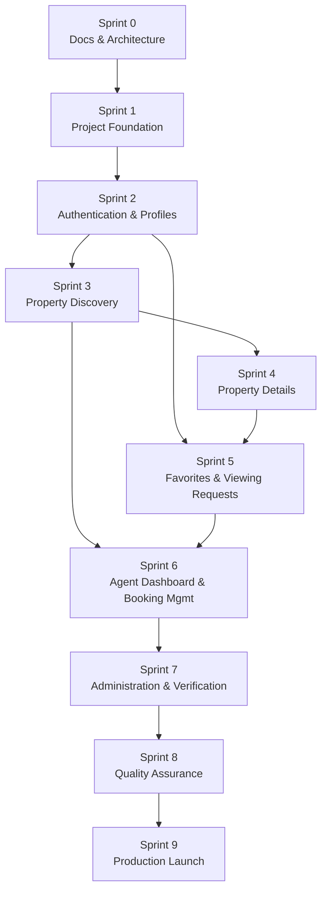
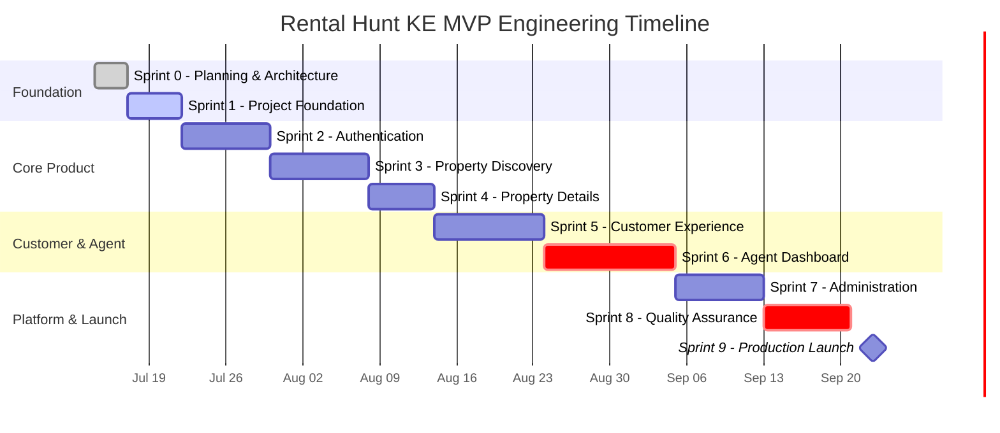

# Rental Hunt KE - Engineering Roadmap

> **Version:** 1.0
> **Status:** Draft
> **Owner:** Engineering
> **Related Documents:** [branding.md](./branding.md), [vision.md](./vision.md), [requirements.md](./requirements.md), [user-stories.md](./user-stories.md), [architecture.md](./architecture.md), [database.md](./database.md), [api-design.md](./api-design.md), [ui-guidelines.md](./ui-guidelines.md), [coding-standards.md](./coding-standards.md)

---

# 1. Purpose

This document is the master execution plan for building Rental Hunt KE's MVP. Where the other eight `docs/*.md` files define *what* the product is and *how* it must be built, this roadmap defines *in what order*, *in what increments*, and *by what gates* — turning `user-stories.md`'s 61 stories into a sequenced, dependency-aware, independently-shippable set of sprints.

**How to use this document during development:**
- Before starting any sprint, re-read that sprint's section here in full — objectives, dependencies, and Definition of Done.
- Treat sprint boundaries as hard gates (§23): a sprint's Definition of Done must be met before the next sprint's work begins, even under schedule pressure.
- Use `project-state.md` (initialized alongside this document) as the living record of actual progress against this plan — this roadmap is the plan, `project-state.md` is the diary of what actually happened, and the two are expected to diverge slightly over time as reality intrudes.
- When a decision made here turns out to be wrong once implementation starts, update this document in the same change (§18) rather than silently drifting from it.

---

# 2. Development Methodology

| Practice | How it's applied here |
|---|---|
| **Documentation-driven development** | No feature is implemented until the relevant `docs/*.md` sections already describe it — this roadmap's own existence is the proof of the practice: nine documents were written before a line of application code. |
| **Sprint planning** | Each sprint (§4–§13) is scoped to a coherent subset of `user-stories.md` epics, sized so it can ship independently and be demoed end-to-end. |
| **Task-based execution** | Each sprint is broken into tracked tasks, each referencing a `user-stories.md` story ID (`AUTH-001`, `DISC-002`, etc.) for traceability from roadmap → story → code. |
| **Continuous integration** | Every Pull Request runs linting, type-checking, and the test suite (`coding-standards.md` §19, §26) via GitHub Actions before merge — no PR merges on a red pipeline. |
| **Incremental delivery** | Every sprint ends with a working, deployed increment — a Vercel preview at minimum, promoted toward staging as the platform stabilizes (§20). "Working software every sprint" is a roadmap principle, not an aspiration. |
| **Feature completion criteria** | A feature is not "done" when the happy path works — it's done when it meets the universal Definition of Done (§19, mirroring `coding-standards.md` §27 exactly). |

---

# 3. Sprint Overview

| Sprint | Name | Duration (Estimate) | Outcome | Status |
|---|---|---|---|---|
| 0 | Planning & Architecture | 2–3 days (remaining) | Complete documentation baseline; repo and Supabase project initialized | In Progress |
| 1 | Project Foundation | 4–5 days | Scaffolded app, tooling, CI/CD, base layout — nothing feature-specific yet, but a real deployed shell | Not Started |
| 2 | Authentication | 6–8 days | Users can register, log in, log out, reset passwords; sessions persist; roles enforced by RLS | Not Started |
| 3 | Property Discovery | 7–9 days | Guests can browse, search, filter, and sort verified listings on the public homepage/search page | Not Started |
| 4 | Property Details | 5–6 days | Full property detail page: gallery, amenities, agent info, map, verification/availability | Not Started |
| 5 | Customer Experience | 8–10 days | Customers can favorite properties, book viewings, and manage both from a dashboard | Not Started |
| 6 | Agent Dashboard | 10–12 days | Agents can create/edit/archive listings, upload images, manage availability, verify status, manage bookings | Not Started |
| 7 | Administration | 6–8 days | Moderator verification queue, Admin user/agency management, activity logs, basic analytics | Not Started |
| 8 | Quality Assurance | 6–8 days | Cross-cutting hardening: accessibility, performance, security, responsive/cross-browser pass | Not Started |
| 9 | Production Launch | 3–4 days | v1.0.0 deployed to production, monitored, and validated against `requirements.md` §15 success criteria | Not Started |

**Total estimate: ~57–73 working days (~11–15 weeks)**, already including per-sprint buffer — see §24 for the detailed breakdown and critical path.

---

# 4. Sprint 0 - Planning & Architecture

## Objectives
Establish a complete, internally consistent documentation baseline before any application code is written, and prepare the minimum infrastructure (repository, Supabase project) needed to start Sprint 1.

## Deliverables
- `docs/branding.md`, `docs/vision.md`, `docs/requirements.md`, `docs/user-stories.md`, `docs/architecture.md`, `docs/database.md`, `docs/api-design.md`, `docs/ui-guidelines.md`, `docs/coding-standards.md`, `docs/roadmap.md` (this document) — all approved and committed.
- An initialized Git repository on GitHub.
- A Supabase project created (development/staging tier).
- `project-state.md` initialized as an empty living-progress log (structure defined in §23).

## Tasks
- [x] Write and review `branding.md`, `vision.md`, `requirements.md` (product foundation).
- [x] Write and review `user-stories.md`, `architecture.md`, `database.md`.
- [x] Write and review `api-design.md`, `ui-guidelines.md`, `coding-standards.md`.
- [x] Write this roadmap.
- [ ] Create the GitHub repository (if not already present) and push the `docs/` baseline.
- [ ] Create the Supabase project and record its connection details in a local, gitignored `.env.local` (`coding-standards.md` §21).

## Dependencies
None — this is the foundational sprint every other sprint depends on.

## Acceptance Criteria
- All nine `docs/*.md` files exist, are internally consistent (no contradicting decisions across documents — verified by cross-reference, not just individually reviewed), and are committed to version control.
- A Supabase project exists and its credentials are available locally, not committed.

## Definition of Done
- Documentation baseline merged to `main`.
- No open contradictions between any two `docs/*.md` files.
- Repository and Supabase project both exist and are accessible.

## Artifacts Produced
The ten documents listed above, plus the initialized (but still code-empty) repository.

## Risks
| Risk | Mitigation |
|---|---|
| Documentation scope grows indefinitely, delaying Sprint 1 | This roadmap is deliberately the *last* planning document — its completion is the explicit exit criterion for Sprint 0. |
| A decision made in an early document (e.g. `branding.md`) turns out to be impractical once implementation starts | The Documentation Maintenance policy (§18) exists precisely so a later correction is a normal, tracked update, not a crisis. |

---

# 5. Sprint 1 - Project Foundation

## Objectives
Stand up the actual application skeleton — tooling, structure, and a deployed (empty) shell — so every subsequent sprint adds features to a working foundation rather than fighting configuration.

## Initialize
- React 19 + TypeScript + Vite
- Tailwind CSS v4 + shadcn/ui (with the design tokens from `ui-guidelines.md` §21 wired into the `@theme` block)
- Supabase client (`shared/lib/supabase.ts`) pointed at the Sprint 0 project
- TanStack Query (`QueryClientProvider` in `app/`)
- React Router (route skeleton matching `architecture.md` §6: public, authenticated, admin route groups)
- React Hook Form + Zod (verified with one throwaway form to confirm the `zodResolver` wiring works end-to-end)

## Configure
- ESLint (including `@typescript-eslint/no-explicit-any`, `import/no-cycle`, an FSD layer-boundary rule — `coding-standards.md` §3.3/§6)
- Prettier + `prettier-plugin-tailwindcss` (`coding-standards.md` §13)
- Git hooks (optional): a pre-commit hook running lint + format on staged files
- Folder structure: the full FSD skeleton (`app/pages/widgets/features/entities/shared/routes/assets/styles`) with placeholder `index.ts` barrels
- Environment variables: `.env.local` (gitignored) with `VITE_SUPABASE_URL`/`VITE_SUPABASE_ANON_KEY` only — no service-role key ever in a `VITE_`-prefixed variable (`coding-standards.md` §21)
- CI/CD: GitHub Actions workflow running install → lint → type-check → test on every PR; Vercel connected for preview deployments
- Base layouts: the shared page shell (header/footer regions) per `ui-guidelines.md` §7
- Navigation shell: top nav + mobile drawer scaffold (`ui-guidelines.md` §15), with no real links behind it yet beyond placeholders

## Definition of Done
- `npm run dev` runs the app locally with a themed (not default-Tailwind) empty shell matching `ui-guidelines.md`'s color tokens.
- `npm run lint`, `npm run typecheck`, and `npm run test` all pass (the test suite may be empty at this point — the pipeline succeeding is what matters).
- A PR merged to `main` triggers a real Vercel preview deployment.
- The FSD folder structure exists with the import-boundary lint rule active and passing.
- No feature-specific code has been written yet — this sprint is infrastructure only, per the Roadmap Principle "build foundational features before dependent features."

---

# 6. Sprint 2 - Authentication

**Stories covered:** `AUTH-001`–`AUTH-006`, `SYS-001`, `SYS-002` (baseline).

## Implement
- Registration (`AUTH-001`), Login (`AUTH-002`), Logout (`AUTH-003`)
- Password Reset request + completion (`AUTH-004`)
- Protected Routes (route guards redirecting unauthenticated users away from `/dashboard`, `/favorites`, `/bookings`, `/profile`, and all `/admin/*` per `architecture.md` §6)
- Session Persistence (`AUTH-005`) — refresh survives a page reload without a flash of "logged out" state
- Profile Creation — the `handle_new_user` trigger (`database.md` §5.1) verified end-to-end from real registration
- Role-based Authorization — RLS policies from `database.md` §9 verified against a real Customer, Agent, and Admin test account (Moderator and full Agent/Admin dashboards don't exist yet, but the *role check itself* is validated here since it's foundational)

## Acceptance Tests
- A new user can register, is immediately signed in, and has a `profiles` row with `role = 'customer'`.
- An invalid login shows the generic `INVALID_CREDENTIALS` message (`api-design.md` §5.2), never revealing whether the email exists.
- Refreshing the page mid-session does not log the user out.
- Navigating to `/dashboard` while logged out redirects to `/login`; navigating to `/admin` as a Customer is blocked (both client-side redirect *and* verified this can't be bypassed by directly hitting a data query, per RLS).

## Deployment Criteria
- Deployed to the Vercel preview environment with real (not mocked) Supabase Auth.
- Password reset emails are confirmed deliverable (Supabase's default email provider is acceptable for MVP; a custom SMTP provider is a post-launch consideration, not a blocker).

---

# 7. Sprint 3 - Property Discovery

**Stories covered:** `DISC-001`–`DISC-006`, `SYS-003` (search performance), reference-data seeding (`database.md` §12).

## Scope
- Homepage: hero search section, trust indicators (`FR-HOME-001`, `FR-HOME-003`)
- Featured Properties (`DISC-005`) — requires at least a handful of seeded, `verified` + `is_featured` properties to be meaningful
- Property Search by location (`DISC-002`) and Filters (`DISC-003`: county, price range, property type, bedrooms, amenities)
- Sorting (`DISC-004`)
- Pagination (`FR-SEARCH-007`, cursor-based per `database.md` §14/`api-design.md` §16.1 — implemented correctly from the start, not retrofitted later)
- Property Cards (`ui-guidelines.md` §12.1)
- Responsive UI across the breakpoints in `ui-guidelines.md` §8
- Empty search results state (`DISC-006`)

## Performance Targets
- Search results return within 2 seconds under normal load (`NFR-SEARCH-001`).
- Initial page load under 3 seconds on a simulated 4G connection (`requirements.md` §13.1).
- Active filters reflected in the URL (`NFR-SEARCH-004`) and shareable.

## Definition of Done
- A guest, with no account, can load the homepage, search by neighborhood, apply at least two combined filters, sort, and paginate through real seeded results — entirely without authentication.
- Lighthouse Performance score ≥ 85 on the search results page (interim target; §21's ≥90 is the Sprint 8/launch bar).
- This sprint requires Sprint 1's foundation and Sprint 2's `profiles`/role infrastructure to exist (agents need to "own" seeded properties even though the Agent Dashboard itself ships in Sprint 6) — see §14.

---

# 8. Sprint 4 - Property Details

**Stories covered:** `PROP-001`–`PROP-006`.

## Scope
- Property Details layout (`PROP-001`, full information architecture per `ui-guidelines.md` §12.4)
- Image Gallery — both the embedded Property Gallery and the full-screen viewer (`PROP-002`, `ui-guidelines.md` §12.2/§12.3)
- Amenities Grid (`PROP-003`)
- Agent Card (`PROP-005`, using the `agent_directory` public view per `database.md` §9)
- Map Integration via Leaflet + OpenStreetMap (`PROP-006`)
- Availability Badge and Verification Badge (`ui-guidelines.md` §12.8/§12.9)
- Share Feature (Web Share API with clipboard fallback, `ui-guidelines.md` §12.13)
- Related Properties (a simple "same county/type" query — not a recommendation engine; `FUT-005` AI recommendations remain explicitly out of scope)

## Dependencies
Requires Sprint 3's property listing/search infrastructure (a detail page is reached *from* a card) and Sprint 2's role model (agent info display, even though the full Agent Dashboard is still two sprints away).

## Definition of Done
- Every field on the detail page traces to a real column in `database.md` §5.8 — no placeholder or fabricated data fields.
- The map loads lazily and never blocks the rest of the page render (`SYS-004`).
- Gallery and map both work correctly on a 375px mobile viewport before being considered done, per mobile-first (`ui-guidelines.md` §1).

---

# 9. Sprint 5 - Customer Experience

**Stories covered:** `FAV-001`–`FAV-003`, `VIEW-001`–`VIEW-005`, `CUST-001`–`CUST-004`.

## Scope
- Favorites: Save, Remove, and the dedicated Favorites list page (`FAV-001`–`FAV-003`)
- Customer Dashboard shell (`ui-guidelines.md` §13, scoped to the Customer role)
- Viewing Requests: booking form with date/time selection (`VIEW-001`, `VIEW-002`), confirmation (`VIEW-003`), cancellation (`VIEW-004`)
- Booking History (`VIEW-005`, `CUST-001` upcoming / `CUST-002` completed)
- Profile management (`CUST-003`) and Notification Preferences (`CUST-004`)
- Basic Notifications: this sprint delivers only the `notification_preferences` UI on `profiles` (`database.md` §5.1) — the full `notifications` table/realtime feed remains a Future item (`database.md` §15) and is **not** built here, to avoid scope creep into a deferred entity.

## Dependencies
Requires Sprint 4's property detail page (the booking CTA lives there) and Sprint 2's authenticated-route infrastructure. This is the first sprint where the booking-availability trigger (`database.md` §9) and the `viewing_status` state machine (`api-design.md` §8.1) are exercised for real.

## Definition of Done
- A customer can save a property, see it in their favorites list, book a viewing on an available property, get blocked with a clear message when attempting to book an unavailable one, and cancel a pending request — end to end, with Realtime status updates working (`api-design.md` §11).
- All four async states (loading/empty/error/success, `coding-standards.md` §16) are handled on every new screen.

---

# 10. Sprint 6 - Agent Dashboard

**Stories covered:** `AGENT-001`–`AGENT-008`, `BOOK-001`–`BOOK-006`. The largest sprint in the roadmap — see §24 for why it carries schedule risk.

## Scope
- Dashboard Overview (`AGENT-001`)
- Property CRUD: Create (`AGENT-002`), Edit (`AGENT-003`), Archive (`AGENT-004`)
- Image Uploads with reordering (`AGENT-005`, `api-design.md` §10)
- Availability management (`AGENT-006`)
- Verification Workflow — the agent-facing side: submitting for review and viewing current status/history (`AGENT-007`'s agent-facing half; the moderator/admin approval action itself ships in Sprint 7)
- Viewing Management: the agent's booking queue and every status transition (`BOOK-001`–`BOOK-006`: view, confirm, reschedule, cancel, complete, no-show)
- Search/Filtering *within* the agent's own property list (distinct from Sprint 3's public search — this is a small, bounded, offset-paginated list per `database.md` §14)
- Basic Analytics (`AGENT-008`) — view counts and viewing-request counts per property

## Dependencies
Requires essentially every prior sprint: Auth/roles (Sprint 2), the property schema and search patterns established for the public side (Sprint 3), the booking state machine (Sprint 5). This is the first sprint where the `agencies`/`agents` relationship (`database.md` §5.3/§5.4) is exercised through a real UI rather than only seed data.

## Definition of Done
- An agent can create a listing from scratch, upload and reorder images, submit it for verification, manage its availability, and process a real viewing request through every status in `api-design.md` §8.1's state machine.
- Every write operation an agent performs is scoped to their own agency by RLS (`database.md` §9) — verified with a second agent test account that must *not* be able to see or edit the first agent's properties.

---

# 11. Sprint 7 - Administration

**Stories covered:** Moderator/Admin portions of `AGENT-007`, `api-design.md` §9 (Admin API) in full.

## Scope
- Moderator Features: the verification queue (`GET /admin/properties/pending-verification`) and the approve/reject action via `set_property_verification()` (`database.md` §9, `api-design.md` §6.9) — this is where `AGENT-007` is completed end-to-end (agent submission from Sprint 6 + moderator decision here).
- Admin Dashboard: platform-wide metrics (`api-design.md` §9)
- User Management: list/deactivate profiles, change role (the one path that can alter `profiles.role`, per `database.md` §9's self-role-change trigger)
- Agency Management: create/edit agencies (admin-driven onboarding in the MVP — self-service onboarding is `FUT-002`, explicitly deferred)
- Analytics: platform-level aggregation on top of Sprint 6's per-property analytics
- Audit Logs: a searchable view over `activity_logs` and `property_verifications` (`database.md` §5.14/§5.15)
- System Monitoring: confirming the logging utility (`coding-standards.md` §22) surfaces errors somewhere reviewable, even without a full Sentry-style integration yet

## Dependencies
Requires Sprint 6 (there must be real agent-submitted listings to verify) and the full role model from Sprint 2.

## Definition of Done
- A moderator can review a pending listing, verify or reject it with a reason, and the agent sees the resulting status change (and, if rejected, the reason) without a manual refresh.
- An admin can deactivate a user, create a new agency, and view a basic activity log filtered by entity — all functions from `api-design.md` §9 are reachable through real UI, not only the API layer.

---

# 12. Sprint 8 - Quality Assurance

This sprint is deliberately **not** feature work — it's the dedicated hardening pass the Roadmap Principles call for ("maintain production-ready quality throughout development" is aspirational without a sprint that actually checks it).

## Scope
- **Responsive Testing:** every screen built in Sprints 3–7 re-verified against `ui-guidelines.md` §16's responsive matrix on real mobile/tablet/desktop viewports, not just resized-desktop-browser approximations.
- **Accessibility:** a full WCAG 2.2 AA pass (`coding-standards.md` §15) — automated (axe) and manual (keyboard-only navigation, screen reader spot checks) across every flow in `user-stories.md`.
- **Performance:** Lighthouse audits on the homepage, search results, property detail, and both dashboards against the budget in §21.
- **Security:** a pass against `coding-standards.md` §21 — confirm no secret is bundled client-side, confirm RLS holds under adversarial manual testing (e.g. attempting to fetch another agency's property via direct API manipulation), confirm rate limiting (`api-design.md` §18) is at least minimally in place for auth and booking creation.
- **Manual Testing:** every acceptance criterion in `user-stories.md` walked through by hand at least once.
- **Bug Fixes:** triage and close everything found above, prioritized Critical → High → Medium → Low.
- **Cross-browser Testing:** current Chrome, Safari, Firefox, and Safari iOS at minimum (matching the primary/secondary audience device mix in `branding.md`).
- **Documentation Review:** confirm all nine `docs/*.md` files still match what was actually built — any drift discovered here is corrected per §18, not left for later.

## Definition of Done
- Zero Critical or High severity bugs open.
- Lighthouse Performance ≥ 90, Accessibility ≥ 95 on every primary screen (§21).
- Zero critical/serious axe violations.
- Every `docs/*.md` file matches the shipped implementation.

---

# 13. Sprint 9 - Production Launch

## Scope
- Static & Legal Content (pre-launch prep, `user-stories.md` Epic 11, added 2026-08-05): `CONTENT-001`–`005` — About/How It Works, Contact form + admin review screen, Terms of Service, Privacy Policy, and a genuine 404 page. Folded into this sprint rather than given its own, since Terms/Privacy is a real launch blocker and the rest is small, low-risk static content. **Terms of Service and Privacy Policy content is blocked on the Product Owner supplying real legal/company text** — engineering does not draft binding legal content; this must be resolved before this sprint's DoD can close.
- Production Build: final production bundle built and smoke-tested locally before deploy.
- Deployment Validation: Vercel production environment configured with the production Supabase project's credentials (not the dev/staging project used through Sprints 1–8).
- Database Migration: full migration history (`database.md` §13) replayed clean against the production Supabase project; seed data (§12) replaced with real launch-ready reference data (all 47 counties, a complete amenities list, real agency/agent accounts — not dev fixtures).
- Environment Verification: all environment variables present and correct in the production environment; confirm no dev/staging secret is reachable from production and vice versa.
- Smoke Testing: the golden path (register → search → view details → book a viewing; agent creates → verifies → confirms a booking) walked through against the live production environment immediately after deploy.
- Monitoring: error logging (`coding-standards.md` §22) confirmed to be receiving events in production.
- Backup Strategy: confirm Supabase Cloud's automated backups/PITR are enabled on the production project (`database.md` §13's rollback backstop).
- Release Checklist: see below.
- Version 1.0 Launch: tag `v1.0.0` (`coding-standards.md` §23).

## Release Checklist
- [ ] `CONTENT-001`–`005` (About, Contact + admin review, Terms, Privacy, 404 page) are built and Terms/Privacy contain real, Product-Owner-approved legal text — not placeholder copy.
- [ ] All Sprint 0–8 Definitions of Done remain true on the production build (no regression since Sprint 8 closed).
- [ ] Every item in `requirements.md` §15 ("MVP Success Criteria") is verified true in production, not just staging.
- [ ] Rollback plan (§20) is understood and has been rehearsed at least once against staging.
- [ ] `v1.0.0` tagged and release notes published referencing the shipped `user-stories.md` scope.

---

# 14. Feature Dependency Graph

## Why These Dependencies Exist

| Dependency | Reason |
|---|---|
| Auth (S2) before everything else | Every other resource in `database.md` traces back to a `profiles.id` (owner, customer, agent, reviewer) via RLS. Nothing can be correctly authorized until the role model exists. |
| Discovery (S3) before Details (S4) | A detail page is reached *from* a card — there is nothing to click into until listing/search exists. Building the detail page first would mean building fixture data twice. |
| Details (S4) before Favorites/Booking (S5) | Both the Favorite button and the Booking CTA live on the detail page (`ui-guidelines.md` §12.12/§12.14) — they're additions to a page that must already exist. |
| Discovery (S3) *and* Booking (S5) before the Agent Dashboard (S6) | The Agent Dashboard's booking queue (`BOOK-001`) has nothing to queue until customers can actually create viewing requests; its property list reuses the same list/search UI patterns proven in S3. |
| Agent Dashboard (S6) before Administration (S7) | Verification (`AGENT-007`) is a two-sided workflow — there is nothing for a Moderator to review until an Agent can submit a listing. |
| Everything before Quality Assurance (S8) | A dedicated hardening pass only makes sense once there's a complete surface to harden — running it earlier would mean re-running it after every subsequent sprint anyway. |
| QA (S8) before Launch (S9) | Per `requirements.md` §15, launch success criteria assume a working, tested product — Sprint 9 is deployment and validation, not a place to discover new bugs. |

---

# 15. Milestones

| Milestone | Marks the end of | Significance |
|---|---|---|
| **Architecture Approved** | Sprint 0 | The technical foundation (`architecture.md`, `database.md`, `api-design.md`) is locked; implementation can begin without re-litigating structure. |
| **Foundation Deployed** | Sprint 1 | A real, empty, correctly-tooled app is live on a Vercel preview. |
| **Authentication Complete** | Sprint 2 | The role model that every RLS policy in `database.md` depends on is proven with real accounts. |
| **Public Search Complete** | Sprint 3 | The platform is demoable to a non-technical stakeholder for the first time — a guest can find a real property. |
| **Property Experience Complete** | Sprint 4 | The full renter-facing discovery journey (`Discover → Evaluate`, `requirements.md` §1) exists. |
| **Booking Workflow Complete** | Sprint 5 | The full core hypothesis from `vision.md` §"Minimum Viable Product" — "people are willing to book a physical viewing through this platform" — is testable end-to-end. |
| **Agent Dashboard Complete** | Sprint 6 | Agents can operate independently of manual database seeding — the platform can be populated by real users. |
| **Admin Dashboard Complete** | Sprint 7 | The full `Discover → Evaluate → Book Viewing → Visit Property` loop (`requirements.md` §1) is operable by all five roles. |
| **Production Ready** | Sprint 8 | Every quality bar in §19/§21 is met; nothing left to build, only to validate. |
| **Launch (v1.0.0)** | Sprint 9 | Rental Hunt KE is live in production. |

---

# 16. Risk Register

| Risk | Likelihood | Impact | Mitigation | Owner |
|---|---|---|---|---|
| Supabase free/starter-tier limits (storage, bandwidth, connection count) hit during development or shortly after launch | Medium | Medium | Monitor usage from Sprint 3 onward (first sprint with real image uploads at scale); budget for a paid tier before Sprint 9 if projected usage requires it. | Developer |
| Image upload reliability/cost as listing volume grows | Medium | Medium | The `process-property-image` Edge Function (`api-design.md` §12) and size/type limits (`database.md` §10) are scoped in from Sprint 6, not retrofitted. | Developer |
| RLS policy complexity causing subtle authorization bugs (e.g. an agent seeing another agency's data) | Medium | High | Every RLS-sensitive Repository has an integration test against a real local Supabase instance (`coding-standards.md` §19), and Sprint 8 includes explicit adversarial manual testing (§12). | Developer |
| Search performance degrading as listing volume grows past dev-scale fixtures | Low (MVP scale) | Medium | Indexing strategy (`database.md` §8) is implemented from Sprint 3, not added reactively; the GIN/composite indexes are already load-tested against the NFR-SEARCH-001 2-second target during that sprint's DoD. | Developer |
| Scope creep — features drifting beyond the approved MVP (e.g. building toward `FUT` items early) | Medium | High | Every sprint's scope is pinned to specific `user-stories.md` IDs in this document; §23's execution rules explicitly forbid implementing outside the active sprint. | Developer |
| Deployment/environment misconfiguration (dev credentials leaking into production, or vice versa) | Low | High | Sprint 9's Environment Verification step is a named, checked task, not an assumption; `coding-standards.md` §21 bans any service-role/secret key from ever being `VITE_`-prefixed. | Developer |
| Solo-developer bus factor / burnout across a ~3-month build | Medium | High | Sprint boundaries (§23) enforce sustainable, checkable increments rather than one undifferentiated push; documentation-driven development (§2) means work can pause and resume without losing context. |
| AI-assisted code drifting from `coding-standards.md` over many sessions | Medium | Medium | `coding-standards.md` §25's AI Collaboration Standards are binding, not advisory; the Code Review Checklist (§26 there) is applied to every PR regardless of who/what wrote it. | Developer |
| Third-party dependency churn (Tailwind v4, React 19, shadcn/ui are all comparatively new/fast-moving) | Low | Medium | Dependency versions are pinned; upgrades are a deliberate, tested decision, never an incidental side effect of an unrelated change. | Developer |
| Real-world Kenyan mobile network conditions (patchy 4G) exposing performance issues dev testing on fast wifi wouldn't catch | Medium | Medium | Performance targets are tested under simulated throttled-4G conditions from Sprint 3 onward (§7), not only measured on a fast development connection. | Developer |

---

# 17. Technical Debt Strategy

| Aspect | Policy |
|---|---|
| **Acceptable debt** | A deliberately deferred, documented scope reduction with a named future owner — e.g. deferring dashboard-table virtualization (`coding-standards.md` §20) until a real list exceeds ~100 rows, or shipping Supabase's default email templates instead of custom-branded ones for password reset. Acceptable debt is written down at the moment it's incurred, with a `// TODO` referencing the deferred story/decision (`coding-standards.md` §24). |
| **Unacceptable debt** | Skipping RLS on a new table "temporarily"; skipping input validation on a write path; skipping tests on a Service or Repository; hardcoding a color instead of using a semantic token; disabling TypeScript strict mode to unblock a build; merging a PR with a failing CI pipeline. None of these are ever an acceptable shortcut under schedule pressure — they are exactly the shortcuts this project's standards exist to prevent (`coding-standards.md` §1). |
| **Refactoring policy** | A refactor is proposed and its tradeoffs explained *before* it's executed (`coding-standards.md` §25, rule 8) — never discovered by the developer after the fact in an unexpectedly large diff. Refactors are scoped to a single PR and never bundled silently inside an unrelated feature PR. |
| **Debt register** | Tracked as a running section within `project-state.md` (§23) — a simple dated log of `(what was deferred, why, which sprint/story will address it)`. Not a separate `TECH_DEBT.md` file; one living-state document is simpler to keep current than two. |
| **Review frequency** | The debt register is reviewed at the start of every sprint (is anything in it now in scope for this sprint?) and explicitly re-reviewed in full during Sprint 8 (is anything left unresolved that blocks a production-ready launch?). |

---

# 18. Documentation Maintenance

| Change Type | Documents That Must Update | In the Same Change As |
|---|---|---|
| Architecture change (folder structure, layering, data-flow) | `architecture.md`, `coding-standards.md` §3 | The structural change itself |
| Database change (new table, column, RLS policy, enum) | `database.md`, `api-design.md` (if it changes a DTO or Repository contract) | The migration that makes the change |
| API/contract change (new endpoint, changed request/response shape, new error code) | `api-design.md`, `coding-standards.md` §17 if a convention changes | The Repository/Service change |
| UI/design-system change (new token, new component pattern) | `ui-guidelines.md` | The component change |
| Feature addition beyond current `user-stories.md` scope | `user-stories.md` (new story with an ID), `requirements.md` (if it implies a new functional requirement), this roadmap (assigned to a sprint) | Before implementation begins, not after |
| Breaking change (schema, API, or a reversal of a prior architectural decision) | The relevant document(s) above **and** a dated decision-record entry (`coding-standards.md` §24) explaining what it supersedes and why | The change itself, with the decision record explaining the "why" a diff alone can't convey |

The underlying rule, restated from `coding-standards.md` §24: a structural change and its documentation are **one unit of work**, never split into "code now, document later."

---

# 19. Definition of Done

This mirrors `coding-standards.md` §27 exactly — restated here as the roadmap's per-feature gate so sprint planning and code review share one definition, not two slightly different ones.

A feature is done only when:

- ✓ **Implemented** — satisfies every acceptance criterion in its `user-stories.md` entry.
- ✓ **Typed** — no `any`; `tsc --noEmit` clean; enums are string-literal unions per `coding-standards.md` §6.
- ✓ **Responsive** — verified across mobile/tablet/desktop per `ui-guidelines.md` §16.
- ✓ **Accessible** — keyboard-operable, labeled, contrast-checked per `coding-standards.md` §15.
- ✓ **Tested** — Services/Repositories meet the coverage floor in `coding-standards.md` §19; critical flows have a component/integration test.
- ✓ **Documented** — relevant `docs/*.md` updated per §18; JSDoc on any non-obvious exported function.
- ✓ **Linted** — zero ESLint errors.
- ✓ **Passes type checking** — `tsc --noEmit` clean.
- ✓ **Reviewed** — a PR opened and self-reviewed against `coding-standards.md` §26 before merge.
- ✓ **Production ready** — no known Critical/High severity bug, no TODO without an explanation (§17).

---

# 20. Release Strategy

| Aspect | Policy |
|---|---|
| **Versioning** | Semantic versioning (`coding-standards.md` §23): `v0.x.y` throughout Sprints 1–8, `v1.0.0` at Sprint 9's production launch, `MAJOR` bumps reserved for breaking schema/API changes post-launch. |
| **Release cadence** | Every merged PR deploys automatically to a Vercel preview against the development Supabase project (continuous deployment to non-production). Promotion to the production environment is a deliberate, manual gate — first exercised at Sprint 9, and thereafter for any subsequent release. |
| **Hotfixes** | Branch from `main`, fix, fast-tracked through the same Definition of Done (§19) and Code Review Checklist (`coding-standards.md` §26) — never skipped for urgency — then a `PATCH` version bump and immediate deploy. |
| **Rollback process** | Application: Vercel's instant rollback to the previous deployment. Database: migrations are forward-only (`database.md` §13) — a bad migration is corrected by a new migration, with Supabase Cloud's Point-in-Time Recovery as the backstop for anything a forward-fix can't address in time. |
| **Database migrations** | Applied via the Supabase CLI through CI/CD (`database.md` §13) — never manually against a shared environment. |
| **Environment promotion** | Local (developer machine, `supabase start`) → Development/Staging (shared Supabase project, used Sprints 1–8) → Production (separate Supabase project, first used at Sprint 9) — matching the environment tiers `architecture.md` §19 already anticipates. |

---

# 21. Success Metrics

| Metric | Target | Measured |
|---|---|---|
| Build success rate | 100% on `main` | CI pipeline status |
| TypeScript errors | Zero, always | `tsc --noEmit` gate on every PR |
| Lighthouse Performance | ≥ 90 on primary screens (home, search, detail, dashboards) by launch | Sprint 8, re-checked at Sprint 9 |
| Lighthouse Accessibility | ≥ 95 | Sprint 8 |
| Accessibility (axe) | Zero critical/serious violations | Sprint 8 |
| Performance budget | Initial load < 3s on simulated 4G; LCP < 2.5s (`requirements.md` §13.1) | Every sprint from Sprint 3 onward |
| Bug count | Zero Critical/High open at each sprint close; trending toward zero of any severity by Sprint 9 | Tracked per sprint |
| Deployment frequency | At least one deploy per completed sprint (continuous preview deployment makes this closer to "every merged PR") | CI/CD logs |
| Feature completion | 100% of MVP `user-stories.md` scope (Epics 1–9) before `v1.0.0`; 0% of Epic 10 (Future) — matching the MVP Scope Summary in `user-stories.md` | Sprint 9 gate |

---

# 22. Future Roadmap

Everything below is **Epic 10** in `user-stories.md` (`FUT-001`–`FUT-006`) and the Future Expansion sections of `database.md` §15 / `api-design.md` §22 / `ui-guidelines.md` §23 — explicitly out of scope for the sprints above, listed here only to show the MVP was built without foreclosing them:

| Initiative | Story Reference | Foundation already in place |
|---|---|---|
| Agency self-service onboarding | `FUT-002` | `agencies`/`agents` already modeled as first-class entities (`database.md` §5.3/§5.4) — onboarding is additive UI, not a schema change. |
| Premium listings | `FUT-003` | `properties.is_featured` already exists; a `subscriptions` table gates it (`database.md` §15). |
| M-Pesa integration | `FUT-001` | A `payments` table sketch plus a `daraja-webhook` Edge Function following the already-established webhook pattern (`api-design.md` §12/§22). |
| AI recommendations | `FUT-005` | `favorites`, `viewing_requests`, and `activity_logs` already capture the behavioral data a recommender would consume. |
| Native mobile app | `FUT-006` | The Service/Repository layer is plain TypeScript, reusable from a React Native client against the same Supabase project (`api-design.md` §22). |
| Public API | — | An Edge Function gateway (`/api/v1/...`) fronting the existing Repositories (`api-design.md` §20/§22). |
| Analytics platform | — | Builds on Sprint 6/7's basic analytics (`AGENT-008`, admin analytics) rather than replacing them. |
| Localization (Swahili, others) | — | Copy is already centralized per `ui-guidelines.md` §20, not scattered inline — extraction to an i18n layer is additive. |

---

# 23. Claude Code Execution Guide

1. **Always complete one sprint before starting another.** Sprint N+1 work does not begin until Sprint N's Definition of Done (§19) is met — even if a later sprint's task looks quick or tempting to knock out early.
2. **Never implement features outside the active sprint's scope.** If a task would require touching a story ID not listed in the current sprint's section (§4–§13), stop and flag it rather than absorbing it silently.
3. **Update `project-state.md` after every completed task.** Its structure: a dated log entry per completed task (`user-stories.md` ID, sprint, one-line summary), the current active sprint, and any open blockers — a running diary of actual progress against this plan, not a copy of the plan itself.
4. **Update documentation when implementation changes**, in the same PR, per §18 — never as a deferred follow-up.
5. **Run linting and type-checking before marking any task complete** (§19) — a task is not done if `npm run lint`/`tsc --noEmit` fail, regardless of whether the feature "works."
6. **Explain architectural trade-offs before large refactors**, per `coding-standards.md` §25 — this applies with particular force to Sprint 6 and Sprint 7, the two sprints most likely to reveal that an earlier sprint's shortcut needs revisiting.
7. **Reference `user-stories.md` IDs in commits and PR descriptions** for traceability from roadmap → story → code → test.
8. **Flag scope creep immediately.** If a sprint's actual work is expanding past what's scoped here, that's a roadmap update (§18), not a silent absorption into "while I'm in here."
9. **Stop and ask when a sprint's scope conflicts with a downstream sprint's stated dependency** (§14) — e.g. if Sprint 5 work seems to require something not actually delivered until Sprint 6, that's a sign either this roadmap's ordering or the current understanding of a dependency is wrong, and it should be resolved explicitly, not worked around.

---

# 24. Engineering Timeline

| Sprint | Estimated Effort | Complexity | Key Dependencies | Critical Path? | Buffer Included |
|---|---|---|---|---|---|
| 0 | 2–3 days | Low | None | Yes | Minimal — nearly complete |
| 1 | 4–5 days | Low | Sprint 0 | Yes | ~1 day |
| 2 | 6–8 days | Medium (RLS correctness is the real risk, not the UI) | Sprint 1 | Yes | ~1–2 days |
| 3 | 7–9 days | Medium–High (search/filter/pagination correctness + performance target) | Sprint 2 | Yes | ~2 days |
| 4 | 5–6 days | Medium (map + gallery integration) | Sprint 3 | Yes | ~1 day |
| 5 | 8–10 days | High (three epics: favorites, booking, customer dashboard; first real state-machine + Realtime work) | Sprints 2, 4 | Yes | ~2 days |
| 6 | 10–12 days | **Highest** — largest single sprint, two epics, image upload pipeline, first full CRUD surface | Sprints 3, 5 | Yes | ~2–3 days |
| 7 | 6–8 days | Medium–High (verification workflow correctness, admin role scope) | Sprint 6 | Yes | ~1–2 days |
| 8 | 6–8 days | Medium (breadth, not depth — many small fixes across every prior sprint) | Sprints 0–7 | Yes | ~2 days |
| 9 | 3–4 days | Medium (deployment risk is operational, not coding) | Sprint 8 | Yes | ~1 day |

Every sprint sits on the critical path — this roadmap has no parallel workstreams, consistent with a solo-developer execution model. There is no slack to absorb a delayed sprint except the per-sprint buffer already built into the ranges above.

**Highest-risk sprints:**
- **Sprint 6 (Agent Dashboard)** — the largest scope in the roadmap (14 stories across two epics) and the first sprint exercising the full image-upload pipeline and a real multi-agency RLS boundary under load. Budget the full 10–12 day range; do not compress it to make up time lost elsewhere.
- **Sprint 2 (Authentication)** — small in story count but foundational; an RLS mistake made here propagates into every later sprint's authorization assumptions, so its buffer exists for correctness verification, not just feature-building speed.
- **Sprint 9 (Launch)** — short in duration but highest-consequence; the "buffer" here is really the rehearsed-rollback requirement in §13's Release Checklist, not extra coding time.

---

This document is the single source of truth for how Rental Hunt KE's MVP gets built, in what order, and by what gates. It should be updated whenever a sprint's actual outcome diverges from this plan (recorded in `project-state.md` as it happens, reconciled back into this document at each milestone, §15), and kept consistent with all eight documents it's built on as the project evolves.
