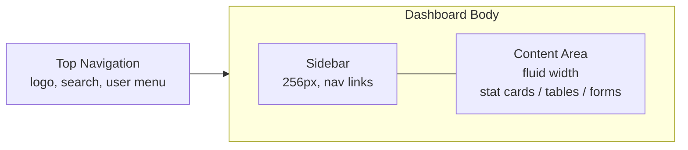

# Rental Hunt KE - UI Guidelines & Design System

> **Version:** 1.0
> **Status:** Draft
> **Owner:** Design & Engineering Team
> **Related Documents:** [branding.md](./branding.md), [vision.md](./vision.md), [requirements.md](./requirements.md), [user-stories.md](./user-stories.md), [architecture.md](./architecture.md), [database.md](./database.md)

This document is the single source of truth for the visual language, interaction patterns, accessibility standards, responsive behavior, and component library of Rental Hunt KE. Every screen — whether built by a human engineer or generated by an AI coding agent — must conform to it. Where this document is silent, defer to `architecture.md`'s technology and structural decisions; never contradict them.

---

# 1. Design Philosophy

Rental Hunt KE's interface exists to do one job well: help a renter go from "I need a home" to "I trust this listing enough to book a viewing" as quickly and confidently as possible. Per `branding.md`, the brand's central promise is **trust first** — every design decision in this document is a mechanism for earning that trust, not a stylistic preference.

Concretely, that means:

- **Trust is shown, not claimed.** Verification status, availability, agent identity, and last-verified dates are always visible, always in plain language, and never buried behind a click.
- **The interface gets out of the way.** A renter comparing five apartments at 11pm on a phone with patchy 4G should never wait on an animation, guess what a button does, or lose their filters navigating back.
- **Calm over exciting.** The emotional register is closer to a well-run bank's app than a marketplace hype site — competent, warm, unhurried. Branding explicitly warns against "overly corporate, overly playful, or cluttered"; this document operationalizes that middle path.
- **Every screen answers a decision, not just displays data.** Property cards, detail pages, and dashboards are built around the decision the user is trying to make at that moment (Is this worth a closer look? Is this worth a viewing? Is this booking worth confirming?), not around exhaustively displaying every field the database has.

The emotional goal, in the user's own words if the product succeeds (per `branding.md`'s definition of brand success): *"I found exactly what I was looking for, and I trusted every step of the process."* Every rule in this document should be traceable back to that sentence.

---

# 2. Design Principles

| Principle | What it means in practice |
|---|---|
| **Simplicity** | One primary action per screen. If a screen needs a secondary action, it is visually subordinate (outline/ghost button, smaller, or lower on the page). No screen should require a legend to understand. |
| **Consistency over creativity** | The same concept (e.g. "verified") always looks the same everywhere it appears — same color, same icon, same label. Novel visual treatments are not introduced for the sake of variety. |
| **Trust** | Every claim the UI makes (verified, available, confirmed) is backed by a real database field (`database.md` §6 enums) and rendered the same way regardless of which screen it appears on. |
| **Clarity** | Plain language over jargon. Real Kenyan geography and pricing conventions (KES, counties, neighborhoods) over generic placeholders. |
| **Accessibility** | WCAG 2.2 AA is a floor, not a target to negotiate down under deadline pressure (§17). |
| **Performance** | Perceived speed is treated as a design property: skeletons over spinners, optimistic UI where safe, no layout shift on image load (`architecture.md` §17, `SYS-004`). |
| **Mobile-first** | Every component is designed for a 375px viewport first, then progressively enhanced upward (`branding.md`: "Mobile is the primary target for the MVP"). |
| **Progressive disclosure** | Show the minimum needed to make the next decision; defer detail (full description, all amenities, full booking history) to the next screen rather than front-loading everything. |

---

# 3. Brand Identity

**Personality:** Professional, Reliable, Honest, Helpful, Modern, Approachable, Local, Efficient (`branding.md`).

**Voice:** Clear, professional, friendly, helpful, honest, confident. Never clickbait, never exaggerated, never pressure-selling, never unnecessary jargon. When in doubt, prefer the plain, information-dense phrasing over the exciting one — e.g. "Discover verified rental homes that match your budget and lifestyle," not "Cheap apartments available!!!"

**Visual identity:** Clean layouts, generous white space, strong visual hierarchy, high-quality photography, mobile-first, fast-loading, accessible. The product should read as a modern technology platform, not a classifieds site — flat surfaces, confident typography, restrained color, real photography doing the visual heavy lifting rather than decorative UI chrome.

**Professional tone in UI copy:** Every label, error, and confirmation in this product is written as if a competent, honest human agent were saying it directly to the renter. See §20 for the full copywriting standard.

**How the UI should feel:** Calm, current, and credible — never sterile-corporate, never trend-chasing, never busy.

---

# 4. Color System

Colors are **semantic tokens only**. No component may hardcode a hex value, a Tailwind color utility (`bg-blue-600`, `text-red-500`, etc.), or an inline style for color. Every color reference goes through the token names below, exposed as CSS custom properties and consumed via a Tailwind v4 `@theme` block, matching the shadcn/ui convention already assumed by `architecture.md`.

## 4.1 Token Reference

| Token | Purpose | Light Value | Dark Value (future-ready) | Usage |
|---|---|---|---|---|
| `background` | Page background | `#F8FAFC` | `#0B1220` | `<body>`, page wrappers |
| `foreground` | Default text on `background` | `#0F172A` | `#F1F5F9` | Base text color |
| `surface` / `card` | Elevated container background | `#FFFFFF` | `#111827` | Cards, panels, dialogs |
| `card-foreground` | Text on `surface` | `#0F172A` | `#F1F5F9` | Text inside cards |
| `primary` | Deep Blue — trust, primary actions | `#1E3A5F` | `#3B6EA5` | Primary buttons, links, active nav, focus ring base |
| `primary-foreground` | Text/icons on `primary` | `#FFFFFF` | `#0B1220` | Text on primary buttons |
| `secondary` | Emerald Green — positive discovery, growth | `#059669` | `#10B981` | Secondary buttons, positive accents, "Available" indicators |
| `secondary-foreground` | Text/icons on `secondary` | `#FFFFFF` | `#0B1220` | Text on secondary buttons |
| `accent` | Soft highlight background | `#EFF6FF` | `#152238` | Hover backgrounds, selected filter chips |
| `accent-foreground` | Text on `accent` | `#1E3A5F` | `#93C5FD` | Text/icons in accent-highlighted elements |
| `muted` | Subdued background for low-emphasis sections | `#F1F5F9` | `#1E293B` | Disabled fields, skeletons, subtle section backgrounds |
| `muted-foreground` | Text on `muted` (also "Text Secondary", see 4.2) | `#475569` | `#94A3B8` | Secondary text, helper text |
| `border` | Default border/divider | `#E2E8F0` | `#1F2937` | Card borders, dividers, input borders |
| `input` | Form control border | `#CBD5E1` | `#334155` | Input/select/textarea borders |
| `ring` | Focus ring | `#1E3A5F` (60% opacity) | `#3B6EA5` (60% opacity) | `:focus-visible` outlines |
| `success` | Positive/confirmed states | `#059669` | `#10B981` | Confirmed bookings, verified badges, success toasts |
| `warning` | Caution / pending states | `#D97706` | `#F59E0B` | Pending verification, reserved status |
| `error` / `destructive` | Errors, destructive actions | `#DC2626` | `#F87171` | Form errors, cancel/reject actions, error toasts |
| `error-foreground` / `destructive-foreground` | Text on `error` | `#FFFFFF` | `#450A0A` | Text on destructive buttons |
| `info` | Neutral informational states | `#0284C7` | `#38BDF8` | Informational banners, tooltips, "no results" hints |

## 4.2 Text Hierarchy

A dedicated three-tier text scale sits on top of the base tokens, since the design calls for more nuance than `foreground`/`muted-foreground` alone provide:

| Tier | Token | Light | Dark | Use for |
|---|---|---|---|---|
| Text Primary | `foreground` | `#0F172A` | `#F1F5F9` | Headings, primary body copy, form values |
| Text Secondary | `muted-foreground` | `#475569` | `#94A3B8` | Supporting copy, field labels, card metadata (location, agent name) |
| Text Muted | `subtle-foreground` | `#94A3B8` | `#64748B` | Timestamps, placeholder text, disabled text, captions |

## 4.3 Deliberate Choices

- **`success` intentionally reuses the `secondary` (Emerald Green) hue** rather than introducing a second, brand-unrelated green. `branding.md` already establishes green as the color of "successful home discovery, growth, and confidence" — reusing it for confirmed bookings and verified badges reinforces that association instead of diluting it. They remain separate tokens so a future rebrand can move `secondary` without silently breaking every "success" state in the product.
- **`info` is a distinct blue from `primary`** (sky vs. deep navy) specifically so informational banners never get mistaken for a primary call-to-action.
- **No pure black or pure white** is used for text/background — `#0F172A`/`#F8FAFC` reduce harshness and match the "soft grays and clean whites" direction in `branding.md`, while still clearing contrast requirements (§4.4).

## 4.4 Accessibility Considerations

- All text/background pairings in the table above meet **WCAG AA contrast** (4.5:1 for body text, 3:1 for large text ≥24px/19px-bold and for non-text UI components like input borders and icons).
- Status is **never conveyed by color alone.** Every colored badge (verification, availability, booking status) always pairs the color with a text label and, where practical, an icon (§10, §12).
- `ring` (focus indicator) must remain visible against both `background` and `surface` in both color modes — verified at implementation time with an automated contrast check, not eyeballed.

## 4.5 Dark Mode Behavior

Every token above already has a documented dark value, so the system is **dark-mode-ready by construction**. However, per §23, a user-facing theme toggle and full cross-screen dark-mode QA are explicitly **out of scope for the MVP** — the product ships light-mode only at launch. Defining the dark values now means enabling dark mode later is a token-file change, not a component rewrite.

---

# 5. Typography

**Font family:** [Inter](https://rsms.me/inter/) (variable font), with the system font stack as fallback:
```css
font-family: "Inter", ui-sans-serif, system-ui, -apple-system, "Segoe UI", Roboto, sans-serif;
```
Inter is chosen for its high legibility at small sizes, wide language/number support, generous free license, and status as the de facto default for Tailwind/shadcn projects — minimizing bundle and integration friction.

## 5.1 Type Scale

| Role | Size (mobile) | Size (≥ lg) | Weight | Line Height | Letter Spacing |
|---|---|---|---|---|---|
| Display (hero only) | 2rem / 32px | 3rem / 48px | 700 | 1.15 | -0.02em |
| H1 (page title) | 1.75rem / 28px | 2.25rem / 36px | 600 | 1.2 | -0.02em |
| H2 (section title) | 1.5rem / 24px | 1.875rem / 30px | 600 | 1.25 | -0.01em |
| H3 (card/subsection title) | 1.25rem / 20px | 1.5rem / 24px | 600 | 1.3 | -0.01em |
| H4 (minor heading) | 1.125rem / 18px | 1.25rem / 20px | 600 | 1.35 | normal |
| Body Large | 1.125rem / 18px | 1.125rem / 18px | 400 | 1.6 | normal |
| Body (default) | 1rem / 16px | 1rem / 16px | 400 | 1.6 | normal |
| Body Small / Caption | 0.875rem / 14px | 0.875rem / 14px | 400 | 1.5 | normal |
| Micro / Overline | 0.75rem / 12px | 0.75rem / 12px | 500 | 1.4 | +0.05em, uppercase |
| Button Label | 0.875rem / 14px | 0.875rem / 14px | 500 | 1 | normal |
| Form Label | 0.875rem / 14px | 0.875rem / 14px | 500 | 1.4 | normal |

## 5.2 Rules

- **Body text is never smaller than 16px on form inputs** — anything smaller triggers unwanted auto-zoom on iOS Safari.
- Headings use weight 600 (semibold), not 700 (bold), except the one-off marketing Display style — this keeps the interface feeling calm rather than shouty, per §1.
- Line height loosens as size shrinks (1.15 for Display down to 1.6 for Body) since long-form body copy needs more breathing room than large display type.
- Negative letter-spacing is reserved for headings ≥18px; body text and captions use normal tracking. Overline/micro labels (e.g. "VERIFIED", "PENDING") use `+0.05em` and uppercase for a small-caps-like emphasis without changing weight.
- **Responsive typography** scales via Tailwind responsive prefixes (`text-2xl lg:text-4xl`), not `clamp()` fluid typography — simpler to reason about and consistent with a small, fixed breakpoint set (§8).

---

# 6. Spacing System

Base unit: **4px**, following an 8-point grid with a 4px half-step for fine adjustments (icon-to-label gaps, badge padding).

| Token | Value | Tailwind class | Typical use |
|---|---|---|---|
| `space-1` | 4px | `p-1` / `gap-1` | Icon-to-text gap, tight badge padding |
| `space-2` | 8px | `p-2` / `gap-2` | Compact control padding, chip spacing |
| `space-3` | 12px | `p-3` / `gap-3` | Input padding, list item gaps |
| `space-4` | 16px | `p-4` / `gap-4` | Default card padding, form field spacing |
| `space-5` | 20px | `p-5` / `gap-5` | Card-to-card gaps in dense grids |
| `space-6` | 24px | `p-6` / `gap-6` | Section-internal spacing, dialog padding |
| `space-8` | 32px | `p-8` / `gap-8` | Section spacing on mobile |
| `space-10` | 40px | `p-10` | Section spacing on tablet |
| `space-12` | 48px | `p-12` | Section spacing on desktop |
| `space-16` | 64px | `p-16` | Major section breaks, hero vertical padding |

**Why this works with zero config:** every value above is already a default Tailwind spacing step (`4px × n`), so this scale requires no custom Tailwind configuration — it's a documented subset of the default scale, not a parallel system.

## Margin & Padding Rules

- **Padding** defines a component's internal breathing room (card padding, button padding) and is fixed per component (§11).
- **Margin** (gaps between siblings) is controlled by the parent layout (`gap-*` on a flex/grid container), never by giving a component its own external margin — this keeps components reusable in any layout context without fighting inherited spacing.
- Vertical rhythm between stacked sections follows the section-spacing values in §7, not ad hoc values.

---

# 7. Layout System

## 7.1 Containers & Max Widths

| Context | Max width | Rationale |
|---|---|---|
| Marketing / listing pages (home, search results) | `1280px` (`max-w-7xl`) | Wide enough for a 4-column property grid on large desktop without lines of text becoming unreadably wide. |
| Property detail page body | `1024px` (`max-w-5xl`) for text/gallery column | Keeps description copy within a comfortable reading measure (~75ch). |
| Forms (auth, booking, profile) | `480px` (`max-w-md`) | Single-column forms stay easy to scan; matches mobile-first design. |
| Dashboard content area | Fluid, fills remaining space beside the sidebar | Tables and stat grids benefit from available width rather than a fixed cap. |

## 7.2 Grid System

- Property listing grid: CSS grid, 1 column (mobile) → 2 (sm) → 3 (lg) → 4 (xl), with a fixed `gap-6` (24px).
- Dashboard stat cards: CSS grid, 1 column (mobile) → 2 (sm) → 4 (lg).
- All grids use Tailwind's `grid-cols-*` utilities with responsive prefixes — no custom CSS grid definitions.

## 7.3 Sidebar Widths

| State | Width | Applies to |
|---|---|---|
| Expanded | `256px` (`w-64`) | Agent/Admin dashboard, ≥ lg |
| Collapsed (icon-only) | `72px` (`w-18`) | Optional dashboard density mode, ≥ lg |
| Mobile | Off-canvas drawer, `85vw` max `320px` | < lg, triggered by hamburger |

## 7.4 Dashboard Layout



On mobile, the sidebar collapses into the drawer described in §7.3 and the top navigation becomes the only persistent chrome (§15).

## 7.5 Content Widths

Body copy and form fields are capped at a comfortable reading measure (`max-w-prose`, ~65–75 characters per line) even inside wider containers — a full-width paragraph on a 1280px desktop screen is a legibility bug, not a feature.

---

# 8. Breakpoints

| Tier | Tailwind prefix | Range | Layout behavior |
|---|---|---|---|
| Mobile | *(none, base)* | `0–639px` | Single column everywhere. Bottom-anchored primary CTAs on detail/booking screens. Hamburger navigation. Tables become stacked cards. |
| Tablet | `sm` | `640–1023px` | Property grid becomes 2 columns. Forms may introduce 2-column field pairs (e.g. bedrooms/bathrooms). Navigation still collapsed. |
| Laptop | `lg` | `1024–1279px` | Full desktop navigation appears (no hamburger). Dashboard sidebar becomes persistent. Property grid becomes 3 columns. Tables render as real tables. |
| Desktop | `xl` | `1280–1535px` | Property grid becomes 4 columns. Max-width containers reach their full size (§7.1). |
| Large Desktop | `2xl` | `≥ 1536px` | Containers stay capped at their `xl` max-width and center with margin auto — content does not stretch indefinitely on ultra-wide monitors. |

Mobile is the design baseline (per `branding.md` and `architecture.md` §17): every component is specified mobile-first and enhanced upward, never designed desktop-first and "made responsive" afterward.

---

# 9. Elevation

## 9.1 Border Radius

| Token | Value | Use |
|---|---|---|
| `radius-sm` | 6px | Badges, chips, small buttons |
| `radius-md` | 8px | Default — buttons, inputs, list items |
| `radius-lg` | 12px | Cards, dropdown menus |
| `radius-xl` | 16px | Dialogs, drawers, large feature cards (e.g. hero search panel) |
| `radius-full` | 9999px | Avatars, pill badges, icon buttons |

## 9.2 Shadows

| Token | Use |
|---|---|
| `shadow-none` (border only) | Default resting state for cards in dense grids — a `border` token line is preferred over a shadow for everyday separation. |
| `shadow-sm` | Resting elevation for cards that sit on a colored/muted background rather than pure white. |
| `shadow-md` | Hover state for interactive cards (property card, agency card). |
| `shadow-lg` | Dropdown menus, popovers, tooltips. |
| `shadow-xl` | Dialogs, drawers, the mobile bottom sheet. |

**Rule:** shadows escalate by exactly one step on hover/open, never two — an element at `shadow-none` goes to `shadow-sm` on hover, not straight to `shadow-lg`. This keeps elevation changes feeling proportionate.

## 9.3 Surface Hierarchy

`background` (page) → `surface`/`card` (content containers) → `accent` (highlighted/selected sub-elements within a card). No more than these three layers are stacked at once — a card inside a card inside a colored panel is a sign the layout needs simplifying, not a fourth elevation token.

## 9.4 Glass Effects

**Not used.** Backdrop-blur/translucency effects read as decorative rather than trustworthy, reduce text contrast unpredictably over photography, and conflict with the "professional, not trend-chasing" personality in §1 and §3. This is a deliberate exclusion, not an oversight.

## 9.5 Hover Elevation

Interactive cards respond to hover with: one shadow step up (§9.2) + a `border` color shift toward `primary` at low opacity. Scale/transform-based hover effects (`scale-105`, etc.) are **not** used on cards — they cause layout jitter in dense grids and provide no accessibility benefit. Scale is acceptable only on small, isolated controls (icon buttons) at ≤1.05.

## 9.6 Focus Styles

Every interactive element has a visible `:focus-visible` ring using the `ring` token: `2px solid`, `2px offset` from the element's edge. Focus rings are never removed (`outline: none` without a replacement is a linting violation, see §17). Mouse clicks do not show the ring (`:focus-visible`, not `:focus`), preserving a clean look for pointer users while guaranteeing keyboard visibility.

---

# 10. Iconography

**Library:** Lucide React exclusively. No emoji-as-icon, no mixing in a second icon set, no custom SVG icons unless a concept has no Lucide equivalent (rare; requires design sign-off).

| Size | Tailwind | Use |
|---|---|---|
| 16px | `w-4 h-4` | Inline with body/caption text, form field icons |
| 20px | `w-5 h-5` | Default — buttons, nav items, list items |
| 24px | `w-6 h-6` | Section headers, standalone action icons |
| 32px | `w-8 h-8` | Empty-state illustrations, feature highlights |

**Stroke width:** `2` (Lucide default) everywhere, except large 32px empty-state icons which use `1.5` for a lighter, less clinical feel at that size.

## Usage Rules

- Icons **reinforce** a text label; they do not replace it for any primary or destructive action. An icon-only button (e.g. a table row's overflow menu) must still carry an `aria-label` and a `Tooltip` (§11) on hover/focus.
- The same concept always uses the same icon everywhere: e.g. `MapPin` for location, `BedDouble` for bedrooms, `ShieldCheck` for verified, `Heart`/`HeartFilled` for favorites, `CalendarClock` for viewing requests.
- Status icons are always paired with both color *and* text (§4.4) — never rely on icon shape alone to distinguish, e.g., "confirmed" from "completed."

## When Icons Should NOT Be Used

- Purely decorative icons next to every heading or list item with no semantic purpose — this adds visual noise without aiding comprehension (violates §2 Simplicity).
- Novel or ambiguous icons for critical actions (booking, cancellation) without a text label alongside.
- Icons as the sole indicator of an error or required field — always pair with text/color per §17.

---

# 11. Component Library

All components below are implemented via **shadcn/ui** primitives (Radix UI under the hood) themed with the semantic tokens in §4, per the "Use shadcn/ui whenever possible" rule in §22. Each entry documents purpose, variants, states, accessibility notes, and a usage example.

## 11.1 Button

**Purpose:** Trigger a single action.

| Variant | Use |
|---|---|
| `default` (primary, filled `primary`) | The one primary action on a screen (e.g. "Book a Viewing," "Save Property"). |
| `secondary` (filled `secondary`) | A meaningful but non-primary confirmatory action (e.g. "Confirm Booking" on the agent dashboard). |
| `outline` | Secondary actions alongside a primary button (e.g. "Cancel" next to "Confirm"). |
| `ghost` | Low-emphasis actions inside dense UI (table row actions, toolbar icons). |
| `destructive` | Irreversible or negative actions (Cancel Booking, Archive Listing, Reject Listing). |
| `link` | Inline, text-style actions (e.g. "View all favorites"). |

**Sizes:** `sm` (32px height), `default` (40px height), `lg` (48px height, used for the one primary CTA on mobile detail/booking screens).

**States:** default, hover (`shadow` step up, §9.5), focus-visible (ring, §9.6), active/pressed (slightly darker fill), disabled (50% opacity, no pointer events, `aria-disabled="true"`), loading (spinner replaces label, label moves to `aria-label`, button remains focusable but not actionable).

**Accessibility:** Minimum touch target 44×44px on mobile even if the visual size is smaller (achieved via padding, not by shrinking the hit area). Loading buttons announce state changes via `aria-live="polite"` on a nearby status region, not by silently disabling.

```tsx
<Button variant="default" size="lg" isLoading={isSubmitting}>
  Book a Viewing
</Button>
```

## 11.2 Input

**Purpose:** Single-line text entry.

**Variants:** `default`, `with-icon` (leading icon, e.g. search, phone), `with-error` (red border + helper text, see §14).

**States:** default, focus (ring), filled, disabled (muted background, muted text), error, read-only.

**Accessibility:** Always paired with a visible `<Label>` (never placeholder-only labels); `aria-invalid` and `aria-describedby` wired to the error message when present (§14).

```tsx
<div className="space-y-1.5">
  <Label htmlFor="email">Email</Label>
  <Input id="email" type="email" aria-invalid={!!error} aria-describedby="email-error" />
  {error && <FieldError id="email-error">{error}</FieldError>}
</div>
```

## 11.3 Textarea

Same states/accessibility pattern as Input. Used for property descriptions, viewing notes, cancellation reasons. Auto-growing height up to a max of ~8 lines before internal scroll.

## 11.4 Select

**Purpose:** Choose one value from a short, bounded list where scrolling to find an option is reasonable (property type, availability status, sort order — typically under a dozen items).

**States:** closed, open, focus, disabled, error.

**Accessibility:** Built on Radix `Select`, which provides full keyboard support (arrow keys, type-ahead, `Esc` to close) and correct `aria-expanded`/`role="listbox"` semantics out of the box — no custom keyboard handling should be written.

## 11.4.1 Combobox (searchable Select)

**Purpose:** The `with-search` variant this section originally anticipated for "long lists like `locations`/neighborhoods" — implemented post-Sprint-8 as its own component (`shared/ui/combobox.tsx`, Popover + `cmdk`'s Command) rather than a `Select` variant, since Radix `Select` has no built-in filtering to extend. Used for county (47 options) and location/neighborhood (open-ended, agent-extensible) in the property form; a plain `Select` stays correct for genuinely short lists like property type.

**Create-new affordance:** When a field's own list of choices is meant to grow (currently only Location), typing a name with no existing match shows an inline "Create '<query>'" option instead of a dead-end empty state — the actual creation and its authorization live in the calling feature (`agent-properties`), not the shared component itself.

**States:** closed, open (with a search input focused), focus, disabled, error, no-results (with or without a create option, depending on whether the field was given one).

**Accessibility:** The trigger is a real `role="combobox"` button labelled the same way a `Select` trigger is (`<Label htmlFor>` pointing at its `id`); the popover's list uses `cmdk`'s own `role="option"` items and arrow-key/type-ahead handling — no custom keyboard handling written here either.

## 11.5 Checkbox

**Purpose:** Binary or multi-select choices (amenity filters, "remember me").

**States:** unchecked, checked, indeterminate (for "select all" in dashboard tables), disabled, error.

**Accessibility:** Minimum 44×44px hit area via padding around a visually smaller (20px) control; always paired with a clickable `<Label>`.

## 11.6 Switch

**Purpose:** Immediate on/off toggles (notification preference categories, `is_active` toggles in dashboard).

**Rule:** Switches take effect immediately (no separate "Save" step) and must show a toast confirming the change (§11.20) — unlike a Checkbox inside a form, which only takes effect on submit.

## 11.7 Badge

**Purpose:** Compact status/category labels. The primary vehicle for verification, availability, and booking-status display (§12).

| Variant | Color mapping | Example |
|---|---|---|
| `success` | `success` bg (10% opacity) / `success` text | "Verified", "Available", "Confirmed" |
| `warning` | `warning` bg (10% opacity) / `warning` text | "Pending Verification", "Reserved", "Pending" |
| `destructive` | `error` bg (10% opacity) / `error` text | "Rejected", "Cancelled" |
| `secondary` | `muted` bg / `muted-foreground` text | "Occupied", "Hidden", "No Show", "Completed" |
| `outline` | transparent bg / `border` | Neutral category tags (property type, amenity chip) |

Every status Badge includes a small leading icon (§10) reinforcing the same meaning conveyed by color and text — never color alone.

## 11.8 Avatar

**Purpose:** Represent a person (agent, customer) or an agency logo.

**Variants:** `sm` (24px, table rows), `default` (40px, cards), `lg` (64px, profile/agent detail pages). Falls back to initials on a `muted` background when `avatar_url` is absent (`database.md` §5.1/5.4).

**Accessibility:** `alt` text is the person's/agency's name, never "avatar" or "user photo."

## 11.9 Card

**Purpose:** The base container for grouped content — property cards, stat cards, dashboard panels.

**Anatomy:** `surface` background, `radius-lg`, `border` (1px), `space-4`–`space-6` padding depending on density. See §12 for the domain-specific Property Card built on top of this primitive.

## 11.10 Dialog (Modal)

**Purpose:** Focused, blocking tasks that interrupt the current flow (confirm cancellation, confirm archive).

**States:** closed, open (entrance/exit transition, §18), with a required primary + optional secondary action in the footer.

**Accessibility:** Radix `Dialog` traps focus within the modal while open, returns focus to the triggering element on close, and closes on `Esc`. The overlay is `aria-hidden` to background content. On mobile (< `sm`), Dialogs render as a full-screen sheet rather than a small centered box (§16).

## 11.11 Drawer

**Purpose:** Off-canvas panels — the mobile navigation menu, mobile filter panel, and the sidebar's mobile equivalent (§7.3).

Same focus-trap and `Esc`-to-close behavior as Dialog, but slides in from an edge (left for navigation, bottom for filters/actions on mobile) rather than centering.

## 11.12 Dropdown Menu

**Purpose:** Contextual action lists (table row actions, user menu, sort options).

**Accessibility:** Full arrow-key navigation and type-ahead via Radix `DropdownMenu`; triggering element gets `aria-haspopup` and `aria-expanded` automatically.

## 11.13 Navigation (Nav Bar / Tabs)

Covered in depth in §15. Component-level notes: the top nav uses semantic `<nav>` with `aria-label="Primary"`; Tabs (dashboard sub-sections, e.g. "Upcoming / Completed" viewings) use Radix `Tabs` with `role="tablist"`/`role="tab"` and arrow-key navigation between tabs.

## 11.14 Accordion

**Purpose:** Progressive disclosure of secondary content — FAQ-style content, or collapsing less-used filter groups on mobile.

**Rule:** Never used to hide information required to complete a primary task (e.g. amenities are always visible on the property detail page, not tucked into an accordion) — reserved for genuinely optional/secondary content, consistent with §2's Progressive Disclosure principle applied correctly (disclosure of *extra* detail, not core decision-making information).

## 11.15 Breadcrumbs

Used on dashboard and property-detail pages only (`Home / Properties / 2BR Apartment in Kilimani`), not on the marketing homepage. See §15.

## 11.16 Pagination

Two distinct patterns (see `database.md` §14 for the underlying rationale):

- **Public property search:** "Load more" infinite scroll backed by keyset pagination — no numbered pagination control on the public site.
- **Dashboard tables** (agent's properties, booking requests): numbered pagination control (`Previous 1 2 3 … Next`), since these lists are small and bounded and benefit from a stable, jumpable position.

## 11.17 Tooltip

**Purpose:** Supplementary explanation for icon-only controls or truncated text.

**Rule:** Never contains information required to complete a task — tooltips are for clarification, not for hiding essential content (they're invisible to touch-only users unless also exposed via long-press, which is unreliable). Delay: 400ms show, instant hide.

## 11.18 Skeleton

**Purpose:** Loading placeholder matching the shape of the content about to appear (a property card skeleton mirrors the card's image/title/price layout).

**Rule:** Used for any async content expected to take >300ms; below that threshold, no loading indicator is shown at all (to avoid a distracting flash) — see §18.

## 11.19 Alert

**Purpose:** Persistent, page-level or section-level messaging (e.g. "This listing is currently unavailable" banner on a detail page).

**Variants:** map directly to `info`, `success`, `warning`, `destructive` tokens (§4), always with a matching icon.

## 11.20 Toast

**Purpose:** Transient confirmation of an action just taken (favorite saved, booking confirmed, profile updated).

**Rules:** Auto-dismiss after 4s (success/info) or require manual dismissal (errors); announced via `aria-live="polite"` (errors: `"assertive"`); never used for information the user must act on immediately — that's an Alert or Dialog's job.

## 11.21 Session Management (post-Sprint-8, ADR-033)

**Sessions section (Account settings/`ProfilePage`):** A "Sessions" block below Update Password — a short explanation ("If you think your account is signed in somewhere it shouldn't be...") plus a single `variant="outline"` button, "Sign out of all other devices." Clicking opens a confirm Dialog (§11.10-style pattern — a real, immediate action against sessions the user can't individually see or undo from here) stating plainly that this device stays signed in; confirming calls `signOutOtherDevices()` and closes the dialog on success.

**Idle-timeout warning (admin/moderator only):** A `Dialog`, not a Toast — this needs an explicit decision ("Stay signed in"), not a passive notification. Title "You've been inactive"; body states the exact remaining seconds, updating live, and *why* ("...to protect your account"), not just the countdown. Single primary action, no destructive-styled button (leaving is the passive default, not a choice being warned against). Fires automatically at 14 minutes idle (1-minute warning before the 15-minute sign-out), any tracked activity — including just moving the mouse while the dialog is open — dismisses it and resets the clock.

---

# 12. Property Components

These components are unique to Rental Hunt KE's domain and are the highest-traffic surface in the product.

## 12.1 Property Card

**Purpose:** The atomic unit of browsing (`DISC-001`). Must answer "is this worth a closer look?" in under two seconds.

**Anatomy (top to bottom):**
1. Primary image (`aspect-[4/3]`, lazy-loaded, `object-cover`) with the **Favorite Button** (§12.12) overlaid top-right and the **Verification Badge** (§12.9) overlaid top-left.
2. Title (H4, single line, truncated with ellipsis).
3. Location line (`MapPin` icon + neighborhood, county) — Text Secondary.
4. Meta row: bedroom/bathroom counts with icons, property type badge.
5. **Price Display** (§12.6) and **Availability Badge** (§12.8), same row, price left-aligned / badge right-aligned.

**States:** default, hover (§9.5), loading (Skeleton, §11.18), unavailable (reduced-opacity image + availability badge takes visual priority).

**Accessibility:** The entire card is a single focusable link (`<a>` wrapping the card, not a `<div onClick>`) so keyboard and screen-reader users get one predictable stop per property, not a maze of nested interactive elements. The Favorite Button (a `<button>` nested inside the `<a>`) uses `event.stopPropagation()`/`preventDefault()` semantics handled at the component level so it doesn't also trigger navigation — implemented once in `entities/property`, never duplicated per screen.

## 12.2 Property Gallery

**Purpose:** The inline, embedded image presentation on the property detail page hero (distinct from the full-screen **Image Gallery** viewer in §12.14, which it launches).

**Layout:** Desktop — a hero image plus a 2×2 thumbnail grid beside/below it with a "+N photos" overlay on the last visible thumbnail if more exist. Mobile — a horizontally swipeable carousel with dot indicators.

**Accessibility:** Swipeable carousel is also operable via visible Previous/Next buttons (not gesture-only) and arrow keys when focused.

## 12.3 Image Gallery (Full-Screen Viewer)

**Purpose:** Full-screen, immersive photo viewing triggered from the Property Gallery (`PROP-002`).

**Behavior:** Opens as a full-viewport overlay; supports swipe/arrow-key/click navigation between images; displays current position ("3 / 12"); closes via `Esc`, a visible close button, or swipe-down on mobile.

**Accessibility:** Focus is trapped within the viewer while open (same pattern as Dialog, §11.10); each image's `alt` text (from `property_images.alt_text`, `database.md` §5.9) is announced as the active image changes.

## 12.4 Property Details Layout

**Purpose:** The full information architecture of the detail page (`PROP-001`), composing nearly every other component in this section.

**Order of information (mobile, top to bottom):** Gallery → Title/Price/Availability → Viewing CTA (sticky on scroll, mobile) → Location + Map Section → Description → Amenities Grid → Agent Card → Verification detail (last verified date) → related/similar properties (if present).

This order is deliberate: price and availability (the fastest disqualifiers) appear before the full description, and the booking CTA is reachable without scrolling past the entire description on mobile.

## 12.5 Amenities Grid

**Purpose:** Scannable display of a property's amenities (`PROP-003`, FR-PROP-012).

**Layout:** 2-column grid (mobile) → 3-column (≥ sm) → 4-column (≥ lg). Each cell: icon + label. Amenities the property does **not** have are shown at reduced opacity with a "not available" visual treatment (per FR-PROP-003's requirement to visually distinguish present vs. absent) rather than omitted — this lets a renter confirm the absence of a dealbreaker (e.g. "no parking") without inferring it from silence.

## 12.6 Price Display

**Purpose:** Render `rent_amount`/`deposit_amount` (`database.md` §5.8) consistently everywhere they appear.

**Format:** `KES 45,000 / month` on cards (rent only, abbreviated); full breakdown (`Rent: KES 45,000/mo` + `Deposit: KES 45,000`) on the detail page. Currency is always shown explicitly (never a bare number) and formatted with thousands separators. Price is always Text Primary weight/size, never de-emphasized, since it's a primary decision input.

## 12.7 Agent Card

**Purpose:** Surface agent identity and trust signal (`PROP-005`).

**Anatomy:** Avatar (§11.8) + name + job title + agency name/logo + short bio. On the public detail page this pulls only the public-safe fields exposed by the `agent_directory` view (`database.md` §9) — never phone/email directly rendered without an explicit "Contact" action.

## 12.8 Availability Badge

Maps `properties.availability_status` (`database.md` §6) directly:

| Value | Badge variant | Label |
|---|---|---|
| `available` | `success` | "Available" |
| `reserved` | `warning` | "Reserved" |
| `occupied` | `secondary` (neutral) | "Occupied" |
| `hidden` | *(not rendered publicly — excluded by RLS, `database.md` §9)* | — |

## 12.9 Verification Badge

Maps `properties.verification_status` (`database.md` §6):

| Value | Badge variant | Label | Notes |
|---|---|---|---|
| `verified` | `success` | "Verified" + `ShieldCheck` icon | Includes last-verified date on hover/detail page. |
| `pending_verification` | `warning` | "Pending Verification" | Shown to agents/moderators/admins in dashboards; on the public site, unverified/pending listings are still browsable (per FR-LIST-006) but never appear in the Featured section. |
| `unverified` | `outline` (neutral, not alarming) | "Unverified" | Newly created, not yet submitted for review. |
| `rejected` | — | *(excluded from public visibility by RLS, `database.md` §9)* | Visible only to the owning agent and moderators/admins, as `destructive` variant with rejection reason. |

## 12.10 Booking Card

**Purpose:** Represent a single `viewing_request` (`database.md` §5.13) in a list — used in both the Customer Dashboard (`VIEW-005`) and Agent's booking queue (`BOOK-001`).

**Anatomy:** Property thumbnail + title, requested date/time, **Viewing Status Badge** (mirrors `viewing_status` enum with the same color mapping pattern as §12.8/12.9: `pending`=warning, `confirmed`=success, `completed`=secondary/neutral, `cancelled`/`no_show`=destructive), and role-appropriate actions (Cancel for customers; Confirm/Reschedule/Cancel/Complete/No-Show for agents, per `BOOK-002`–`BOOK-006`).

## 12.11 Map Section

**Purpose:** Show property location via Leaflet + OpenStreetMap (`PROP-006`, `architecture.md` §14).

**Behavior:** A fixed-height (`320px` mobile, `400px` desktop) map, single marker at the property's `latitude`/`longitude`, with a visible "Get Directions" button that opens the platform's default external maps app — never an embedded routing UI. The map loads lazily (not blocking the rest of the page) and shows a Skeleton until Leaflet initializes.

## 12.11.1 Location Picker (property form)

**Purpose:** Let an agent set a listing's exact `latitude`/`longitude` visually (post-Sprint-8) instead of only typing raw coordinates — same Leaflet/OpenStreetMap stack as §12.11's read-only map, no new mapping dependency.

**Behavior:** A search box (Nominatim/OpenStreetMap geocoding, `countrycodes=ke`) above a `256px`–`320px` map. Typing a place and submitting shows up to 5 candidate results to choose from — never auto-selects the first, since geocoding for informal/local Kenyan addressing is often ambiguous. Clicking anywhere on the map itself also places (or moves) a draggable marker directly. Either path writes straight into the same `latitude`/`longitude` fields the manual number inputs below the map already control — both stay live and editable, so an agent can fine-tune a picked point by typing an exact value, or override the map entirely by typing coordinates with no map interaction at all. No coordinate is ever silently applied without a fields update the agent can see and correct.

**Default view:** if the listing already has coordinates (edit mode), centers there; otherwise fits the whole of Kenya's bounding box rather than guessing a default city, since an agent could be listing anywhere in the country.

## 12.12 Favorite Button

**Purpose:** Toggle a `favorites` row (`FAV-001`/`FAV-002`).

**States:** unsaved (outline `Heart` icon), saved (filled `Heart`, `secondary`-colored), loading (brief, optimistic UI preferred — toggle visually first, reconcile on response), guest (clicking prompts login/registration rather than silently failing, per FR requirement that only authenticated customers can save).

**Accessibility:** `aria-pressed` reflects saved state; `aria-label` reads "Save property"/"Remove from favorites" depending on state, not a static "Favorite."

## 12.13 Share Button

**Purpose:** Copy/share the current property's URL.

**Behavior:** Uses the Web Share API on supporting mobile browsers (native share sheet); falls back to a "Copy link" action with a confirming Toast (§11.20) on desktop/unsupported browsers.

## 12.14 Viewing CTA

**Purpose:** The single primary action on the property detail page — "Book a Viewing" (`VIEW-001`).

**Behavior:** `Button` `variant="default" size="lg"`, sticky at the bottom of the viewport on mobile (safe-area aware) so it's reachable at any scroll position; disabled with an explanatory `Alert` (§11.19) if `availability_status !== 'available'` (per the booking-integrity rule enforced at the database layer, `database.md` §9); for guests, clicking opens the login/registration flow rather than the booking form.

## 12.14.1 Verification Review Page (moderator/admin)

**Purpose:** Let a moderator/admin actually see the listing they're deciding on (post-Sprint-8) — "the point of verification is to verify whatever the agent has entered is correct and accurate information," not just a title in a confirmation dialog.

**Behavior:** Clicking "Review" in the Verification Queue table/card (§13.2) navigates to a dedicated page (`/admin-dashboard/verification-queue/:id`, and the moderator-dashboard equivalent) rather than opening a dialog. Reuses the exact same component set and order as the public Property Details Layout (§12.4) — Gallery → Title/Price/Verification Badge → bed/bath/type → Location + Map → Description → Amenities Grid → Agent Card — so a reviewer sees precisely what a guest would eventually see, field for field. The decision surface (reason field + Reject/Approve) is a fixed action bar at the bottom of the page (`VerificationActionBar`), sticky on mobile / in-flow at the bottom of content on `sm:` and up — the same breakpoint pattern as the Viewing CTA (§12.14) — rather than a separate modal. A reason is required to reject (§6.9's existing rule); approving needs none. On success, returns to the queue.

---

# 13. Dashboard Components

Shared across the Agent Dashboard (`AGENT-001`–`AGENT-008`, `BOOK-001`–`BOOK-006`) and, in lighter form, the Customer Dashboard (`CUST-001`–`CUST-004`).

## 13.1 Statistics Cards

**Purpose:** At-a-glance dashboard overview (`AGENT-001`: total properties, active listings, pending viewings, completed viewings).

**Anatomy:** Label (Text Secondary, small) + large numeric value (H2, Text Primary) + optional trend/comparison caption (Text Muted) + optional icon. Laid out in the responsive grid from §7.2.

## 13.2 Tables

**Purpose:** Dense, scannable lists (property management, booking requests) on screens ≥ `lg`.

**Rules:** Sticky header row on scroll; row hover highlight (`accent` background); status columns always render as Badges (§11.7), never raw enum text; row-level actions live in a trailing Dropdown Menu (§11.12), not inline icon clutter. Below `lg`, tables convert to a stacked Card list (§16) — a raw HTML table is never horizontally scrolled on mobile as the primary pattern.

## 13.3 Filters

**Purpose:** Narrow property search (`DISC-003`) or a dashboard table (e.g. filter bookings by status).

**Pattern:** Public search filters render as a horizontal filter bar (desktop) collapsing into a Drawer (§11.11) behind a "Filters" button (mobile). Dashboard table filters render inline above the table (a Select for status, a search Input for text). All active filters reflect into the URL (`NFR-SEARCH-004`) so results are shareable/bookmarkable, and are removable individually via a dismissible filter chip (`Badge` with a close icon).

## 13.4 Forms

Dashboard forms (create/edit listing, profile edit) follow the shared standard in §14, laid out in a single column on mobile and optionally 2-column field pairs (e.g. bedrooms/bathrooms, rent/deposit) at `lg` and above where fields are naturally paired.

## 13.5 Charts

**Purpose:** Lightweight visual analytics for `AGENT-008` (view counts, viewing-request counts per property).

**Scope for MVP:** Simple bar/line visualizations only (e.g. views over the last 30 days) — no interactive drill-down, no custom charting library beyond what's needed for these basic views. Richer analytics are explicitly deferred (§23). Charts use the semantic token palette (§4) for series colors, prioritizing `primary`/`secondary`/`info` in that order, and always include a text data table alternative for screen-reader users (WCAG 2.2 non-text-content requirement).

## 13.6 Search Bars

The homepage hero search (`DISC-002`) is large (`lg` Input, prominent placement) and single-purpose (location). The dashboard's table search is compact (`default` Input with a leading `Search` icon) and filters the current table only.

## 13.7 Sidebar

See §7.3 for widths/breakpoint behavior. Contains: logo/agency mark, primary nav links (Overview, Properties, Bookings, Analytics), and a bottom-anchored user/account section.

## 13.8 Top Navigation

Persistent across all dashboard screens: logo (links to dashboard home), page title/breadcrumb (§11.15), and the User Menu (§13.9) right-aligned. On mobile, also hosts the hamburger trigger for the sidebar Drawer.

## 13.9 User Menu

A Dropdown Menu (§11.12) triggered by the user's Avatar: shows name/email, links to Profile (§14, `CUST-003`), Notification Preferences (`CUST-004`), and Logout (`AUTH-003`).

## 13.10 Empty States

See §19 for the full standard applied to dashboard contexts (no properties yet, no bookings yet).

## 13.11 Loading States

See §18 for timing rules; dashboards specifically use Skeleton table rows (matching real row height/column structure) rather than a centered spinner, so the layout doesn't jump when data arrives.

---

# 14. Forms

Applies to every form in the product: registration, login, password reset, booking, profile, listing create/edit.

| Aspect | Rule |
|---|---|
| **Required fields** | Marked with a trailing asterisk *and* the word "required" available to assistive tech via the field's accessible description — never asterisk-only, since a screen reader may not announce it. |
| **Validation timing** | Validate on blur for the field just left, and on submit for the whole form. Never validate on every keystroke while a field is still being typed — the exception is *clearing* an existing error, which happens immediately once the field becomes valid, so the error doesn't linger after it's fixed. |
| **Error messages** | Rendered directly below the field, in `error` color, prefixed with an `AlertCircle` icon, and linked via `aria-describedby`. Message states what's wrong and how to fix it ("Enter a valid email address," not "Invalid input"). |
| **Disabled state** | `muted` background, `muted-foreground` text, `cursor-not-allowed`; disabled fields always have a visible reason nearby (e.g. "Email cannot be changed after verification") rather than being silently unavailable. |
| **Loading state** | Submit button shows its `isLoading` state (§11.1); all fields become read-only (not fully disabled, to preserve their visual/contrast state) during submission to prevent double-submit. |
| **Submission feedback** | Success → Toast (§11.20) + redirect or in-place confirmation, matching the specific story's acceptance criteria (e.g. `VIEW-003`'s booking confirmation). Failure → an `Alert` at the top of the form summarizing the problem, in addition to (not instead of) inline field errors, so a screen-reader user landing at the top of the form immediately knows something failed. |
| **Success messages** | Specific and action-oriented: "Viewing request sent — you'll be notified once the agent confirms," not a bare "Success." |

---

# 15. Navigation

## 15.1 Desktop Navigation (≥ `lg`)

A single persistent top bar: logo (left) → primary links (Browse Properties, [role-specific: Dashboard]) (center/left-aligned) → search affordance + auth/user actions (right). Public and authenticated states share the same bar; only the right-hand cluster changes (Login/Register vs. Favorites/Bookings/Avatar menu).

## 15.2 Mobile Navigation (< `lg`)

A compact top bar (logo + hamburger + a persistent Favorite/Bookings quick-access icon for authenticated users) opening a full-height Drawer (§11.11) with the same link set as desktop, stacked vertically, plus auth actions at the bottom.

## 15.3 Breadcrumbs

Shown on: property detail pages (`Home / Properties / {title}`) and all dashboard sub-pages (`Dashboard / Properties / Edit`). Not shown on: the homepage, auth pages, or the top level of any dashboard section (no breadcrumb needed when there's nowhere shallower to go).

## 15.4 Sidebar

Dashboard-only; see §7.3 and §13.7.

## 15.5 Search

Homepage hero search is the primary entry point (`DISC-002`); once on the search results page, the same search input persists in a condensed sticky header so users can refine location without scrolling back to the top.

## 15.6 Pagination

See §11.16.

## 15.7 Back Buttons

An explicit back affordance (not just relying on the browser back button) appears on: the full-screen Image Gallery (§12.3), the mobile Drawer, and the mobile property detail page header (returns to the previous search results, preserving scroll position and filters).

## 15.8 Deep Linking

All search filters, sort order, and pagination cursors are reflected in the URL query string (`NFR-SEARCH-004`), so any filtered view is bookmarkable and shareable. Dashboard tab states (e.g. "Upcoming" vs. "Completed" viewings) are also reflected in the URL where feasible, so a shared/refreshed link returns to the same view.

---

# 16. Responsive Behavior

| Component | Mobile (< `sm`) | Tablet (`sm`–`md`) | Desktop (`lg`+) |
|---|---|---|---|
| **Property grid** | 1 column, full-width cards | 2 columns | 3 columns (`lg`), 4 columns (`xl`) |
| **Dashboard** | Sidebar hidden, accessible via Drawer; stat cards stack 1-up | Stat cards 2-up; sidebar still in Drawer | Persistent sidebar (§7.3); stat cards 4-up |
| **Tables** | Convert to a stacked Card list — one card per row, key/value pairs | Same as mobile up to `md`, or a horizontally-contained table with only the most critical columns | Full table with all columns |
| **Forms** | Single column always | Single column, or 2-column for naturally-paired fields | Same as tablet — forms do not benefit from 3+ columns at any size |
| **Navigation** | Hamburger + Drawer | Hamburger + Drawer | Full horizontal nav, no hamburger |
| **Dialogs** | Full-screen sheet (slides up from bottom) | Full-screen sheet | Centered modal, capped width |
| **Cards** | Full container width, stacked vertically | Grid per component above | Grid per component above |
| **Property Gallery** | Swipeable carousel | Swipeable carousel | Hero + thumbnail grid (§12.2) |
| **Filters** | Drawer triggered by a "Filters" button | Drawer or partial inline bar | Full inline horizontal filter bar |

---

# 17. Accessibility

Target: **WCAG 2.2 Level AA**, as a hard requirement (`SYS-008`), not an aspiration.

| Area | Standard |
|---|---|
| **Keyboard navigation** | Every interactive element is reachable and operable via keyboard alone, in a logical (visual) order. A "Skip to main content" link is the first focusable element on every page. |
| **Focus management** | Modals/Drawers trap focus while open and return it to the triggering element on close (§9.6, §11.10). Route changes move focus to the new page's H1. |
| **Contrast** | 4.5:1 minimum for body text, 3:1 for large text and non-text UI components (input borders, icons conveying meaning) — verified against the exact token values in §4, not assumed. |
| **ARIA usage** | Native semantic HTML is used first; ARIA is added only where native semantics fall short (e.g. `aria-live` regions for Toasts, `aria-current="page"` for active nav links). ARIA is never used to fix broken markup that could instead be corrected. |
| **Screen readers** | All images have meaningful `alt` text (property photos describe the room/view, not "image1.jpg"; purely decorative icons are `aria-hidden`). All form fields have programmatically associated labels. |
| **Semantic HTML** | `<nav>`, `<main>`, `<button>` vs `<a>` (button for actions, anchor for navigation), `<table>` for tabular data — never a `<div>` soup with click handlers standing in for interactive elements. |
| **Touch targets** | Minimum 44×44px hit area for every interactive control on touch devices (WCAG 2.2 SC 2.5.8), achieved via padding even when the visual element is smaller. |
| **Reduced motion** | All non-essential transitions/animations respect `prefers-reduced-motion: reduce` by either disabling or substantially shortening (§18). |

---

# 18. Motion Design

| Interaction | Duration | Easing |
|---|---|---|
| Hover/focus micro-feedback (shadow, border, color) | 100–150ms | `ease-out` |
| Dropdown/Popover/Tooltip open | 150ms | `ease-out` |
| Dialog/Drawer open | 200–250ms | `ease-out` (entrance), `ease-in` (exit, slightly faster at 150ms) |
| Page/route transition | None by default — instant navigation | — |
| Toast enter/exit | 200ms | `ease-out` / `ease-in` |
| Skeleton shimmer | 1.5s loop | `linear` |

**Guidelines for restraint:**
- Motion communicates *state change* (something opened, something loaded), never decoration. If an animation doesn't help the user understand what just happened, remove it.
- No parallax, no scroll-triggered reveal animations, no bouncy/elastic easing — these read as playful/trend-driven, which §1 and §3 explicitly rule out for this brand.
- All durations above are halved (or disabled entirely for anything longer than 150ms) when `prefers-reduced-motion: reduce` is set.
- **Skeletons over spinners** wherever the final content's shape is known (property cards, tables, stat cards); spinners are reserved for indeterminate, shape-unknown waits (e.g. a full-page initial auth check).
- If in doubt, leave it out — the default answer to "should this have an animation" is no.

---

# 19. Empty States

Every empty state shares one anatomy: an icon (32px, §10) → a short heading (H4) → one supporting sentence (Body Small, Text Secondary) → an optional primary action.

| Scenario | Heading | Supporting text | Action |
|---|---|---|---|
| No search results | "No properties match your search" | "Try adjusting your filters or searching a different area." | "Clear filters" |
| No favorites | "No saved properties yet" | "Tap the heart on any listing to save it here for later." | "Browse properties" |
| No bookings | "No viewing requests yet" | "Once you book a viewing, you'll be able to track it here." | "Browse properties" |
| No properties (agent) | "You haven't listed any properties yet" | "Create your first listing to start receiving viewing requests." | "Add a property" |
| No notifications | "You're all caught up" | "New booking and listing updates will appear here." | — |
| Offline | "You're offline" | "Check your connection — we'll reload automatically once you're back." | "Retry" |
| Server error | "Something went wrong on our end" | "This wasn't caused by anything you did. Please try again in a moment." | "Try again" |
| 404 | "We couldn't find that page" | "It may have moved, or the listing may no longer be available." | "Back to homepage" |

Error-flavored empty states (offline, server error, 404) use the `info`/neutral icon treatment rather than `destructive` red — these are situational, not the user's fault, and alarming red reduces trust rather than building it (§1).

---

# 20. Copywriting Guidelines

Voice: clear, professional, friendly, helpful, honest, confident (`branding.md`). Concretely:

| Element | Rule | Example |
|---|---|---|
| **Button labels** | Verb + specific object. Never "Submit," "OK," or "Click here." | "Book a Viewing," "Save Changes," "Cancel Booking" |
| **Error messages** | State what happened and how to fix it. No stack traces, error codes, or technical jargon surfaced to end users. | "That email is already registered — try logging in instead." |
| **Success messages** | Specific about what happened and, where relevant, what happens next. | "Your viewing request has been sent. The agent typically responds within 24 hours." |
| **Confirmation dialogs** | State the consequence plainly; the primary button names the action, never a generic "OK"/"Yes." | Heading: "Cancel this viewing?" Body: "The agent will be notified and this slot will be released." Buttons: "Keep Booking" / "Cancel Booking." |
| **Empty state messaging** | Encouraging, never apologetic or blaming the user. | "No saved properties yet" — not "You have no favorites." |
| **Form helper text** | Explains *why*, not just *what*, when the reason isn't obvious. | "We'll only use this to send booking confirmations." |

**Avoid:** clickbait ("Cheap apartments available!!!"), exaggerated claims, pressure-selling language ("Only 1 left!" style urgency the platform cannot actually verify), and unnecessary jargon (no "CTA," "modal," or "endpoint" ever surfaces in user-facing copy).

---

# 21. Design Tokens

A consolidated reference, expressed as the shape of a Tailwind v4 `@theme` block. This is the canonical list — every value here has already been justified in the sections above; this table exists purely as an implementation cheat-sheet.

**Note (added 2026-07-21, FEAT-002):** this snippet originally omitted `--color-card-foreground` despite §4.1 already naming and valuing that token, and didn't define `--color-card`/`--color-destructive` at all. Both gaps are fixed below — `--color-card-foreground` now matches §4.1's already-decided value exactly, and `--color-card`/`--color-destructive`(`-foreground`) are added as value-identical aliases of `--color-surface`/`--color-error`(`-foreground`) so shadcn/ui's generated components (which use `bg-card`/`text-card-foreground`/`bg-destructive` class names by convention) work without hand-editing vendor component source. See `docs/decisions.md` ADR-024.

**Note (added 2026-07-27, Sprint 3):** `--color-success`/`--color-warning` had no `-foreground` pair, unused until Sprint 3's Availability/Verification badges (§12.8/§12.9) became the first real consumer. A programmatic WCAG contrast check found white text fails AA against both colors in both themes (~3.2-3.8:1); `--color-foreground`'s light-mode value (`#0F172A`) passes comfortably (4.7-8.3:1) in both themes, so `-foreground` is a **fixed** dark value in both the light and dark blocks below — not a theme-flipping pair like `error`/`destructive`, since these badge colors stay light/vivid in both themes rather than inverting.

**Note (added 2026-08-02, Sprint 8):** `--color-secondary` is the identical green value to `--color-success` (`#059669`), but `--color-secondary-foreground` was never revisited when the note above shipped — a Sprint 8 accessibility pass found it still white, failing AA at 3.77:1 on any `Badge`/`Button` `secondary` variant (both render well under the WCAG "large text" size threshold, so the full 4.5:1 bar applies). Fixed to the same `#0F172A` fixed-dark value as `success-foreground`, verified passing at 4.74:1 (identical background color, identical result). The dark-theme override already used a correct dark value and needed no change.

```css
@theme {
  /* Color */
  --color-background: #F8FAFC;
  --color-foreground: #0F172A;
  --color-surface: #FFFFFF;
  --color-card: #FFFFFF;             /* alias of --color-surface, for shadcn/ui's bg-card */
  --color-card-foreground: #0F172A;  /* was missing despite §4.1 naming it */
  --color-primary: #1E3A5F;
  --color-primary-foreground: #FFFFFF;
  --color-secondary: #059669;
  --color-secondary-foreground: #0F172A;    /* fixed dark value, same reasoning as success/warning-foreground below — see Sprint 8 note */
  --color-accent: #EFF6FF;
  --color-accent-foreground: #1E3A5F;
  --color-muted: #F1F5F9;
  --color-muted-foreground: #475569;
  --color-subtle-foreground: #94A3B8;
  --color-border: #E2E8F0;
  --color-input: #CBD5E1;
  --color-ring: #1E3A5F;
  --color-success: #059669;
  --color-success-foreground: #0F172A;      /* fixed dark value in both themes, see note above */
  --color-warning: #D97706;
  --color-warning-foreground: #0F172A;      /* fixed dark value in both themes, see note above */
  --color-error: #DC2626;
  --color-error-foreground: #FFFFFF;
  --color-destructive: #DC2626;             /* alias of --color-error, for shadcn/ui's destructive variant */
  --color-destructive-foreground: #FFFFFF;  /* alias of --color-error-foreground */
  --color-info: #0284C7;

  /* Typography */
  --font-sans: "Inter", ui-sans-serif, system-ui, sans-serif;
  --text-display: 2rem;    /* 3rem at lg */
  --text-h1: 1.75rem;      /* 2.25rem at lg */
  --text-h2: 1.5rem;       /* 1.875rem at lg */
  --text-h3: 1.25rem;      /* 1.5rem at lg */
  --text-h4: 1.125rem;     /* 1.25rem at lg */
  --text-body: 1rem;
  --text-body-sm: 0.875rem;
  --text-micro: 0.75rem;

  /* Spacing (subset of Tailwind default scale, documented per §6) */
  --spacing-1: 0.25rem;  /* 4px */
  --spacing-2: 0.5rem;   /* 8px */
  --spacing-3: 0.75rem;  /* 12px */
  --spacing-4: 1rem;     /* 16px */
  --spacing-5: 1.25rem;  /* 20px */
  --spacing-6: 1.5rem;   /* 24px */
  --spacing-8: 2rem;     /* 32px */
  --spacing-10: 2.5rem;  /* 40px */
  --spacing-12: 3rem;    /* 48px */
  --spacing-16: 4rem;    /* 64px */

  /* Radius */
  --radius-sm: 0.375rem;  /* 6px */
  --radius-md: 0.5rem;    /* 8px */
  --radius-lg: 0.75rem;   /* 12px */
  --radius-xl: 1rem;      /* 16px */
  --radius-full: 9999px;

  /* Shadow */
  --shadow-sm: 0 1px 2px rgb(15 23 42 / 0.04);
  --shadow-md: 0 4px 8px rgb(15 23 42 / 0.08);
  --shadow-lg: 0 8px 24px rgb(15 23 42 / 0.12);
  --shadow-xl: 0 16px 40px rgb(15 23 42 / 0.16);

  /* Border */
  --border-width-default: 1px;

  /* Opacity (states, not colors) */
  --opacity-disabled: 0.5;
  --opacity-overlay: 0.6;

  /* Motion */
  --duration-fast: 150ms;
  --duration-default: 200ms;
  --duration-slow: 250ms;
  --ease-out: cubic-bezier(0, 0, 0.2, 1);
  --ease-in: cubic-bezier(0.4, 0, 1, 1);
}
```

Dark-mode token overrides (§4.5) live in a parallel `:root[data-theme="dark"]` block using the dark values already documented in §4.1, kept ready but unused until dark mode ships (§23).

---

# 22. Claude UI Rules

Instructions for Claude Code (or any AI coding agent) generating or modifying UI in this repository:

1. **This document is the source of truth.** If a requested change conflicts with it, implement the closest compliant version and flag the conflict rather than silently deviating.
2. **Use existing components before creating new ones.** Search `shared/ui` (primitive/shadcn wrappers) and `entities/*` (domain components like `PropertyCard`, `AgentCard`) before writing a new component. A new component is justified only when no existing one reasonably composes to the need.
3. **Never duplicate components.** If two screens need visually similar but not identical UI, extract the shared part into `shared/ui` or the relevant `entities/` folder rather than copy-pasting JSX, per `architecture.md`'s "no duplicated logic" engineering principle.
4. **Follow the Feature-Sliced Design layering from `architecture.md` §5.** Primitive UI → `shared/ui`. Domain presentational components (PropertyCard, AgentCard, Badges mapped to enums) → `entities/`. Business flows composing entities (booking form, favorites toggle) → `features/`. Page-section composition → `widgets/`. Route-level composition → `pages/`. Never put business logic in `shared/`.
5. **Mobile-first, always.** Write the unprefixed (mobile) Tailwind classes first, then layer `sm:`/`lg:`/`xl:` on top — never design a desktop layout and retrofit mobile overrides.
6. **Use semantic color tokens only.** Never emit a raw Tailwind color utility (`bg-blue-600`, `text-red-500`) or a hex literal in component code — always the tokens from §4/§21 (`bg-primary`, `text-error`, etc.).
7. **Keep business logic outside the UI layer.** Components render props/state and call hooks; validation, workflow rules, and data-fetching orchestration live in `features/*/hooks` and `services`, per `architecture.md` §9's Hook → Service → Repository flow — never inline a Supabase call or a business rule inside a component body.
8. **Prefer composition over inheritance/configuration explosion.** If a component is accumulating many boolean props to handle divergent cases, split it into composed pieces (e.g. `<Card><Card.Header>…` style) rather than adding another prop.
9. **Use shadcn/ui primitives whenever a suitable one exists** (Button, Input, Dialog, etc., §11) rather than hand-rolling equivalents. Only introduce a new dependency if explicitly approved — no new UI framework, per the technology constraints in this task and `architecture.md` §4.
10. **Accessibility is not optional or a follow-up pass.** Every new interactive element ships with correct semantics, keyboard support, and focus handling in the same change that introduces it — not deferred to a later "a11y pass" (§17).
11. **Every async UI state is handled explicitly**: loading (Skeleton, §11.18/§18), empty (§19), error (Alert, §11.19), and success — matching `architecture.md` §16's requirement that every asynchronous operation handle all four states.
12. **Status is always color + icon + text**, never color alone (§4.4, §10, §12.8–12.9) — this is a hard accessibility and trust requirement, not a stylistic nicety.
13. **Do not invent new enums, statuses, or entities in the UI layer.** Every status badge, filter option, or form field must map to a real field defined in `database.md` — if a screen seems to need a status that doesn't exist in the schema, stop and flag it rather than fabricating one client-side.
14. **Match copy tone to §20.** No placeholder Lorem Ipsum, no generic "Submit"/"Error occurred" strings, in committed code.

---

# 23. Future Enhancements

The following are intentionally deferred beyond the MVP, consistent with `vision.md`'s "Out of Scope" list and `user-stories.md` Epic 10 (`FUT-001`–`FUT-006`). Their tokens/structure are anticipated where cheap to do so (§4.5), but they are not implemented now.

| Enhancement | What's deferred | Why the foundation is already in place |
|---|---|---|
| **Dark mode** | User-facing theme toggle and full cross-screen dark-mode QA | Every semantic token already has a documented dark value (§4.1); enabling it later is a token/theme-provider change, not a component rewrite. |
| **Theme customization** | Per-tenant color/branding overrides | The semantic token architecture (no hardcoded colors, §22 rule 6) already isolates every color decision to one layer that could be swapped per tenant. |
| **Agency branding** | Custom agency-level visual identity on public agency profile pages (ties to `FUT-002`/`FUT-004`) | `agencies.logo_url` already exists (`database.md` §5.3); richer per-agency theming is additive. |
| **Animations** | Richer micro-interactions (e.g. animated map pins, card entrance choreography) | Current motion system (§18) intentionally starts minimal; the duration/easing tokens are already centralized for later expansion. |
| **Maps improvements** | Marker clustering, drawn search-radius, custom pin styling | The single-marker Map Section (§12.11) is deliberately simple for MVP; Leaflet supports these as additive plugins. |
| **Charts** | Interactive, drill-down analytics beyond the basic bar/line views in §13.5 | `AGENT-008`'s MVP scope is intentionally limited to simple counts; the chart component's token-based coloring already generalizes. |
| **Localization** | Swahili (and other) language support | No component in this system embeds English strings in a way that would resist extraction to an i18n layer; copy is already centralized per §20 rather than scattered inline. |

---

This document is the single source of truth for Rental Hunt KE's visual language and component behavior. It should be updated alongside any new component or pattern, and kept consistent with `branding.md`, `requirements.md`, `user-stories.md`, `architecture.md`, and `database.md` as the product evolves.
